<!-- Layout: A4, 16 mm x 15 mm margins, 10 pt body text. Page breaks below are placed for this layout.
     Needs a Markdown-to-PDF tool that renders Mermaid (```mermaid) and LaTeX ($$ ... $$). -->
<style>
  @page { size: A4; margin: 16mm 15mm; }
  html, body { font-size: 10pt; line-height: 1.45; }
  p, ul, ol, pre, table, blockquote { margin-top: 0; margin-bottom: 6pt; }
  h1, h2, h3 { break-after: avoid; page-break-after: avoid; }
  pre, table, blockquote, .mermaid, .katex-display { break-inside: avoid; page-break-inside: avoid; }
  pre { font-size: 8.5pt; }
  .mermaid svg { max-width: 100%; height: auto; }
  .page-break { break-after: page; page-break-after: always; height: 0; margin: 0; padding: 0; border: 0; }
</style>

# GATE DA: The Ultimate Guide for Dummies
## Score a Perfect 100 in Just 2 Months

> **Your Challenge:** 2 months ≈ 60 days. This guide is designed so you can pick it up with zero prior knowledge, study with focus, and score perfectly.

> **How to use the 🧪 Worked Examples:** every formula and concept now ends with a worked example. Cover the answer, try it on paper first, then compare. If you can redo the example without looking, you own the concept.

> **Icons in this guide:** 🧪 worked example · 📐 the same formula in proper math notation · 🗺️ diagram · 💻 runnable Python (the printed output is shown as comments).

---

## START HERE: What is GATE DA?

**GATE DA** = Graduate Aptitude Test in Engineering - Data Analytics
- **What's tested:** 65 questions about Data Science, AI, and General Aptitude
- **Time:** 3 hours
- **Format:** Multiple Choice (MCQ) + Multiple Select (MSQ) + Numerical Answer (NAT)
- **Your goal:** Master every topic in 8 weeks, then practice 4 weeks

**The 11 subjects that matter, ranked by marks:**
1. Probability & Statistics — 17.7 marks (18 hours study needed)
2. Data Structures & Algorithms — 15.3 marks (15 hours)
3. Machine Learning — 13.7 marks (14 hours)
4. Database Management — 12.7 marks (13 hours)
5. Linear Algebra — 10 marks (10 hours)
6. Artificial Intelligence — 8 marks (8 hours)
7. Calculus — 7.7 marks (8 hours)
8. Quantitative General Aptitude — 6 marks (6 hours)
9-11. Verbal, Spatial, Analytical GA — 8.6 marks total (8 hours)

**Why this order matters:** The top 4 subjects = 59.4 marks. If you perfect these, you already have more than half the exam.

<div class="page-break"></div>

**🗺️ Diagram: where the 100 marks come from**

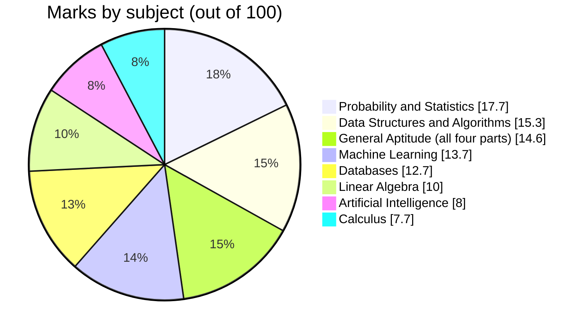

<div class="page-break"></div>

## Your 8-Week Study Plan (60 Days)

| Week | Main Topic | Daily Goal | Practice |
|---|---|---|---|
| 1 | Foundations: What numbers mean, basic math, English | 3 hours/day | 30 practice problems |
| 2 | Probability: How chance works, coin flips, predictions | 3.5 hours/day | 50 problems |
| 3 | Statistics: Real data, averages, comparing groups | 4 hours/day | 60 problems |
| 4 | Linear Algebra: Grids of numbers, solving systems | 3.5 hours/day | 45 problems |
| 5 | Calculus & Algorithms: Rates of change, fast solutions | 4 hours/day | 70 problems |
| 6 | Databases: Organizing data like Excel sheets | 3 hours/day | 60 problems |
| 7 | Machine Learning: Teaching computers to predict | 4 hours/day | 65 problems |
| 8 | AI, Practice, Review | 3 hours/day | 80 full-length practice tests |

**After Week 8:** 4 weeks of mixed practice and weak-topic repair.

<div class="page-break"></div>

**🗺️ Diagram: the plan at a glance**

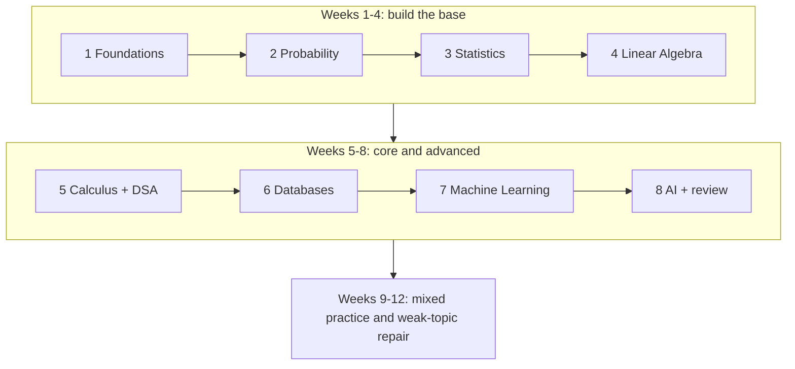

<div class="page-break"></div>

# PART 1: GENERAL APTITUDE (GA)
## The Easy 14.6 Marks You Absolutely Must Get

GA has 10 questions worth 1-2 marks each. If you're struggling elsewhere, GA is your safety net. It tests English, math speed, logic, and shape visualization — skills you already have.

---

## GA Section 1: Verbal Aptitude (3.3 marks)

### What's being tested?
- Can you speak correct English?
- Can you read a passage and understand what it means?
- Do you know the rules of grammar?

### The 8 Parts of Speech (Things to memorize)

Every English word is one of these 8 types:

| Part | What it does | Example | How to recognize |
|---|---|---|---|
| **Noun** | Names a person, place, thing, or idea | teacher, building, courage | Usually the "main character" of a sentence |
| **Verb** | Shows action or existence | run, is, calculate | The "action" happening in the sentence |
| **Adjective** | Describes a noun (adds detail) | fast, blue, beautiful | Comes before the noun or after "is" |
| **Adverb** | Describes a verb (HOW it happens) | quickly, silently, always | Often ends in "-ly" |
| **Pronoun** | Replaces a noun (shorthand) | he, she, it, they, who | Points back to a noun |
| **Preposition** | Shows WHERE or WHEN or HOW things connect | in, on, under, before, with | Links objects to each other |
| **Conjunction** | Joins words or ideas together | and, but, because, or | Connects things of equal weight |
| **Article** | Marks if a noun is specific or general | a, an, the | Always comes before a noun |

**🧪 Worked Example — Tag every word in one sentence**

Sentence: *"The quick analyst quickly ran the model in the lab because it was late."*

<div class="page-break"></div>

| Word | Part of speech | Why? |
|---|---|---|
| The / the | Article | Points to a specific noun |
| quick | Adjective | Describes the noun "analyst" |
| analyst | Noun | The person, the "main character" |
| quickly | Adverb | Describes HOW she ran (ends in -ly) |
| ran | Verb | The action |
| model / lab | Noun | Things |
| in | Preposition | Connects "ran the model" to "the lab" (WHERE) |
| because | Conjunction | Joins two ideas (the reason) |
| it | Pronoun | Replaces "the model" |
| was | Verb | Shows a state (existence) |
| late | Adjective | Describes "it" |

**Trap to remember:** the *job* a word does decides its type, not how it looks. "a **fast** car" → adjective (describes car), but "he runs **fast**" → adverb (describes runs).

### Grammar Rule 1: Subject-Verb Agreement
**What it means:** The verb must match the noun (singular or plural).

- ✓ Correct: "The model **is** accurate." (singular subject → is)
- ✗ Wrong: "The model **are** accurate." (doesn't match)
- ✓ Correct: "Models **are** accurate." (plural subject → are)
- ✗ Wrong: "Models **is** accurate." (doesn't match)

**Trap:** "Each of the answers **is** checked" — "each" is always singular, so use "is" not "are"

**🧪 Worked Example — The "ignore the middle" trick**

Find the REAL subject by mentally deleting the extra phrase (the part starting with *of, in, with, along with, as well as*).

<div class="page-break"></div>

| Sentence | Real subject | Verb |
|---|---|---|
| The **list** (of students) ___ long. | list (singular) | **is** |
| The **accuracy** (of these models) ___ improved. | accuracy (singular) | **has** |
| The **models** (in this folder) ___ trained. | models (plural) | **are** |
| **Neither** the teacher **nor** the students ___ ready. | closest noun = students | **are** |
| **Neither** the students **nor** the teacher ___ ready. | closest noun = teacher | **is** |

**Rules of thumb:** *each, every, either, neither, one of* → singular. For *either…or / neither…nor*, the verb agrees with the noun **closest** to it.

### Grammar Rule 2: Tenses (When things happen)

Every verb shows WHEN something happens:

| Tense | Pattern | Example | When to use |
|---|---|---|---|
| **Simple Present** | base verb | She studies. | General truths, habits |
| **Present Continuous** | am/is/are + verb+ing | She is studying now. | Right now, this moment |
| **Present Perfect** | has/have + past verb | She has studied for 2 hours. | Recently completed |
| **Simple Past** | past verb | She studied yesterday. | Finished action in past |
| **Simple Future** | will + base verb | She will study tomorrow. | Future actions |

**Trap:** "Did he **go**?" not "Did he **went**?" After "did," always use the base form.

<div class="page-break"></div>

**🧪 Worked Example — One student, five tenses**

| Tense | Sentence about Ravi | Clue |
|---|---|---|
| Simple Present | Ravi **studies** data science. | habit / always true |
| Present Continuous | Ravi **is studying** probability right now. | "now", "at the moment" |
| Present Perfect | Ravi **has studied** for 2 hours. | started earlier, still connected to now; "for / since / already / yet" |
| Simple Past | Ravi **studied** Bayes' theorem yesterday. | finished; "yesterday, last week, in 2020" |
| Simple Future | Ravi **will take** the mock test tomorrow. | "tomorrow, next week" |

**The GATE trap:** a *finished-time word* (yesterday, last year, in 2019) forces **simple past**.
- ✗ "I **have seen** that movie yesterday."  → ✓ "I **saw** that movie yesterday."
- ✓ "I **have lived** here **since** 2020." ("since/for" → present perfect)

### Grammar Rule 3: Articles (a, an, the)

- **a** = one thing, not specific, starts with consonant sound
  - "a model" ✓ | "a algorithm" ✗
- **an** = one thing, not specific, starts with vowel sound
  - "an algorithm" ✓ | "an model" ✗
- **the** = specific, already mentioned, unique thing
  - "The model we discussed" (we know which one)
- **no article** = general plural or uncountable
  - "Models are useful." ✓ | "Information is important." ✓

**🧪 Worked Example — Follow one noun through a paragraph**

> I built **a** model. **The** model uses **an** algorithm called kNN. **The** algorithm is simple. Models like this are useful.

- **a model** → first mention, we don't know which one yet → *a*
- **The model** → second mention, now it's specific → *the*
- **an algorithm** → first mention, starts with a vowel **sound** → *an*
- **Models** → general plural ("models in general") → no article

**Sound, not spelling, decides a/an:** **an** hour (silent h), **an** MBA (says "em"), **a** university (says "yoo"), **a** one-time offer (says "wun").

<div class="page-break"></div>

### Grammar Rule 4: Prepositions (Connection words)

Learn these as PHRASES, not individual words:

| Phrase | Correct | Incorrect |
|---|---|---|
| Interested **in** data | ✓ | interested **on** data ✗ |
| Different **from** others | ✓ | different **than** ✗ |
| Depend **on** accuracy | ✓ | depend **in** accuracy ✗ |
| Capable **of** learning | ✓ | capable **to** learn ✗ |
| Similar **to** this model | ✓ | similar **with** model ✗ |

**🧪 Worked Example — Fill in the blank (cover the answers first!)**

| Sentence | Answer |
|---|---|
| She is very good ___ mathematics. | **at** |
| He is fond ___ solving puzzles. | **of** |
| The new result is different ___ the old one. | **from** |
| We discussed ___ the problem for an hour. | **(nothing!)** → "discuss" needs no preposition |
| The model consists ___ three layers. | **of** |
| He was accused ___ cheating. | **of** |

**Strategy:** learn the phrase as one chunk ("good at", "fond of", "consist of"). If a sentence feels odd, replace the preposition with the chunk you memorised.

### Reading Comprehension Strategy (4 steps)

**Step 1:** Read the QUESTION first, not the passage.
**Step 2:** Scan the passage for the answer to that question.
**Step 3:** Mark with your finger where the evidence is.
**Step 4:** Check your answer matches the passage (not what you think).

**Golden rule:** Never use outside knowledge. Only mark answers the passage directly supports.

**Types of questions to recognize:**
- **Fact questions:** "What did the passage say?" → Answer is directly stated
- **Inference questions:** "What can we conclude?" → Answer must be logically supported
- **Opinion questions:** "What does the author believe?" → Author's evaluation
- **Purpose questions:** "Why did the author write this?" → Author's main goal

<div class="page-break"></div>

**🗺️ Diagram: the 4-step loop**

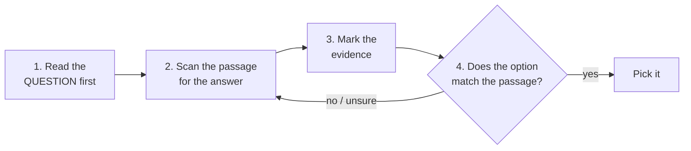

**🧪 Worked Example — All four question types on one passage**

> *"Over the last decade, many companies have started collecting customer data. Critics argue this threatens privacy, yet supporters say it lets businesses serve customers better. The author does not suggest ignoring privacy concerns; she argues only that they must be balanced against the benefits of better service."*

| Type | Question | Right answer | Why |
|---|---|---|---|
| **Fact** | What do supporters say data collection allows? | Better service for customers | Directly stated |
| **Inference** | Which can be concluded? | Some people are worried about privacy | Logically supported ("critics argue…") |
| **Opinion** | What is the author's attitude to privacy concerns? | Takes them seriously but wants balance | "does not suggest ignoring" |
| **Purpose** | Why was this written? | To argue for balancing privacy and benefits | The main goal of the passage |

**Elimination trick:** options with extreme words (*always, never, only, all, completely*) are usually wrong. "Data collection should be banned" is NOT supported by the passage, so it is out.

## GA Section 2: Quantitative Aptitude (9 marks)

### Concept 1: Percentages (The most important GA tool)

**What it means:** Out of 100, how many?

<div class="page-break"></div>

| Concept | Formula | Example |
|---|---|---|
| **What percentage is X of Y?** | (X ÷ Y) × 100 | What % is 25 out of 100? = (25÷100)×100 = 25% |
| **What is X% of Y?** | (X ÷ 100) × Y | What is 25% of 80? = (25÷100)×80 = 20 |
| **If Y becomes Z, what's the % change?** | ((Z-Y)÷Y)×100 | If 60→70: ((70-60)÷60)×100 = 16.67% change |

**CRITICAL TRAP:** Percentage POINTS vs Percentage CHANGE
- If accuracy goes 60% → 70%:
  - It rises by **10 percentage points** (70-60 = 10)
  - But it rises by **16.67% change** ((70-60)÷60)×100)
  - Never confuse these two!

**📐 Math notation**

$$
\begin{gathered}
\text{Percentage} = \frac{\text{part}}{\text{whole}} \times 100
\qquad
\%\text{ change} = \frac{\text{new} - \text{old}}{\text{old}} \times 100
\\[6pt]
\text{Two successive changes of } a\% \text{ and } b\%:\quad
\text{net factor} = \left(1+\tfrac{a}{100}\right)\left(1+\tfrac{b}{100}\right)
\end{gathered}
$$

**🧪 Worked Example — One story per formula**

| Formula | Problem | Working | Answer |
|---|---|---|---|
| **What % is X of Y?** | You solved 18 of 24 questions. What %? | (18 ÷ 24) × 100 | **75%** |
| **What is X% of Y?** | 15% of ₹200? | 0.15 × 200 (or 10% = 20, 5% = 10, so 30) | **₹30** |
| **% change** | Price ₹500 → ₹600 | ((600−500) ÷ 500) × 100 | **+20%** |
| **% change (reverse)** | Price ₹600 → ₹500 | ((500−600) ÷ 600) × 100 | **−16.67%** (not 20%!) |
| **Discount** | 30% off ₹2000 | pay 70% → 0.70 × 2000 | **₹1400** |

**Why is the reverse change different?** Both are a ₹100 gap, but the *base* (the "before" value) is different: 500 vs 600. **Always divide by the starting value.**

**Successive changes (favourite GATE trap):** price ₹100 goes **up 20%**, then **down 20%**.
```
100 → 120 (up 20%) → 120 × 0.80 = 96
Net = −4%, NOT 0%.   Shortcut: multiply the factors 1.20 × 0.80 = 0.96
```

**Points vs change:** accuracy 40% → 50% is **+10 percentage points** but a **+25% change** ((10 ÷ 40) × 100).

<div class="page-break"></div>

### Concept 2: Ratios (Comparing quantities)

**What it means:** If A:B = 2:3, write A = 2k and B = 3k (where k is some unknown number)

**Example:** If boys:girls = 2:3 and there are 5 more girls than boys:
- Boys = 2k, Girls = 3k
- Difference: 3k - 2k = 5
- So k = 5
- Boys = 10, Girls = 15

**Trap:** Adding a number to both doesn't preserve the ratio!

**📐 Math notation**

$$
a : b = \frac{a}{b},
\qquad
a : b = c : d \iff a\,d = b\,c,
\qquad
\text{share of } a = \frac{a}{a+b} \times \text{total}
$$

**🧪 Worked Example — Three ratio situations**

**1) Sharing money.** Split ₹1200 in the ratio A : B : C = 2 : 3 : 5.
```
Total parts = 2 + 3 + 5 = 10  →  one part = 1200 ÷ 10 = 120
A = 2 × 120 = 240,  B = 3 × 120 = 360,  C = 5 × 120 = 600   (240+360+600 = 1200 ✓)
```

**2) The "add to both" trap.** Boys : girls = 2 : 3. Add 1 boy and 1 girl → 3 : 4, which is **not** 2 : 3. Ratios survive *multiplying* both sides, never *adding*.

**3) Chained ratios.** A : B = 2 : 3 and B : C = 4 : 5. Find A : B : C.
```
Make B the same in both: multiply the first by 4 and the second by 3.
A : B = 8 : 12    B : C = 12 : 15   →   A : B : C = 8 : 12 : 15
```

### Concept 3: Counting (How many ways?)

**Use multiplication if:** You have separate stages of choices
- Example: Choose a shirt (4 options) AND pants (3 options) = 4 × 3 = 12 outfits

**Use addition if:** Alternatives (only one choice from many)
- Example: Choose tea OR coffee OR juice = 3 options total

**Combinations (order doesn't matter):** Choosing 3 people from 10
- Formula: C(10,3) = 10!/(3!×7!) = 120 ways
- Read as "10 choose 3"

**Permutations (order matters):** Arranging 3 people in a line
- Formula: P(10,3) = 10!/(7!) = 720 ways
- Read as "10 permute 3"

**Key rule for "at least one":**
- At least one = Total - None
- Example: At least one red ball = All outcomes - All non-red balls

<div class="page-break"></div>

**🧪 Worked Example — Which tool do I use?**

| Situation | Order matters? | Tool | Calculation |
|---|---|---|---|
| 3-digit PIN, digits may repeat | yes | multiply | 10 × 10 × 10 = **1000** |
| 3-digit PIN, no repeated digit | yes | multiply | 10 × 9 × 8 = **720** |
| Pick 2 people from 5 for a committee | **no** | C(5,2) | 5!/(2!·3!) = **10** |
| Pick a President **and** a VP from 5 | **yes** | P(5,2) | 5 × 4 = **20** |

**Quick test:** swap the two people. Does the result change? "President Asha, VP Bala" ≠ "President Bala, VP Asha" → order matters. A committee {Asha, Bala} = {Bala, Asha} → order doesn't matter.

**"At least one" example:** flip a coin 3 times. In how many outcomes do we see at least one head?
```
Total outcomes = 2 × 2 × 2 = 8.  "No head" = only TTT = 1.
At least one head = 8 − 1 = 7   →  probability 7/8
```

### Concept 4: Simple Probability (Coin flips, dice)

**What it means:** (Good outcomes) ÷ (All possible outcomes)

| Situation | Formula | Example |
|---|---|---|
| Fair coin, heads? | 1/2 | 50% chance |
| Fair die, rolling 3? | 1/6 | 16.67% chance |
| Fair die, rolling even? | 3/6 = 1/2 | (2, 4, 6 are 3 out of 6 options) |
| Two dice, sum is 7? | 6/36 = 1/6 | (1,6), (2,5), (3,4), (4,3), (5,2), (6,1) |

**🧪 Worked Example — A bag of balls, a die, and a deck**

**Bag:** 3 red, 2 blue, 5 green (10 balls). Pick one at random.
- P(red) = 3/10 = 0.3
- P(not green) = (3+2)/10 = 1/2
- P(red or blue) = 5/10 = 1/2

**Two dice:** P(sum ≥ 10)? Favorable: (4,6), (5,5), (6,4), (5,6), (6,5), (6,6) = 6 outcomes → 6/36 = **1/6**.

**Deck of 52:** P(ace) = 4/52 = 1/13. P(heart) = 13/52 = 1/4.

<div class="page-break"></div>

**Sanity check:** every probability must lie between 0 and 1. If you get 1.4 or −0.2, you made a mistake.

## GA Section 3: Analytical Aptitude (2 marks)

### Concept: Logic (Is an argument valid?)

**What's valid logic:**
- **P → Q** means "If P, then Q"
- If you know P is true, Q must be true
- Example: "If it rains, the ground is wet." It rained. → Ground is wet. ✓

**What breaks logic:**
- Knowing Q is true does NOT mean P is true
- Example: Ground is wet. But it might be from the sprinkler, not rain. ✗

**To test if an argument is valid:** Find ONE situation where all the starting statements (premises) are true but the conclusion is false. If you can, the argument is invalid.

**🧪 Worked Example — Test an argument by hunting for a counterexample**

**Argument 1:** "If I study, I pass. I passed. **Therefore I studied.**"
- Can all premises be true while the conclusion is false? Yes: I did not study but the exam was easy and I passed.
- One counterexample is enough → **invalid** (this mistake is called *affirming the consequent*).

**Argument 2:** "If I study, I pass. I did **not** pass. **Therefore I did not study.**"
- Suppose I *did* study; then I would have passed, which contradicts the premise. → **valid** (called *modus tollens*).

**"All" trap:** "All engineers are graduates" does **not** mean "All graduates are engineers". (Every dog is an animal; not every animal is a dog.)

## GA Section 4: Spatial Aptitude (3.3 marks)

### Concept 1: 3D Rotation
- Keep a marked face visible
- Track which faces are next to it before and after rotation
- A rotation doesn't change handedness (left-hand stays left-hand)

**🧪 Worked Example — Track a die as it tips**

A standard die has **opposite faces adding to 7** (1↔6, 2↔5, 3↔4).

<div class="page-break"></div>

Start: **top = 1, front = 2** → so bottom = 6, back = 5.
Now **tip the die toward you** (top face falls to the front):
```
old top (1)    → becomes FRONT
old front (2)  → becomes BOTTOM
old bottom (6) → becomes BACK
old back (5)   → becomes TOP
```
New view: top = 5, front = 1, bottom = 2, back = 6. Check: 5+2 = 7 ✓ and 1+6 = 7 ✓. Left and right faces did not move because we rotated around the left–right axis.

**Method:** name the faces, follow where each one goes, and verify with the "opposites add to 7" rule.

### Concept 2: Mirroring
- A mirror REVERSES handedness
- Left becomes right and vice versa
- Image appears flipped horizontally

**🧪 Worked Example — Mirror tricks**

- Letter **b** in a vertical mirror looks like **d**. Word **AMBULANCE** on an ambulance is printed reversed so drivers read it correctly in their rear-view mirror.
- **Clock in a mirror:** mirror time = 11:60 − actual time. A clock showing **4:20** looks like **7:40** in a mirror (11:60 − 4:20 = 7:40).
- A shape with a notch at its **top-left** corner shows the notch at the **top-right** in a vertical mirror, but the top stays the top.
- **Water image** (reflection in water below the object) flips top↔bottom instead of left↔right.

### Concept 3: Paper Folding & Cutting
- Reverse the last fold first
- Reflect every cut across fold lines in reverse order
- Draw the unfolded result

**🧪 Worked Example — Fold, punch, unfold**

1. Fold a square sheet **in half** (left over right) and punch **one hole** through both layers, 1 cm from the folded edge.
2. **Unfold in reverse:** you get **two** holes, mirror images of each other across the crease, each 1 cm from it.
3. Fold in half **twice** (quarters) and punch one hole → after unfolding you get **4 holes** (2 folds → 2² = 4).

**Rule:** holes = 2^(number of folds) for a hole punched through all layers.
**Trap:** a half-circle cut **on the fold line** becomes **one** full circle when unfolded (it is not doubled into two half-circles).

<div class="page-break"></div>

# PART 2: PROBABILITY & STATISTICS
## The Foundation (17.7 + parts of other subjects)

### Why probability matters:
Every ML algorithm, every test, every data decision uses probability underneath. Master this section and half of ML becomes obvious.

---

## Chapter 1: Counting and Elementary Probability

### Concept 1: The Multiplication Rule (Building sequences)

**When to use:** You make choices one after another.

**How to think about it:** 
- Stage 1: Make choice A (let's say 5 options)
- Stage 2: Make choice B (let's say 3 options)
- Total ways = 5 × 3 = 15

**Real example:**
- Pick a starting city: 5 choices
- Pick a destination: 4 remaining choices
- Pick a hotel: 3 choices
- Total routes = 5 × 4 × 3 = 60

**📐 Math notation**

$$
N = n_1 \times n_2 \times \cdots \times n_k
\qquad\text{e.g. } 5 \times 4 \times 3 = 60
$$

**🗺️ Diagram: stages multiply**

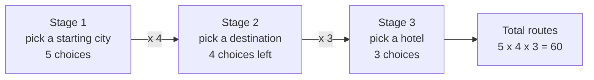

**🧪 Worked Example — Menus, PINs and a restriction**

- **Menu:** 3 starters × 4 mains × 2 desserts = **24** possible meals.
- **Digits 1–5, make a 3-digit number, no repeats:** 5 × 4 × 3 = **60**.
- **Same, but the number must be EVEN:** handle the restricted position **first**.

<div class="page-break"></div>

```
Last digit must be 2 or 4  → 2 choices
Hundreds digit: 4 digits left → 4 choices
Tens digit:     3 digits left → 3 choices
Total = 2 × 4 × 3 = 24
```
**Memory hook:** *AND* (stage after stage) → **multiply**.

### Concept 2: Addition Rule (Alternatives)

**When to use:** You pick ONE from several DIFFERENT options.

**How to think about it:**
- Option A: Do this (5 ways)
- Option B: Or do that (3 ways)
- Total = 5 + 3 = 8 ways

**Real example:**
- Travel by train: 2 times available
- Travel by bus: 3 times available
- Travel by flight: 4 times available
- Total = 2 + 3 + 4 = 9 options

**📐 Math notation**

$$
N(A \text{ or } B) = N(A) + N(B)
\qquad (A \text{ and } B \text{ cannot happen together})
$$

**🧪 Worked Example — When the options overlap**

The basic rule (just add) only works when the options **don't overlap**.

- **No overlap:** tea (2 kinds) OR coffee (3 kinds) OR juice (4 kinds) → 2 + 3 + 4 = **9** drinks.
- **With overlap:** Pick ONE student representative from the Maths club (12 students) or the Chess club (8 students). 3 students are in both clubs.
```
12 + 8 = 20 counts the 3 double-members twice.
Correct total = 12 + 8 − 3 = 17 different students
```
- **Numbers up to 20 divisible by 2 or 5:** multiples of 2 → 10, multiples of 5 → 4 (5, 10, 15, 20), both (multiples of 10) → 2 (10, 20).
  10 + 4 − 2 = **12**.

**Memory hook:** *OR* → **add** (then subtract any overlap).

### Concept 3: Permutations (Order MATTERS)

**What it means:** Arranging objects in a line where position matters.

**Formula:**
- P(n, r) = n! / (n-r)!
- Reads as "n permute r"
- n! = n × (n-1) × (n-2) × ... × 1 (factorial, meaning multiply all numbers down to 1)

<div class="page-break"></div>

**Example:** Arrange 3 people from 10 in a line:
- P(10, 3) = 10 × 9 × 8 = 720 ways
- Why? Position 1 has 10 choices, position 2 has 9 left, position 3 has 8 left

**📐 Math notation**

$$
P(n, r) = \frac{n!}{(n-r)!},
\qquad P(n, n) = n!
$$

**🧪 Worked Example — Lines, letters and tables**

| Problem | Working | Answer |
|---|---|---|
| Line up all 5 friends for a photo | P(5,5) = 5! = 5×4×3×2×1 | **120** |
| Gold, silver, bronze from 8 runners | P(8,3) = 8 × 7 × 6 | **336** |
| Arrange the letters of **DATA** (two A's!) | 4! ÷ 2! = 24 ÷ 2 | **12** |
| Arrange **MISSISSIPPI** | 11! ÷ (4!·4!·2!) = 39,916,800 ÷ 1,152 | **34,650** |
| 5 people around a **round** table | (5−1)! | **24** |

**Why divide by 2! for DATA?** Swapping the two identical A's gives the *same* word, so every arrangement was counted twice.
**Why (n−1)! at a round table?** Rotating everyone by one seat gives the same arrangement, so fix one person and arrange the rest.

### Concept 4: Combinations (Order does NOT matter)

**What it means:** Selecting objects where position/order is irrelevant.

**Formula:**
- C(n, r) = n! / (r! × (n-r)!)
- Reads as "n choose r"

**Example:** Select 3 people from 10 for a committee:
- C(10, 3) = 10! / (3! × 7!) = (10 × 9 × 8) / (3 × 2 × 1) = 720 / 6 = 120 ways
- Why divide by 3!? Because selecting {A,B,C} is the same as {C,A,B}

**📐 Math notation**

$$
C(n, r) = \binom{n}{r} = \frac{n!}{r!\,(n-r)!} = \frac{P(n,r)}{r!},
\qquad \binom{n}{r} = \binom{n}{n-r}
$$

<div class="page-break"></div>

**🧪 Worked Example — Teams, hands and a constraint**

- **Choose 2 from 5:** C(5,2) = (5×4)/(2×1) = **10**.
- **Symmetry shortcut:** C(10,3) = C(10,7) = **120** (choosing 3 to *include* is the same as choosing 7 to *leave out*). Use it to make numbers smaller: C(100,98) = C(100,2) = 4950.
- **Poker hand:** C(52,5) = **2,598,960** different 5-card hands.
- **Committee with a rule:** 3 men from 5 men AND 2 women from 4 women.
  `C(5,3) × C(4,2) = 10 × 6 = 60`  (AND → multiply).
- **Link to permutations:** P(n,r) = C(n,r) × r!. Check: P(10,3) = 120 × 6 = **720** ✓.

**💻 In code: permutations vs combinations**

```python
import math, itertools

print(math.perm(5, 3))    # ordered:   5*4*3
print(math.comb(5, 3))    # unordered: 5*4*3 / 3!
print(list(itertools.combinations("ABCD", 2)))   # every 2-person committee

# Output:
# 60
# 10
# [('A', 'B'), ('A', 'C'), ('A', 'D'), ('B', 'C'), ('B', 'D'), ('C', 'D')]
```

### Concept 5: Basic Probability

**The definition:**
```
Probability of event = (Ways it can happen) / (Total possible ways)

P(A) = Number of favorable outcomes / Total number of outcomes
```

**Example 1: One fair die**
- Event: "Roll a 3"
- Favorable: 1 way (rolling 3)
- Total: 6 ways (1,2,3,4,5,6)
- P(3) = 1/6 ≈ 0.1667 or 16.67%

**Example 2: Two fair dice**
- Event: "Sum is 7"
- Favorable: 6 ways → (1,6), (2,5), (3,4), (4,3), (5,2), (6,1)
- Total: 36 ways (6 × 6)
- P(sum=7) = 6/36 = 1/6

**CRITICAL TRAP:** Rolling twice does NOT make sums equally likely!
- Sum of 2: Only 1 way → (1,1)
- Sum of 7: Six ways → listed above
- Sum of 12: Only 1 way → (6,6)

**📐 Math notation**

$$
P(A) = \frac{\text{number of favorable outcomes}}{\text{total number of equally likely outcomes}},
\qquad 0 \le P(A) \le 1
$$

<div class="page-break"></div>

**🧪 Worked Example — List the sample space when in doubt**

**Two coin flips.** Sample space = {HH, HT, TH, TT}, all equally likely.
- P(at least one head) = 3/4 (HH, HT, TH)
- P(exactly one head) = 2/4 = 1/2

**Drawing without replacement.** A bag has 4 red and 6 blue balls. Pick 2. P(both red)?
```
Favorable = C(4,2) = 6      Total = C(10,2) = 45
P = 6/45 = 2/15 ≈ 0.133
```
**Trap:** "Either it rains or it doesn't, so P(rain) = 1/2" is wrong. The formula only works when all outcomes are **equally likely**.

**💻 In code: estimate a probability by simulation**

```python
import random
random.seed(42)

N = 100_000
hits = sum(random.randint(1, 6) + random.randint(1, 6) >= 10 for _ in range(N))
print(hits / N, "vs exact", round(6 / 36, 4))    # P(sum of two dice >= 10)

# Output:
# 0.16704 vs exact 0.1667
```

### Concept 6: "At Least One" (A useful trick)

**Rule:** At least one of something = Total - None of it

**Example:** In a group of 10 people, at least one has blue eyes:
- It's easier to count "nobody has blue eyes" then subtract
- P(at least one blue) = 1 - P(none blue)

**📐 Math notation**

$$
P(\text{at least one}) = 1 - P(\text{none})
= 1 - (1-p)^{n}
\qquad (n \text{ independent tries, each with success chance } p)
$$

**🧪 Worked Example — Turn a hard problem into an easy one**

**1) Die, 4 rolls.** P(at least one six)?
```
P(no six in one roll) = 5/6
P(no six in 4 rolls)  = (5/6)^4 = 625/1296 ≈ 0.482
P(at least one six)   = 1 − 0.482 ≈ 0.518
```
**2) The blue-eyes group.** Each of 10 people independently has blue eyes with probability 0.1.
```
P(none blue) = 0.9^10 ≈ 0.349      →  P(at least one) = 1 − 0.349 ≈ 0.651
```
Counting "exactly 1, exactly 2, … exactly 10" separately would take forever. Subtracting from 1 is one line.

<div class="page-break"></div>

**💻 In code: the complement trick**

```python
p, n = 1/6, 4                     # a six on one roll, 4 rolls
print(round(1 - (1 - p) ** n, 4))  # P(at least one six)

# Output:
# 0.5177
```

---

## Chapter 2: Probability Rules and Notation

### Notation Guide (What the symbols mean)

| Symbol | Reads as | Means |
|---|---|---|
| P(A) | "Probability of A" | Chance that A happens, between 0 and 1 |
| P(A ∩ B) | "P of A and B" | Both A and B happen together |
| P(A ∪ B) | "P of A or B" | At least one of A or B happens |
| P(A \| B) | "P of A given B" | Probability of A, knowing B already happened |
| A' or ¬A | "not A" | Event A does not happen |

**📐 Math notation**

$$
\begin{aligned}
A \cup B &: \text{A or B (or both)} \\
A \cap B &: \text{A and B} \\
A^{c} &: \text{not A (the complement)} \\
P(A \mid B) &: \text{probability of A, given that B happened}
\end{aligned}
$$

**🧪 Worked Example — One class, every symbol**

A class has **100 students**. 60 like Maths (M), 40 like Physics (P), 25 like **both**.

<div class="page-break"></div>

| Symbol | Meaning here | Value |
|---|---|---|
| P(M) | picks a Maths-lover | 60/100 = **0.60** |
| P(P) | picks a Physics-lover | **0.40** |
| P(M ∩ P) | likes both | **0.25** |
| P(M ∪ P) | likes at least one | 0.60 + 0.40 − 0.25 = **0.75** |
| P(M') | does NOT like Maths | 1 − 0.60 = **0.40** |
| P(M \| P) | likes Maths, given they like Physics | 0.25 / 0.40 = **0.625** |
| P(P \| M) | likes Physics, given they like Maths | 0.25 / 0.60 ≈ **0.417** |

Notice **P(M|P) ≠ P(P|M)**: the "given" part changes which group you look inside. We will reuse this class in the next rules.

### Rule 1: Complement Rule

**What it says:** The probability something happens + probability it doesn't = 1

```
P(A) + P(not A) = 1

Therefore: P(not A) = 1 - P(A)
```

**Real example:**
- P(it rains) = 0.3 (30%)
- P(it doesn't rain) = 1 - 0.3 = 0.7 (70%)

**📐 Math notation**

$$
P(A^{c}) = 1 - P(A)
$$

**🧪 Worked Example — "Not" is 1 minus "is"**

- Roll two dice. P(at least one 6)?
```
P(no 6 on either die) = (5/6) × (5/6) = 25/36
P(at least one 6)     = 1 − 25/36 = 11/36 ≈ 0.306
```
- A server is up with probability 0.95 → P(down) = 1 − 0.95 = **0.05**.
- From the class: P(M') = 1 − 0.60 = **0.40**.

### Rule 2: Addition Rule

**What it says:** To find P(A or B), add the individual probabilities but subtract the overlap.

```
P(A ∪ B) = P(A) + P(B) - P(A ∩ B)
```

**Why subtract the overlap?** Because when you add P(A) + P(B), you count the overlap twice.

<div class="page-break"></div>

**Real example:** 
- 60% of students study math (A)
- 50% of students study physics (B)
- 30% study both (A ∩ B)
- P(study at least one) = 0.6 + 0.5 - 0.3 = 0.8 (80%)

**📐 Math notation**

$$
P(A \cup B) = P(A) + P(B) - P(A \cap B)
\qquad\text{(if mutually exclusive: } P(A \cap B) = 0 \text{)}
$$

**🧪 Worked Example — Cards**

Draw one card from a 52-card deck.
```
P(King or Heart) = P(King) + P(Heart) − P(King AND Heart)
                 = 4/52   + 13/52    − 1/52     (the King of Hearts)
                 = 16/52 = 4/13 ≈ 0.308
```
**Special case — mutually exclusive events** (they can't both happen):
P(King or Queen) = 4/52 + 4/52 − **0** = 8/52 = 2/13. The overlap is zero, so nothing to subtract.

**Class check:** P(M ∪ P) = 0.60 + 0.40 − 0.25 = 0.75. So 25% of the class likes neither.

### Rule 3: Multiplication Rule (Things happening together)

**Basic version:** If A and B are independent (unrelated):
```
P(A ∩ B) = P(A) × P(B)
```

**Example:** 
- P(fair coin shows heads) = 0.5
- P(fair die shows 3) = 1/6
- P(both happen) = 0.5 × (1/6) = 1/12

**📐 Math notation**

$$
P(A \cap B) = P(A)\,P(B \mid A)
\qquad\text{independent events: } P(A \cap B) = P(A)\,P(B)
$$

**🧪 Worked Example — Independent vs dependent**

**Independent (coin flips):** P(3 heads in a row) = 0.5 × 0.5 × 0.5 = **1/8**.

**Dependent (cards without replacement).** Draw 2 cards. P(both aces)?
```
General rule:  P(A ∩ B) = P(A) × P(B | A)
P(first ace) = 4/52
P(second ace | first was ace) = 3/51      (one ace and one card are gone)
P(both) = 4/52 × 3/51 = 12/2652 = 1/221
```
With replacement (put the card back) it is independent: (4/52)² = 1/169.

**Independence test:** in our class, P(M) × P(P) = 0.60 × 0.40 = 0.24, but P(M ∩ P) = 0.25. Not equal → Maths-liking and Physics-liking are **not independent**.

<div class="page-break"></div>

### Rule 4: Conditional Probability (Given that we know something)

**What it says:** If we KNOW B happened, how does that change the probability of A?

```
P(A | B) = P(A ∩ B) / P(B)
```

**Real example:** 
- 50 students total
- 30 passed exam (B)
- 20 of those studied (A ∩ B)
- P(studied | passed) = 20/30 = 2/3 (66.67%)

**Intuition:** Don't look at all 50 students. Look only at the 30 who passed. Of those, 20 studied.

**📐 Math notation**

$$
P(A \mid B) = \frac{P(A \cap B)}{P(B)}, \qquad P(B) > 0
$$

**🧪 Worked Example — Shrink the world**

Conditioning means "throw away everything that isn't B, then look inside B".

- **Cards:** P(King | face card). There are 12 face cards (J, Q, K × 4 suits), 4 of them Kings → **4/12 = 1/3**.
- **Order matters:** P(face card | King) = **1** (every King is a face card), but P(King | face card) = **1/3**.
- **Dice:** first die shows 3. P(sum = 8)? Second die must be 5 → **1/6**.

**Formula check (cards):** P(King ∩ face) = 4/52, P(face) = 12/52 → (4/52) ÷ (12/52) = 4/12 ✓.

### Rule 5: Bayes' Theorem (The most important rule)

**What it says:** Reverse the conditional probability.

```
P(A | B) = P(B | A) × P(A) / P(B)
```

**Breaking it down:**
- **P(B | A)** = "If A is true, what's the probability B is true?" (the likelihood)
- **P(A)** = "How likely is A on its own?" (the prior)
- **P(B)** = "How likely is B overall?" (the total probability)
- **P(A | B)** = "Given B is true, what's the probability A is true?" (what we want)

**Real example: Medical test**
- Disease prevalence: 1% (P(disease) = 0.01)
- Test accuracy if you have disease: 99% (P(positive | disease) = 0.99)
- Test accuracy if you don't: 90% (P(negative | no disease) = 0.90 → P(positive | no disease) = 0.10)

**Question:** You test positive. What's the real probability you have the disease?

<div class="page-break"></div>

**Answer using Bayes:**
- P(positive | disease) = 0.99
- P(disease) = 0.01
- P(positive) = P(positive | disease) × P(disease) + P(positive | no disease) × P(no disease)
  - = 0.99 × 0.01 + 0.10 × 0.99
  - = 0.0099 + 0.099 = 0.1089
- P(disease | positive) = (0.99 × 0.01) / 0.1089 = 0.0099 / 0.1089 = 9.09%

**Surprising result:** Even though the test is 99% accurate, you only have about 9% chance of actually having the disease! (Because the disease is rare.)

**📐 Math notation**

$$
P(A \mid B) = \frac{P(B \mid A)\,P(A)}{P(B)},
\qquad
P(B) = P(B \mid A)\,P(A) + P(B \mid A^{c})\,P(A^{c})
$$

**🗺️ Diagram: the medical test as a tree of 10,000 people**

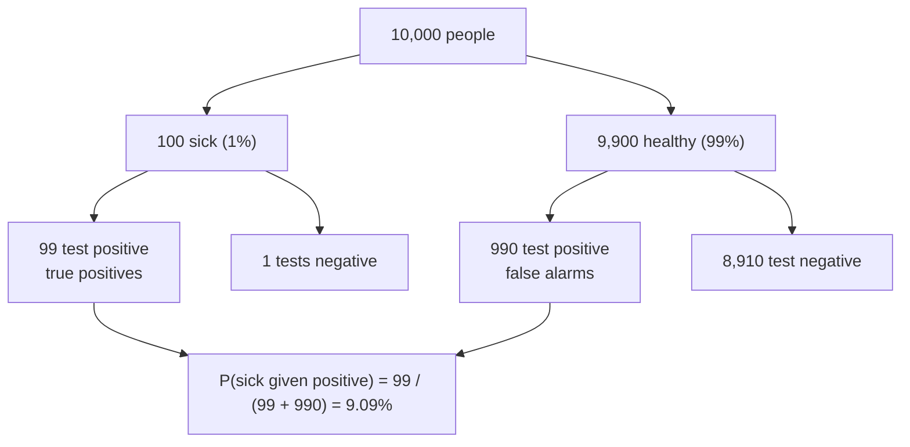

**🧪 Worked Example — The same medical test with "10,000 people"**

Formulas hide the intuition. Count real people instead:

```
Imagine 10,000 people.
Disease prevalence 1%  →  100 sick, 9,900 healthy.
Sick people who test positive:     99% of 100   = 99
Healthy people who test positive:  10% of 9,900 = 990

Total positives = 99 + 990 = 1,089
P(sick | positive) = 99 / 1,089 ≈ 9.09%   (matches the formula!)
```
**Why so low?** The 990 false alarms from the huge healthy group swamp the 99 true cases.

<div class="page-break"></div>

**Second example — spam filter.** 30% of emails are spam. The word "free" appears in 60% of spam and 5% of normal mail. An email contains "free". P(spam)?
```
Spam & free:   0.30 × 0.60 = 0.18
Normal & free: 0.70 × 0.05 = 0.035
P(spam | free) = 0.18 / (0.18 + 0.035) ≈ 0.837
```
**4-step recipe:** (1) write the prior, (2) multiply by the likelihood for each cause, (3) add them up to get P(B), (4) divide.

**💻 In code: Bayes as a function**

```python
def bayes(prior, sensitivity, false_pos):
    p_positive = sensitivity * prior + false_pos * (1 - prior)
    return sensitivity * prior / p_positive

print(round(bayes(0.01, 0.99, 0.10), 4))   # rare disease (1%)
print(round(bayes(0.10, 0.99, 0.10), 4))   # 10x more common -> far more trustworthy

# Output:
# 0.0909
# 0.5238
```

## Chapter 3: Probability Distributions (Common patterns)

### What's a distribution?

**A distribution is:** A pattern showing which outcomes are likely and which are unlikely.

**Visual:** Imagine a histogram:
- X-axis: Possible outcomes
- Y-axis: How likely each is
- Shape: The pattern tells us the distribution type

**📐 Math notation**

$$
\sum_{x} P(X = x) = 1 \ \text{(discrete)},
\qquad
\int_{-\infty}^{\infty} f(x)\,dx = 1 \ \text{(continuous)},
\qquad
F(x) = P(X \le x)
$$

**🗺️ Diagram: which distribution should I use?**

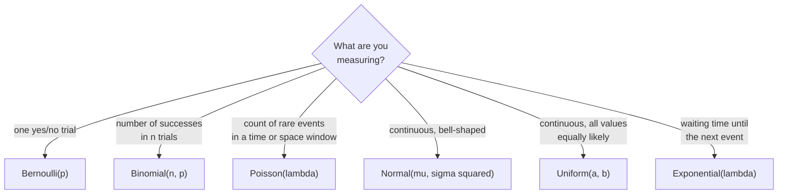

<div class="page-break"></div>

**🧪 Worked Example — Two coin flips, X = number of heads**

| X | 0 | 1 | 2 |
|---|---|---|---|
| P(X) | 0.25 | 0.50 | 0.25 |

```
X=0 | ▇▇▇▇▇        0.25
X=1 | ▇▇▇▇▇▇▇▇▇▇   0.50
X=2 | ▇▇▇▇▇        0.25          (all probabilities add to 1)
```
**Discrete vs continuous:** for counts like this you list P(X = k). For measurements like height, P(height is *exactly* 170.000… cm) = 0, so we talk about ranges: P(165 < height < 175) = the **area** under the curve.

### Distribution 1: Bernoulli (One coin flip)

**What it models:** A single event with two outcomes: success or failure.

**Examples:**
- One coin flip: heads or tails
- One test: pass or fail
- One prediction: correct or wrong

**Formula:**
```
P(X = k) = p^k × (1-p)^(1-k)

Where:
- X = outcome
- k = 1 (success) or 0 (failure)
- p = probability of success
```

**Simple version:** P(success) = p, P(failure) = 1-p

**📐 Math notation**

$$
P(X = x) = p^{x}(1-p)^{1-x},\ x \in \{0, 1\};
\qquad E[X] = p,\quad \operatorname{Var}(X) = p(1-p)
$$

**🧪 Worked Example — A free-throw shooter with p = 0.7**

X = 1 if the shot goes in, 0 if it misses.
```
P(X=1) = 0.7^1 × 0.3^0 = 0.7
P(X=0) = 0.7^0 × 0.3^1 = 0.3
```
Bonus facts used everywhere later: **mean = p = 0.7**, **variance = p(1−p) = 0.7 × 0.3 = 0.21**.

**Where you meet it:** every single prediction being right/wrong, every single coin flip, every single "click / no click".

### Distribution 2: Binomial (Multiple coin flips)

**What it models:** Multiple independent trials, each with same success probability.

<div class="page-break"></div>

**When to use:**
- Flipped a coin 10 times, how many heads?
- Tested 100 students, how many pass?
- Made 5 predictions, how many correct?

**Requirements:**
1. Fixed number of trials (n)
2. Two outcomes each time (success/failure)
3. Same probability each time (p)
4. Trials are independent

**Formula:**
```
P(X = k) = C(n,k) × p^k × (1-p)^(n-k)

Where:
- n = number of trials
- k = number of successes
- p = probability of success each time
- C(n,k) = "n choose k" = ways to arrange k successes in n trials
```

**Example:** Flip a fair coin 4 times. What's P(exactly 2 heads)?
- n = 4, k = 2, p = 0.5
- C(4,2) = 6 ways to get 2 heads
- P(X=2) = 6 × (0.5)^2 × (0.5)^2 = 6 × 0.0625 = 0.375 (37.5%)

**📐 Math notation**

$$
P(X = k) = \binom{n}{k} p^{k} (1-p)^{n-k},
\qquad E[X] = np,\quad \operatorname{Var}(X) = np(1-p)
$$

**🧪 Worked Example — Guessing on a quiz**

5 MCQs, 4 options each, you guess every one. So n = 5, p = 0.25.
```
P(exactly 3 correct) = C(5,3) × 0.25³ × 0.75²
                     = 10 × 0.015625 × 0.5625 ≈ 0.088   (8.8%)

P(at least 1 correct) = 1 − P(none) = 1 − 0.75⁵ ≈ 0.763
```
Bonus: **mean = n·p = 1.25** correct answers on average, **variance = n·p·(1−p) = 0.9375**.

**Is it really binomial? Check the 4 requirements.** Drawing 3 cards *without* replacement and counting aces is **not** binomial (the probability changes after each draw, so trials aren't independent).

<div class="page-break"></div>

**💻 In code: binomial with scipy**

```python
from scipy.stats import binom

n, p = 10, 0.5
print(round(binom.pmf(3, n, p), 4))        # P(X = 3)
print(round(binom.cdf(3, n, p), 4))        # P(X <= 3)
print(round(1 - binom.cdf(6, n, p), 4))    # P(X >= 7)
print(binom.mean(n, p), binom.var(n, p))   # np and np(1-p)

# Output:
# 0.1172
# 0.1719
# 0.1719
# 5.0 2.5
```

### Distribution 3: Poisson (Rare events)

**What it models:** Counting events that happen randomly but rarely over a fixed period.

**Examples:**
- Emails received per hour
- Customers per day
- Typos per page
- Car accidents per week

**Formula:**
```
P(X = k) = e^(-λ) × λ^k / k!

Where:
- λ (lambda) = average number of events per period
- k = actual number of events we observe
- e ≈ 2.718 (mathematical constant)
- k! = k × (k-1) × ... × 1 (factorial)
```

**Simple meaning:** If events happen with average rate λ, the probability of observing exactly k events follows this pattern.

**Example:** Average 3 emails per hour. What's P(exactly 2 emails in an hour)?
- λ = 3, k = 2
- P(X=2) = e^(-3) × 3^2 / 2!
- = 0.0498 × 9 / 2
- ≈ 0.224 (22.4%)

**📐 Math notation**

$$
P(X = k) = \frac{e^{-\lambda}\,\lambda^{k}}{k!},
\qquad E[X] = \operatorname{Var}(X) = \lambda
$$

**🧪 Worked Example — Emails per hour (λ = 3)**

```
P(no emails in an hour)  = e^−3 × 3⁰/0! = e^−3 ≈ 0.0498
P(at least one email)    = 1 − 0.0498     ≈ 0.950
P(exactly 2 emails)      = e^−3 × 9/2     ≈ 0.224  (as in the guide)
```

<div class="page-break"></div>

**Change the time window → change λ.** In 30 minutes the average is 3 × 0.5 = **1.5**, so P(no emails in 30 min) = e^−1.5 ≈ **0.223**.

**Handy facts:** Poisson has **mean = variance = λ**. Also, Binomial with huge n and tiny p behaves like Poisson with λ = n·p (e.g., n = 1000, p = 0.003 → λ = 3).

**💻 In code: Poisson with scipy**

```python
from scipy.stats import poisson

lam = 3                                     # average of 3 events per interval
print(round(poisson.pmf(0, lam), 4))        # P(no events)
print(round(poisson.pmf(2, lam), 4))        # P(exactly 2)
print(round(1 - poisson.cdf(4, lam), 4))    # P(5 or more)

# Output:
# 0.0498
# 0.224
# 0.1847
```

### Distribution 4: Normal (The bell curve)

**What it models:** Continuous data that clusters around a center value.

**Examples:**
- Heights of people
- Test scores
- Measurement errors
- Most natural phenomena

**Formula (theoretical, memorize the concept not the math):**
```
The normal distribution is defined by two numbers:
- μ (mu) = mean (center of bell curve)
- σ (sigma) = standard deviation (how spread out it is)

Notation: X ~ N(μ, σ²)
```

**The 68-95-99.7 Rule:** In a normal distribution:
- 68% of data falls within μ ± σ (mean ± 1 standard deviation)
- 95% falls within μ ± 2σ
- 99.7% falls within μ ± 3σ

**Real example:** 
- Test scores: μ = 70, σ = 10
- 68% of students scored between 60-80
- 95% scored between 50-90
- 99.7% scored between 40-100

<div class="page-break"></div>

**📐 Math notation**

$$
\begin{gathered}
f(x) = \frac{1}{\sigma\sqrt{2\pi}}\,
\exp\!\left(-\frac{(x-\mu)^2}{2\sigma^2}\right),
\qquad Z = \frac{X - \mu}{\sigma} \sim \mathcal{N}(0, 1)
\\[8pt]
P(\mu \pm 1\sigma) \approx 0.68,\quad
P(\mu \pm 2\sigma) \approx 0.95,\quad
P(\mu \pm 3\sigma) \approx 0.997
\end{gathered}
$$

**🧪 Worked Example — Test scores with μ = 70, σ = 10**

**1) P(score > 85)?** Standardize first:
```
Z = (85 − 70) / 10 = 1.5
Table: P(Z < 1.5) = 0.9332   →   P(Z > 1.5) = 1 − 0.9332 = 0.0668  (≈ 6.7%)
```
**2) P(60 < score < 80)?** That is μ ± 1σ → about **68%**.

**3) What score puts you in the top 10%?** Need Z where the area below = 0.90 → Z ≈ 1.28 → score = 70 + 1.28 × 10 ≈ **82.8**.

**Values worth remembering:**

| Z | 1.0 | 1.645 | 1.96 | 2.576 |
|---|---|---|---|---|
| P(Z < z) | 0.8413 | 0.95 | 0.975 | 0.995 |

The bell curve is **symmetric**: P(Z < −1.5) = P(Z > 1.5) = 0.0668.

**💻 In code: normal probabilities and z-values**

```python
from scipy.stats import norm

print(round(norm.cdf(1.96), 4))                    # P(Z <= 1.96)
print(round(norm.cdf(1) - norm.cdf(-1), 4))        # within 1 sigma  (~68%)
print(round(norm.ppf(0.975), 3))                   # z* for a 95% interval
mu, sigma = 70, 10
print(round(norm.cdf(85, mu, sigma) - norm.cdf(60, mu, sigma), 4))   # P(60 < X < 85)

# Output:
# 0.975
# 0.6827
# 1.96
# 0.7745
```

### Distribution 5: Uniform (Equal chances)

**What it models:** All outcomes equally likely.

**Examples:**
- Fair die: each face has 1/6 probability
- Random number 1-10: each has 1/10 probability

**Formula:**
```
P(X) = 1 / n

Where n = number of outcomes
```

<div class="page-break"></div>

**📐 Math notation**

$$
f(x) = \frac{1}{b-a}\ (a \le x \le b),
\qquad E[X] = \frac{a+b}{2},\quad \operatorname{Var}(X) = \frac{(b-a)^2}{12}
$$

**🧪 Worked Example — A bus that comes "sometime in the next 30 minutes"**

The wait X is **continuous uniform** on [0, 30]. Density = 1/(b − a) = 1/30.
```
P(wait < 10 min)        = 10/30 = 1/3
P(5 < wait < 20)        = 15/30 = 0.5
Mean = (a + b)/2        = 15 minutes
Variance = (b − a)²/12  = 900/12 = 75
```
**Discrete version:** a fair die gives P = 1/6 for each face, and its mean is (1 + 6)/2 = 3.5, which matches the E[X] we computed earlier.

### Distribution 6: Exponential (Waiting times)

**What it models:** Time until something rare happens, or time between rare events.

**Examples:**
- Time until next earthquake
- Time between customer arrivals
- Lifetime of a device before failure

**Key insight:**
```
If λ (lambda) = rate (events per time)
Then: 1/λ = average waiting time

Example: If customers arrive at rate λ=3 per hour
Then: average wait time = 1/3 hour = 20 minutes
```

**Trap to avoid:** λ is the RATE, not the waiting time. If told "average waiting time is 20 minutes," then λ = 1/20 per minute.

**📐 Math notation**

$$
\begin{gathered}
f(x) = \lambda e^{-\lambda x},\quad F(x) = 1 - e^{-\lambda x}\ (x \ge 0),
\qquad E[X] = \frac{1}{\lambda},\quad \operatorname{Var}(X) = \frac{1}{\lambda^{2}}
\\[8pt]
\text{Memoryless: } P(X > s + t \mid X > s) = P(X > t)
\end{gathered}
$$

**🧪 Worked Example — Waiting for customers (λ = 3 per hour)**

Mean wait = 1/λ = 1/3 hour = 20 minutes.
```
P(wait > t) = e^(−λt)
P(wait > 20 min = 1/3 hour) = e^(−3 × 1/3) = e^−1 ≈ 0.368
P(wait ≤ 10 min = 1/6 hour) = 1 − e^(−0.5) ≈ 0.393
```
**Memoryless property:** you've already waited 30 minutes with no customer. The chance you wait *another* 20 minutes is still 0.368. The past doesn't matter.

<div class="page-break"></div>

**Unit trap:** keep units consistent. λ = 3 **per hour** → t must be in **hours**.

**Second example:** a bulb has mean lifetime 1000 h → λ = 1/1000 per hour. P(lasts > 500 h) = e^(−0.5) ≈ **0.607**.

**Link to Poisson:** number of arrivals in an hour ~ Poisson(3); the *gap* between arrivals ~ Exponential(3).

**💻 In code: waiting times and memorylessness**

```python
from scipy.stats import expon

lam = 0.5                          # 0.5 events per minute -> mean wait = 2 minutes
wait = expon(scale=1 / lam)
print(wait.mean())                 # 2.0
print(round(wait.cdf(3), 4))       # P(wait <= 3)
print(round(wait.sf(3), 4))        # P(wait > 3)
print(round(wait.sf(5) / wait.sf(2), 4))   # P(X > 5 | X > 2) equals P(X > 3): memoryless

# Output:
# 2.0
# 0.7769
# 0.2231
# 0.2231
```

## Chapter 4: Expectation and Variance

### Concept 1: Expected Value (The average)

**What it means:** The average outcome if you repeat the experiment many times.

**Formula:**
```
E[X] = Σ (value × probability of that value)

In plain English: Multiply each possible outcome by its probability, then add them up.
```

**Real example:** Roll a fair die
- Outcomes: 1,2,3,4,5,6 (each with 1/6 probability)
- E[X] = 1×(1/6) + 2×(1/6) + 3×(1/6) + 4×(1/6) + 5×(1/6) + 6×(1/6)
- = (1+2+3+4+5+6) / 6 = 21/6 = 3.5

**Reality check:** The expected value isn't necessarily a possible outcome! You can't roll 3.5.

**📐 Math notation**

$$
E[X] = \sum_{x} x\,P(X = x)
\qquad
E[aX + b] = a\,E[X] + b,
\qquad
E[X + Y] = E[X] + E[Y]
$$

**🧪 Worked Example — Is this game worth playing?**

You pay ₹10 to roll a die. If you roll a **6**, you win ₹30; otherwise you win nothing.
```
E[winnings] = 30 × (1/6) + 0 × (5/6) = ₹5
E[profit]   = 5 − 10 = −₹5 per game
```

<div class="page-break"></div>

On average you **lose ₹5 every game**. (Any single game you either lose ₹10 or win ₹20; the "average" is what happens over many games.)

**Linearity shortcuts (very handy in GATE):**
- E[aX + b] = a·E[X] + b → for a die, E[2X + 1] = 2(3.5) + 1 = **8**.
- E[X + Y] = E[X] + E[Y] → sum of two dice = 3.5 + 3.5 = **7**, no need to list 36 outcomes.

### Concept 2: Variance (How spread out)

**What it means:** How much do outcomes typically differ from the expected value?

**Formula:**
```
Var(X) = E[X²] - (E[X])²

In words: 
1. Square each outcome
2. Find the average of the squares
3. Subtract the square of the original average
```

**Real example:** Die roll
- E[X] = 3.5 (from above)
- E[X²] = 1²×(1/6) + 2²×(1/6) + ... + 6²×(1/6) = 91/6 ≈ 15.17
- Var(X) = 15.17 - (3.5)² = 15.17 - 12.25 = 2.92

**What it means:** Outcomes differ from 3.5 by about 2.92 on average (technically, squared).

**📐 Math notation**

$$
\operatorname{Var}(X) = E\big[(X - \mu)^2\big] = E[X^2] - \big(E[X]\big)^2,
\qquad
\operatorname{Var}(aX + b) = a^{2}\operatorname{Var}(X)
$$

**🧪 Worked Example — A tiny data set, step by step**

X takes the values 2, 4, 6, each with probability 1/3.
```
E[X]   = (2 + 4 + 6)/3            = 4
E[X²]  = (4 + 16 + 36)/3          = 18.67
Var(X) = E[X²] − (E[X])² = 18.67 − 16 = 2.67
```
**Properties to memorize:**
- **Adding a constant doesn't change spread:** Var(X + 3) = 2.67.
- **Multiplying scales by the square:** Var(2X) = 2² × 2.67 = **10.67**.
- **Independent variables add:** Var(X + Y) = Var(X) + Var(Y). Two dice: 2.92 + 2.92 = **5.83**.

<div class="page-break"></div>

**💻 In code: expectation, variance and standard deviation of a fair die**

```python
import numpy as np

faces = np.arange(1, 7)
p = np.full(6, 1 / 6)
mean = (faces * p).sum()
var = ((faces - mean) ** 2 * p).sum()
print(round(float(mean), 3), round(float(var), 4), round(float(var ** 0.5), 4))

# Output:
# 3.5 2.9167 1.7078
```

### Concept 3: Standard Deviation (Variance's friendly version)

**Formula:**
```
σ (sigma) = √(Variance)
```

**Real example (continuing die):**
- σ = √2.92 ≈ 1.71

**Why use this instead of variance?** Standard deviation is in the same units as the original data, so it's easier to interpret.

**📐 Math notation**

$$
\sigma = \sqrt{\operatorname{Var}(X)},
\qquad
s = \sqrt{\frac{1}{n-1}\sum_{i=1}^{n}(x_i - \bar{x})^2}\ \ \text{(sample)}
$$

**🧪 Worked Example — Same average, very different classes**

| | Scores | Mean | Variance | σ |
|---|---|---|---|---|
| Class A | 70, 70, 70, 70 | 70 | 0 | **0** |
| Class B | 50, 60, 80, 90 | 70 | (400+100+100+400)/4 = 250 | √250 ≈ **15.8** |

Both classes average 70, but Class B is spread out. σ tells you a "typical" student in B is about 16 marks away from 70.

**Units check:** heights in cm → variance is in **cm²** (weird!), σ is in **cm** (sensible). That's why we report σ.

### Concept 4: Covariance (How two things move together)

**What it means:** Do two variables tend to increase together, decrease together, or move independently?

**Formula:**
```
Cov(X,Y) = E[(X - E[X])(Y - E[Y])]

Simpler form: Cov(X,Y) = E[XY] - E[X]×E[Y]
```

<div class="page-break"></div>

**Intuition:**
- Positive covariance: When X goes up, Y tends to go up
- Negative covariance: When X goes up, Y tends to go down
- Zero covariance: No relationship

**Important property:**
```
Cov(aX, bY) = ab × Cov(X,Y)

Example: If Cov(X,Y) = 5, then Cov(2X, 3Y) = 2×3×5 = 30
```

**📐 Math notation**

$$
\begin{gathered}
\operatorname{Cov}(X, Y) = E\big[(X-\mu_X)(Y-\mu_Y)\big] = E[XY] - E[X]\,E[Y]
\\[6pt]
\operatorname{Var}(X + Y) = \operatorname{Var}(X) + \operatorname{Var}(Y) + 2\operatorname{Cov}(X, Y)
\end{gathered}
$$

**🧪 Worked Example — Study hours vs marks (tiny data, 3 students)**

X = hours = {1, 2, 3}, Y = marks/10 = {2, 4, 6}. Each pair equally likely.
```
E[X] = 2,   E[Y] = 4
E[XY] = (1·2 + 2·4 + 3·6)/3 = 28/3 ≈ 9.33
Cov(X,Y) = E[XY] − E[X]·E[Y] = 9.33 − 8 = +1.33   → they move together
```
Flip the marks to Y = {6, 4, 2}: E[XY] = (6 + 8 + 6)/3 = 6.67 → Cov = 6.67 − 8 = **−1.33** (more study, fewer marks).

**Useful identities:** Cov(X,X) = Var(X). Var(X + Y) = Var(X) + Var(Y) + 2·Cov(X,Y).

**Classic trap — zero covariance ≠ independent.** Let X be −1, 0, 1 (equally likely) and Y = X².
```
E[X] = 0, E[XY] = E[X³] = 0  →  Cov = 0
Yet Y is completely determined by X!  (Covariance only detects LINEAR relationships.)
```

### Concept 5: Correlation (Covariance, standardized)

**What it means:** Covariance that's been "normalized" so it's always between -1 and +1.

**Formula:**
```
ρ (rho) = Cov(X,Y) / (σ_X × σ_Y)

Where:
- σ_X = standard deviation of X
- σ_Y = standard deviation of Y
```

**Interpretation:**
- ρ = +1: Perfect positive relationship (if X doubles, Y doubles)
- ρ = -1: Perfect negative relationship (if X doubles, Y halves)
- ρ = 0: No linear relationship
- ρ = 0.7: Strong positive relationship

<div class="page-break"></div>

**Key rule:**
```
Correlation of aX+b and cY+d = sign(ac) × correlation of X and Y

Meaning: Adding constants doesn't change correlation. Multiplying by negative flips the sign.
```

**📐 Math notation**

$$
\rho_{XY} = \frac{\operatorname{Cov}(X, Y)}{\sigma_X\,\sigma_Y},
\qquad -1 \le \rho_{XY} \le 1
$$

**🧪 Worked Example — From covariance to ρ**

Data: X = {1, 2, 3}, Y = {2, 3, 7}.
```
E[X] = 2, E[Y] = 4, E[XY] = (2 + 6 + 21)/3 = 9.67  →  Cov = 9.67 − 8 = 1.67
Var(X) = 0.67 → σ_X = 0.82        Var(Y) = 4.67 → σ_Y = 2.16
ρ = 1.67 / (0.82 × 2.16) ≈ 0.945    (strong positive)
```
**Change of units:** convert X from hours to minutes (multiply by 60). Cov becomes 60× bigger, but **ρ stays 0.945**. That's the whole point of standardizing.

**Sign rule in action:** Y = −3X + 2 → sign(−3) is negative → ρ = **−1** (perfect straight line, going down).

**Remember:** correlation ≠ causation (ice-cream sales and drowning both rise in summer).

**💻 In code: covariance and correlation**

```python
import numpy as np

x = np.array([1, 2, 3, 4, 5])
y = np.array([2, 4, 5, 4, 5])
print(round(float(np.cov(x, y, ddof=0)[0, 1]), 3))   # population covariance
print(round(float(np.corrcoef(x, y)[0, 1]), 4))      # correlation, always in [-1, 1]

# Output:
# 1.2
# 0.7746
```

## Chapter 5: Statistics (Using data to make decisions)

### Concept 1: Sampling and Distributions

**What's the problem:** You can't survey everyone. You sample 100 people, but you want to know about all 1 million.

<div class="page-break"></div>

**The Central Limit Theorem (Most important statistics concept):**

```
If you take many samples of size n from ANY distribution,
the averages of those samples form a NORMAL distribution!

Key facts:
- Mean of sample averages = population mean (μ)
- Standard deviation of sample averages = σ/√n
  (where σ = population standard deviation, n = sample size)
```

**Real example:**
- Population average height: 170 cm with standard deviation 10 cm
- Sample 100 people, calculate average
- Do this 1000 times
- Those 1000 averages will be normally distributed!
- Mean = 170 cm
- Standard deviation = 10/√100 = 10/10 = 1 cm (much smaller!)

**Why it matters:** This lets us use normal distribution tests even if the underlying data isn't normal!

**📐 Math notation**

$$
\begin{gathered}
\bar{X} = \frac{1}{n}\sum_{i=1}^{n} X_i,
\qquad E[\bar{X}] = \mu,
\qquad \mathrm{SE} = \frac{\sigma}{\sqrt{n}}
\\[6pt]
\text{Central Limit Theorem: } \bar{X} \approx \mathcal{N}\!\left(\mu,\ \frac{\sigma^{2}}{n}\right)\ \text{for large } n
\end{gathered}
$$

**🗺️ Diagram: why sample means form a bell curve**

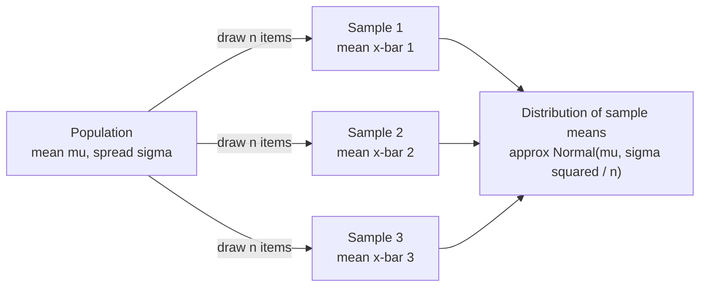

**🧪 Worked Example — Average of 36 dice rolls**

One die: μ = 3.5, σ = 1.71. Roll it **36 times** and take the average. How likely is the average to exceed 4?

<div class="page-break"></div>

```
The sample mean is ~ Normal with mean 3.5 and SD = σ/√n = 1.71/6 ≈ 0.285
Z = (4 − 3.5)/0.285 ≈ 1.76
P(mean > 4) = 1 − 0.9608 ≈ 0.039   (about 4%)
```
Even though a single die is *uniform* (not bell-shaped), the **average** is bell-shaped. That's the CLT.

**Why √n matters:** n = 4 → SD halves (÷2). n = 100 → SD ÷10. **To cut the noise in half you need 4× the data.**

### Concept 2: Z-Score (Standardizing)

**What it means:** How many standard deviations away from the mean?

**Formula:**
```
Z = (X - μ) / σ

Where:
- X = your value
- μ = population mean
- σ = population standard deviation
```

**Real example:**
- Height distribution: μ = 170, σ = 10
- Your height: 190 cm
- Z = (190 - 170) / 10 = 20/10 = 2
- You're 2 standard deviations above average (quite tall!)

**Why use it:** Z-scores let you compare different scales. Is a score of 85 on a test "better" than a height of 185? Convert both to Z-scores to compare!

**📐 Math notation**

$$
z = \frac{x - \mu}{\sigma},
\qquad
z_{\bar{x}} = \frac{\bar{x} - \mu}{\sigma / \sqrt{n}}
$$

**🧪 Worked Example — Which result is more impressive?**

| | Your score | Class mean μ | σ | Z = (X−μ)/σ |
|---|---|---|---|---|
| Maths | 85 | 70 | 10 | (85−70)/10 = **1.5** |
| Physics | 78 | 60 | 6 | (78−60)/6 = **3.0** |

The Maths mark is higher (85 > 78), but Physics is **3 σ above average** vs 1.5 σ. Physics is the stronger performance.

**Going backwards:** μ = 60, σ = 8, Z = −1.5 → X = μ + Zσ = 60 + (−1.5)(8) = **48**.

**Reading Z:** 0 = exactly average · ±1 = normal · ±2 = unusual (5%) · beyond ±3 = very rare (outlier).

<div class="page-break"></div>

### Concept 3: Confidence Intervals (Range of likely values)

**What it means:** Instead of guessing "the average is 170," we say "I'm 95% sure the average is between 168 and 172."

**Formula (for normal distribution with known σ):**
```
Confidence Interval = Sample average ± Z* × (σ/√n)

Where:
- Z* = critical value (1.96 for 95% confidence)
- σ = population standard deviation
- n = sample size
```

**Interpretation:** If you repeated this sampling 100 times, about 95 of those intervals would contain the true population mean.

**Real example:**
- Sample 100 students, average test score = 75
- Population standard deviation = 5
- 95% confidence interval = 75 ± 1.96 × (5/√100)
- = 75 ± 1.96 × 0.5 = 75 ± 0.98
- = [74.02, 75.98]
- Interpretation: 95% confident the true average is between 74 and 76

**📐 Math notation**

$$
\begin{gathered}
\bar{x} \pm z^{*}\,\frac{\sigma}{\sqrt{n}}\ \ (\sigma \text{ known}),
\qquad
\bar{x} \pm t^{*}_{n-1}\,\frac{s}{\sqrt{n}}\ \ (\sigma \text{ unknown})
\\[6pt]
z^{*} = 1.645\ (90\%),\quad 1.96\ (95\%),\quad 2.576\ (99\%)
\end{gathered}
$$

**🧪 Worked Example — What makes an interval narrower?**

Earlier: n = 100, x̄ = 75, σ = 5 → 75 ± 1.96 × 0.5 = **[74.02, 75.98]**.

| Change | Margin of error | Interval |
|---|---|---|
| n = 400 (4× data) | 1.96 × 5/√400 = **0.49** | [74.51, 75.49] |
| 99% confidence (Z* = 2.576), n = 100 | 2.576 × 0.5 = **1.29** | [73.71, 76.29] |
| 90% confidence (Z* = 1.645), n = 100 | 1.645 × 0.5 = **0.82** | [74.18, 75.82] |

**Rules:** more data → narrower. More confidence → wider (you're "safer" so you must cast a wider net).

**Reverse trick for exam questions:** given an interval [74.02, 75.98]: sample mean = midpoint = **75**, margin of error = half the width = **0.98**.

<div class="page-break"></div>

**Interpretation trap:** don't say "there's a 95% chance the true mean is in this interval". The true mean is fixed. The correct meaning: **this method** captures the true mean in 95% of repeated samples.

**💻 In code: a 95% t-interval**

```python
import numpy as np
from scipy import stats

data = np.array([52, 48, 55, 51, 49, 53, 50, 54])
n, m, s = len(data), data.mean(), data.std(ddof=1)
lo, hi = stats.t.interval(0.95, df=n - 1, loc=m, scale=s / np.sqrt(n))
print(float(m), round(float(s), 3), (round(float(lo), 2), round(float(hi), 2)))

# Output:
# 51.5 2.449 (49.45, 53.55)
```

### Concept 4: Hypothesis Tests (Did something change?)

**The question:** Data might show a change, but is it real or just random noise?

**The process:**
1. **Null hypothesis (H₀):** Nothing changed. The difference is due to randomness.
2. **Alternative hypothesis (H₁):** Something real changed.
3. **Test statistic:** Calculate a number that measures the difference.
4. **P-value:** What's the probability of seeing this difference if H₀ is true?
5. **Decision:** If P-value < 0.05, reject H₀ (the difference is real).

**📐 Math notation**

$$
H_0: \mu = \mu_0 \quad\text{vs}\quad H_1: \mu \ne \mu_0,
\qquad
\text{reject } H_0 \iff p\text{-value} < \alpha
$$

**🗺️ Diagram: the decision procedure**

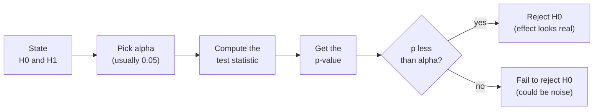

<div class="page-break"></div>

**🗺️ Diagram: which test do I run?**

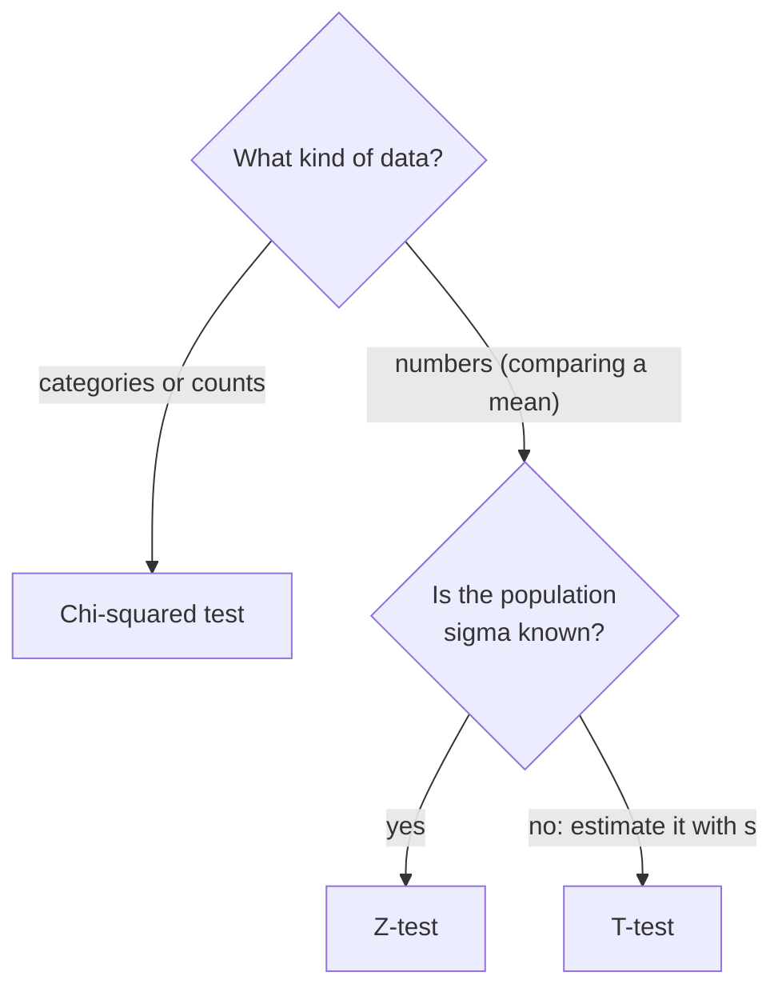

**🧪 Worked Example — Is the battery claim true? (all 5 steps)**

A company says its batteries last **500 hours** on average (known σ = 40). You test **64 batteries**: sample mean = **490 h**.

1. **H₀:** μ = 500 (claim is true). **H₁:** μ ≠ 500.
2. **Test statistic:** Z = (490 − 500) / (40/√64) = −10 / 5 = **−2**.
3. **P-value** (two-sided): 2 × P(Z < −2) = 2 × 0.0228 = **0.0455**.
4. **Decision at 5%:** 0.0455 < 0.05 → **reject H₀**. The batteries seem to fall short.
5. **But at 1%:** 0.0455 > 0.01 → we would **not** reject. The conclusion depends on how strict you choose to be *before* looking at the data.

<div class="page-break"></div>

**Two ways to be wrong:**
- **Type I error** (false alarm): rejecting a true H₀. Probability = α (e.g., 5%). *Court analogy: convicting an innocent person.*
- **Type II error** (miss): failing to reject a false H₀. *Acquitting a guilty person.*

**Wording:** we "reject H₀" or "fail to reject H₀". We never "prove H₀ true".

### Test 1: Z-Test (When you know the population standard deviation)

**When to use:** Comparing a sample mean to a known population mean.

**Formula:**
```
Z = (Sample average - Population mean) / (σ / √n)

Where:
- σ = population standard deviation
- n = sample size
```

**Example:** IQ test (population mean 100, population σ = 15). 
- You test 100 people: average = 105
- Z = (105 - 100) / (15 / √100) = 5 / 1.5 = 3.33
- This is very high (> 2), suggesting a real difference

**📐 Math notation**

$$
z = \frac{\bar{x} - \mu_0}{\sigma / \sqrt{n}}
$$

**🧪 Worked Example — Two quick z-tests**

**A) The IQ test from above:** Z = 3.33 → two-sided p-value = 2 × (1 − 0.9996) ≈ **0.0009** → far below 0.05 → **reject H₀**.

**B) Small difference:** n = 25, σ = 10, sample mean 53 vs claimed 50.
```
Z = (53 − 50) / (10/√25) = 3 / 2 = 1.5
Critical value (two-sided, 5%) = ±1.96   →  |1.5| < 1.96  → NOT significant
```
**Critical values to memorize:** two-sided 5% → **±1.96**. One-sided 5% → **1.645**. Two-sided 1% → **±2.576**.

**💻 In code: a two-sided z-test by hand**

```python
from math import sqrt
from scipy.stats import norm

xbar, mu0, sigma, n = 52, 50, 8, 64
z = (xbar - mu0) / (sigma / sqrt(n))
p = 2 * (1 - norm.cdf(abs(z)))              # two-sided p-value
print(round(z, 2), round(p, 4))             # p < 0.05 -> reject H0

# Output:
# 2.0 0.0455
```

<div class="page-break"></div>

### Test 2: T-Test (When you don't know the population standard deviation)

**When to use:** Most of the time! When you only have sample data.

**Formula:**
```
T = (Sample average - Population mean) / (s / √n)

Where:
- s = SAMPLE standard deviation (not population)
```

**Reality:** T-test is more conservative (harder to declare something significant) when samples are small.

**📐 Math notation**

$$
t = \frac{\bar{x} - \mu_0}{s / \sqrt{n}},
\qquad \mathrm{df} = n - 1
$$

**🧪 Worked Example — Raw data, σ unknown**

You measure 5 values: **48, 50, 52, 54, 56**. Test H₀: μ = 50.
```
Sample mean = 52
s² = [(48−52)² + (50−52)² + 0 + (54−52)² + (56−52)²] / (n−1)
   = (16 + 4 + 0 + 4 + 16) / 4 = 10      → s = 3.16     (note: divide by n−1)
SE = s/√n = 3.16/√5 = 1.414
t  = (52 − 50)/1.414 = 1.414              degrees of freedom = n − 1 = 4
```
Critical t (two-sided 5%, df = 4) = **2.776**. Since 1.414 < 2.776 → **fail to reject H₀**.

**Why is t stricter than z?** With only 5 data points, s is a shaky estimate of σ, so t demands stronger evidence (2.776 vs 1.96). With df = 30 it drops to 2.04, and as n grows it approaches 1.96.

**💻 In code: one-sample t-test**

```python
from scipy import stats

data = [12.1, 11.8, 12.6, 12.3, 12.9, 12.4]
res = stats.ttest_1samp(data, popmean=12.0)   # H0: true mean is 12.0
print(round(float(res.statistic), 3), round(float(res.pvalue), 4))

# Output:
# 2.236 0.0756
```

### Test 3: Chi-Squared Test (For categories)

**When to use:** Comparing observed counts to expected counts.

<div class="page-break"></div>

**Formula:**
```
χ² = Σ (Observed - Expected)² / Expected

Where:
- Sum over all categories
- Observed = actual count
- Expected = what we'd expect if H₀ true
```

**Example:** Coin flip 100 times:
- Expected: 50 heads, 50 tails
- Observed: 58 heads, 42 tails
- χ² = (58-50)²/50 + (42-50)²/50 = 64/50 + 64/50 = 2.56
- If χ² > 3.84 (critical value for 1 df), reject H₀

**📐 Math notation**

$$
\chi^{2} = \sum \frac{(O - E)^{2}}{E},
\qquad
\mathrm{df} = k - 1\ \text{(goodness of fit)},
\quad (r-1)(c-1)\ \text{(independence)}
$$

**🧪 Worked Example — Finish the coin, then test a die and a table**

**Coin from above:** χ² = 2.56, critical value = 3.84 → **2.56 < 3.84 → fail to reject H₀.** 58 heads out of 100 can easily happen by luck.

**Is this die fair?** Roll 60 times, expected 60/6 = 10 per face.

| Face | 1 | 2 | 3 | 4 | 5 | 6 |
|---|---|---|---|---|---|---|
| Observed | 5 | 8 | 9 | 8 | 10 | 20 |
| (O−E)²/E | 2.5 | 0.4 | 0.1 | 0.4 | 0 | 10 |

χ² = 13.4, df = categories − 1 = **5**, critical value (5%) = **11.07**. Since 13.4 > 11.07 → **reject H₀**: the die looks loaded towards 6.

**Independence test (2×2 table).** 100 people, tea vs coffee by gender:

| | Tea | Coffee | Row total |
|---|---|---|---|
| Men | 20 | 30 | 50 |
| Women | 30 | 20 | 50 |

Expected count for each cell = (row total × column total)/grand total = 50 × 50/100 = **25**.
χ² = 4 × (5²/25) = **4.0**, df = (rows−1)(cols−1) = **1**, critical = 3.84 → 4.0 > 3.84 → **reject H₀**: preference and gender appear related.

<div class="page-break"></div>

**💻 In code: goodness-of-fit test**

```python
from scipy.stats import chisquare

observed = [18, 22, 20, 40]          # counts seen in 4 categories
expected = [25, 25, 25, 25]          # counts expected if all are equally likely
stat, p = chisquare(observed, expected)
print(round(float(stat), 2), round(float(p), 4))

# Output:
# 12.32 0.0064
```

<div class="page-break"></div>

# PART 3: LINEAR ALGEBRA
## Matrices and Systems (10 marks)

Linear algebra is about grids of numbers and solving systems of equations. It's the language of ML.

---

## Chapter 1: Vectors and Matrices (Building blocks)

### Concept 1: Vectors (Lists of numbers)

**A vector is:** A column or row of numbers.

**Notation:**
```
Column vector:        Row vector:
v = [1]              v = [1  2  3]
    [2]
    [3]
```

**What it represents:** Direction and magnitude in space.

**📐 Math notation**

$$
\mathbf{v} = \begin{bmatrix} v_1 \\ v_2 \\ v_3 \end{bmatrix},
\qquad \|\mathbf{v}\| = \sqrt{v_1^2 + v_2^2 + v_3^2},
\qquad \mathbf{u}\cdot\mathbf{v} = \sum_i u_i v_i = \|\mathbf{u}\|\,\|\mathbf{v}\|\cos\theta
$$

**🧪 Worked Example — A student as a vector, plus the 4 vector skills**

Marks in (Maths, Physics, English) → **s = [80, 90, 70]**. A vector is just an ordered list.

Let **a = [1, 2, 3]** and **b = [4, 5, 6]**:
```
Add:            a + b  = [1+4, 2+5, 3+6]     = [5, 7, 9]
Scale:          2a     = [2, 4, 6]
Dot product:    a · b  = 1×4 + 2×5 + 3×6     = 32     (multiply pairs, then add → one number)
Length (norm):  ||a||  = √(1² + 2² + 3²) = √14 ≈ 3.74
```
**Perpendicular test:** two vectors are perpendicular (orthogonal) exactly when their dot product is 0. Example: [1, 2] · [2, −1] = 2 − 2 = **0** → perpendicular.

You'll use the dot product again in projections and in every neuron (w · x).

### Concept 2: Matrices (Grids of numbers)

**A matrix is:** A rectangular grid of numbers.

<div class="page-break"></div>

```
A = [1  2  3]  ← 3 elements, row 1
    [4  5  6]  ← 3 elements, row 2
    [7  8  9]  ← 3 elements, row 3

↓  ↓  ↓
Col1 Col2 Col3

This is a 3×3 matrix (3 rows, 3 columns)
```

**Notation:** A_{ij} means element in row i, column j.
- A_{2,3} = 6 (row 2, column 3)

**📐 Math notation**

$$
A \in \mathbb{R}^{m \times n}
= \begin{bmatrix} a_{11} & a_{12} & \cdots & a_{1n} \\ a_{21} & a_{22} & \cdots & a_{2n} \\ \vdots & & \ddots & \vdots \\ a_{m1} & a_{m2} & \cdots & a_{mn} \end{bmatrix}
\qquad (m \text{ rows},\ n \text{ columns})
$$

**🧪 Worked Example — A sales table is a matrix**

Rows = stores, columns = products (units sold last week):
```
              Pens  Books  Bags
Store 1  [    10     5     8  ]
Store 2  [     7    12     3  ]      → A is 2×3  (2 rows, 3 columns, 6 entries)
```
- **A₁,₃ = 8** → Store 1 sold 8 bags. (Say it "row, column": row first!)
- **A₂,₂ = 12** → Store 2 sold 12 books.
- **Transpose Aᵀ** is 3×2: the rows become columns.

### Concept 3: Matrix Operations

**Addition/Subtraction:** Add element by element
```
[1 2]   [5 6]   [1+5  2+6]   [6  8]
[3 4] + [7 8] = [3+7  4+8] = [10 12]
```

**Multiplication by scalar (just a number):**
```
2 × [1 2]   [2  4]
    [3 4] = [6  8]
```

**Matrix multiplication:** This is tricky!

<div class="page-break"></div>

```
A (2×3) × B (3×2) = C (2×2)

Rule: Element (i,j) of result = (row i of A) · (column j of B)

Example:
[1 2 3]     [1 2]
[4 5 6]  ×  [3 4]
            [5 6]

First element = (row 1) · (col 1) = 1×1 + 2×3 + 3×5 = 22
```

**Key rule:** Number of columns in A must equal number of rows in B!

**📐 Math notation**

$$
\begin{gathered}
(AB)_{ij} = \sum_{k} A_{ik} B_{kj},
\qquad (AB)^{T} = B^{T} A^{T},
\qquad (AB)^{-1} = B^{-1} A^{-1}
\\[6pt]
\det\begin{bmatrix} a & b \\ c & d \end{bmatrix} = ad - bc,
\qquad
\begin{bmatrix} a & b \\ c & d \end{bmatrix}^{-1} = \frac{1}{ad - bc}\begin{bmatrix} d & -b \\ -c & a \end{bmatrix}
\end{gathered}
$$

**🧪 Worked Example — Matrix multiplication with a shopping story**

Two shops buy 3 items. **A** = quantities (rows = shops). **B** = prices (columns = two suppliers).
```
A (2×3) = [1 2 3]      B (3×2) = [1 2]     ← price of item1 at supplier 1, supplier 2
          [4 5 6]                [3 4]
                                 [5 6]

Shop 1 at supplier 1: 1×1 + 2×3 + 3×5 = 22
Shop 1 at supplier 2: 1×2 + 2×4 + 3×6 = 28
Shop 2 at supplier 1: 4×1 + 5×3 + 6×5 = 49
Shop 2 at supplier 2: 4×2 + 5×4 + 6×6 = 64

C = AB = [22 28]
         [49 64]
```
**Size rule:** (2×3)(3×2) = 2×2 ✓. (3×2)(2×3) = 3×3 (different!). (2×3)(2×3) is **impossible** (3 ≠ 2).

**Order matters (AB ≠ BA):**
```
A = [1 2]   B = [0 1]     AB = [2 1]     BA = [3 4]
    [3 4]       [1 0]          [4 3]          [1 2]
```
(Multiplying by B on the right swaps A's *columns*; on the left it swaps A's *rows*.)

<div class="page-break"></div>

**💻 In code: matrix arithmetic in NumPy**

```python
import numpy as np

A = np.array([[1, 2], [3, 4]])
B = np.array([[0, 1], [1, 0]])
print(A @ B)                      # matrix product
print(B @ A)                      # different! order matters
print(A.T)                        # transpose
print(round(float(np.linalg.det(A)), 3))
print(np.linalg.inv(A).round(3))

# Output:
# [[2 1]
#  [4 3]]
# [[3 4]
#  [1 2]]
# [[1 3]
#  [2 4]]
# -2.0
# [[-2.   1. ]
#  [ 1.5 -0.5]]
```

### Concept 4: Special Matrices

| Matrix | What it is | Example |
|---|---|---|
| **Identity Matrix (I)** | 1's on diagonal, 0's elsewhere. When you multiply by I, nothing changes. | [1 0] |
| | | [0 1] |
| **Diagonal Matrix** | Non-zero values only on diagonal | [2 0] |
| | | [0 3] |
| **Symmetric Matrix** | Transpose equals itself: A^T = A | [1 2] = [1 2] |
| | | [2 3]   [2 3] |
| **Transpose (A^T)** | Flip rows and columns | A = [1 2] → A^T = [1 3] |
| | | [3 4]      [2 4] |

**📐 Math notation**

$$
AI = IA = A,
\qquad A^{T} = A\ \text{(symmetric)},
\qquad Q^{T}Q = I\ \text{(orthogonal)},
\qquad \det(AB) = \det(A)\det(B)
$$

<div class="page-break"></div>

**🧪 Worked Example — See each special matrix in action**

- **Identity does nothing:**
```
[1 0] [2 3]   [2 3]
[0 1] [4 5] = [4 5]
```
- **Symmetric or not?** [[1, 2], [2, 3]] is symmetric (mirror across the diagonal) ✓. [[1, 2], [3, 4]] is **not** (2 ≠ 3).
- **Transpose of a 2×3:**
```
[1 2 3]ᵀ   [1 4]
[4 5 6]  = [2 5]        (shape 2×3 becomes 3×2)
           [3 6]
```
- **Diagonal matrices are easy:** diag(2, 3) × [1, 1]ᵀ = [2, 3]ᵀ, and diag(2, 3)² = diag(4, 9) (just square the diagonal).
- **Trace** = sum of diagonal entries: trace of [[3, 1], [1, 3]] = **6**.

## Chapter 2: Solving Systems of Equations

### Concept 1: System of Linear Equations

**What it is:** Multiple equations with multiple unknowns.

```
2x + 3y = 8
x - y = 1

In matrix form:
[2  3] [x]   [8]
[1 -1] [y] = [1]

Written as: Ax = b
```

**📐 Math notation**

$$
A\mathbf{x} = \mathbf{b}
\quad\Longleftrightarrow\quad
\begin{bmatrix} a_{11} & a_{12} \\ a_{21} & a_{22} \end{bmatrix}
\begin{bmatrix} x_1 \\ x_2 \end{bmatrix}
= \begin{bmatrix} b_1 \\ b_2 \end{bmatrix}
$$

**🧪 Worked Example — From a shop bill to Ax = b**

"2 apples + 3 bananas cost ₹8. An apple costs ₹1 more than a banana." Let x = apple price, y = banana price.
```
2x + 3y = 8          [2  3] [x]   [8]
 x −  y = 1    →     [1 −1] [y] = [1]     i.e.  A x = b
```

<div class="page-break"></div>

Solution (found with elimination below): **x = 2.2, y = 1.2**.
Check: 2(2.2) + 3(1.2) = 4.4 + 3.6 = **8** ✓ and 2.2 − 1.2 = **1** ✓.

**How to read the matrix:** each *row* of A is one equation, each *column* belongs to one unknown.

### Concept 2: Gaussian Elimination (Step-by-step solving)

**The idea:** Transform the system into triangular form, then solve backwards.

**Process:**
1. Write augmented matrix [A|b]
2. Use row operations to make lower triangle zero
3. Back-substitute to find unknowns

**Example:**
```
System:           Augmented:        After elimination:
2x + 3y = 8      [2  3 | 8]        [2  3 | 8]
x - y = 1        [1 -1 | 1]        [0 -2.5| -3]

From row 2: -2.5y = -3, so y = 1.2
From row 1: 2x + 3(1.2) = 8, so 2x = 4.4 and x = 2.2
```

**📐 Math notation**

$$
[A \mid \mathbf{b}]
\ \xrightarrow{\text{row operations}}\ 
[U \mid \mathbf{c}]
\ \xrightarrow{\text{back-substitution}}\ 
\mathbf{x}
$$

**🗺️ Diagram: elimination, then back-substitution**

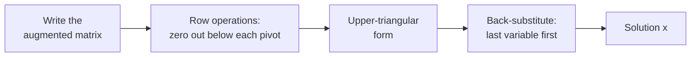

**🧪 Worked Example — A full 3×3 solve**

```
 x +  y +  z =  6
      2y + 5z = −4
2x + 5y −  z = 27
```
Augmented matrix, then eliminate below each pivot:
```
[1 1  1 |  6]                     [1 1  1 |  6]                     [1 1   1   |  6 ]
[0 2  5 | −4]   R3 ← R3 − 2·R1    [0 2  5 | −4]   R3 ← R3 − 1.5·R2  [0 2   5   | −4 ]
[2 5 −1 | 27]   ─────────────►    [0 3 −3 | 15]   ─────────────►    [0 0 −10.5 | 21 ]
```
**Back-substitute (bottom to top):**
```
−10.5 z = 21          → z = −2
2y + 5(−2) = −4       → y = 3
x + 3 + (−2) = 6      → x = 5            Answer: (5, 3, −2)
```
**Check in the original equations:** 5+3−2 = 6 ✓; 6−10 = −4 ✓; 10+15+2 = 27 ✓.

<div class="page-break"></div>

**Only 3 moves are allowed:** swap two rows · multiply a row by a non-zero number · add a multiple of one row to another.

**💻 In code: let NumPy solve the system**

```python
import numpy as np

A = np.array([[2, 3], [1, -1]], dtype=float)    # 2x + 3y = 8,  x - y = 1
b = np.array([8, 1], dtype=float)
print(np.linalg.solve(A, b))                    # [x, y]

# Output:
# [2.2 1.2]
```

### Concept 3: Solution Types

| Type | How many solutions? | What it means | Example |
|---|---|---|---|
| **Unique solution** | Exactly 1 | Equations intersect at one point | 2x + y = 5, x = 2 → (2,1) |
| **Infinite solutions** | Infinitely many | Equations describe same line | 2x + y = 5, 4x + 2y = 10 |
| **No solution** | 0 | Equations describe parallel lines | 2x + y = 5, 2x + y = 6 |

**📐 Math notation**

$$
\begin{cases}
\operatorname{rank}(A) < \operatorname{rank}([A \mid \mathbf{b}]) & \Rightarrow \text{no solution} \\
\operatorname{rank}(A) = \operatorname{rank}([A \mid \mathbf{b}]) = n & \Rightarrow \text{exactly one solution} \\
\operatorname{rank}(A) = \operatorname{rank}([A \mid \mathbf{b}]) < n & \Rightarrow \text{infinitely many solutions}
\end{cases}
\qquad (n = \text{number of unknowns})
$$

<div class="page-break"></div>

**🗺️ Diagram: how many solutions?**

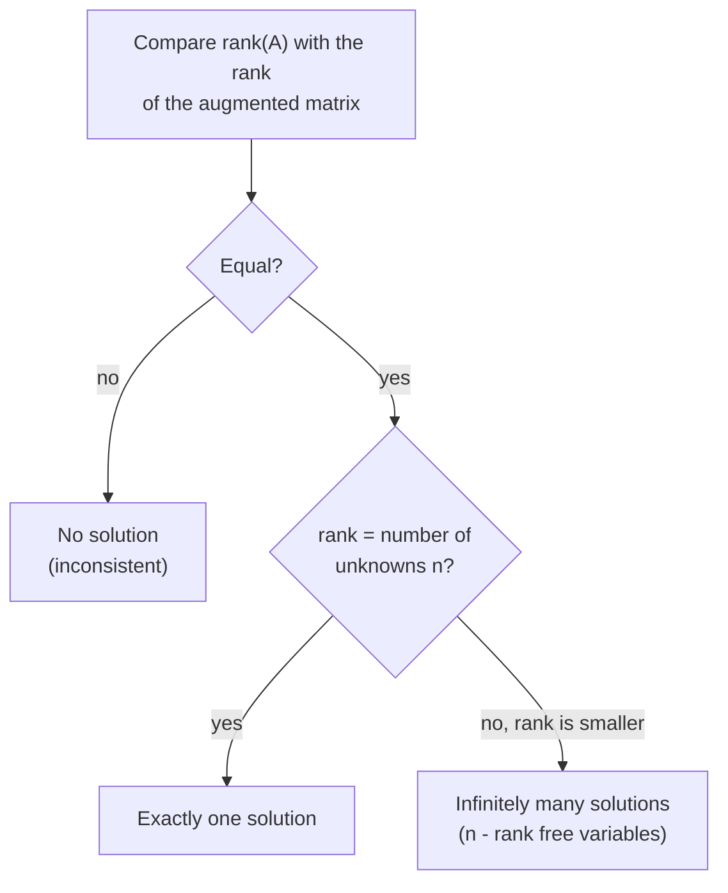

<div class="page-break"></div>

**🧪 Worked Example — What elimination tells you**

| System | After elimination | Meaning |
|---|---|---|
| 2x + y = 5, x = 2 | x = 2, y = 1 | **Unique**: (2, 1) |
| 2x + y = 5, 4x + 2y = 10 | R2 − 2·R1 → **0 = 0** | **Infinite**: one free variable. Points: (0,5), (1,3), (2,1), … i.e. y = 5 − 2x |
| 2x + y = 5, 2x + y = 6 | R2 − R1 → **0 = 1** | **No solution** (contradiction) |

**Rank test (great for MCQs):** compare rank(A), rank([A|b]) and n (number of unknowns).
- rank(A) = rank([A|b]) = n → **unique**
- rank(A) = rank([A|b]) < n → **infinitely many**
- rank(A) < rank([A|b]) → **none**

For the middle row above: A = [[2,1],[4,2]] has rank 1, [A|b] also rank 1, and n = 2 → 1 < 2 → infinite.

## Chapter 3: Rank and Dimension

### Concept 1: Rank (How much info does the matrix have?)

**What it means:** The number of linearly independent rows (or columns).

**In plain English:** How many unique pieces of information are in this matrix?

**Example:**
```
Matrix: [1 2 3]
        [2 4 6]

Rank = 1, because row 2 = 2 × row 1 (it's redundant)
```

**Importance:** If rank < number of unknowns, the system has infinite solutions or no solution.

**📐 Math notation**

$$
\operatorname{rank}(A) = \#\text{pivots} = \dim\operatorname{col}(A) = \dim\operatorname{row}(A),
\qquad \operatorname{rank}(A) \le \min(m, n)
$$

**🧪 Worked Example — Counting non-redundant rows**

```
[1 2 3]   R2 − 2·R1   [1 2 3]   R3 − R1   [1  2  3]
[2 4 6]   ─────────►  [0 0 0]   ───────►  [0  0  0]      (reorder rows)
[1 1 1]               [1 1 1]             [0 −1 −2]

Two non-zero rows remain → rank = 2
```
- I₃ (3×3 identity) → rank **3**. Zero matrix → rank **0**. Rank can never exceed min(rows, columns).
- [[1,2],[3,4]]: rows are not multiples of each other → rank **2** (full rank, invertible).

<div class="page-break"></div>

**Real-life meaning:** if a dataset has a column "height in cm" and another "height in inches", one column is a multiple of the other → rank drops → the regression formula (XᵀX)⁻¹ **breaks** (no inverse exists).

**💻 In code: rank and nullity**

```python
import numpy as np
from scipy.linalg import null_space

A = np.array([[1, 2, 3], [2, 4, 6], [1, 0, 1]])   # row 2 = 2 * row 1
r = np.linalg.matrix_rank(A)
print("rank:", r, " nullity:", A.shape[1] - r)
print(null_space(A).round(3).T)                   # a basis vector of the null space

# Output:
# rank: 2  nullity: 1
# [[-0.577 -0.577  0.577]]
```

### Concept 2: Nullity

**What it means:** Number of free variables (dimension of the solution space).

**Formula:**
```
rank(A) + nullity(A) = number of columns
```

**Example:**
```
Matrix A: 3×4 (3 rows, 4 columns)
Rank = 2
Nullity = 4 - 2 = 2 (two free variables)
```

**📐 Math notation**

$$
\operatorname{null}(A) = \{\mathbf{x} : A\mathbf{x} = \mathbf{0}\},
\qquad
\operatorname{rank}(A) + \operatorname{nullity}(A) = n
$$

**🗺️ Diagram: rank-nullity theorem**

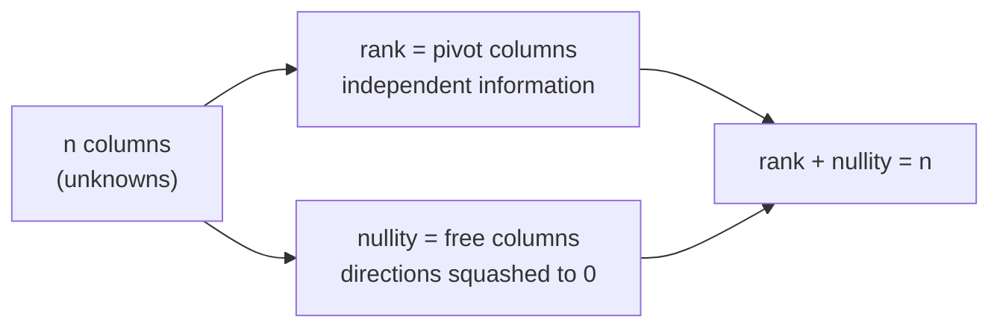

**🧪 Worked Example — Find the free variables**

A (3×4) = [[1, 2, 0, 1], [0, 0, 1, 1], [1, 2, 1, 2]]. Solve **Ax = 0**.

<div class="page-break"></div>

```
R3 − R1 − R2 = [0 0 0 0]  → rank = 2,   columns n = 4   →   nullity = 4 − 2 = 2
Pivots are in columns 1 and 3; columns 2 and 4 are FREE (call them s and t).
Row 2:  x3 + x4 = 0      → x3 = −t
Row 1:  x1 + 2x2 + x4 = 0 → x1 = −2s − t
General solution: x = s·(−2, 1, 0, 0) + t·(−1, 0, −1, 1)
```
Two independent building-block vectors = **two dimensions** = nullity 2.
**Check one:** A·(−2,1,0,0): row1 → −2+2 = 0 ✓, row2 → 0 ✓, row3 → −2+2 = 0 ✓.

---

## Chapter 4: Eigenvalues and Eigenvectors

### Concept 1: What are they?

**Eigenvector:** A direction that doesn't change when the matrix multiplies it.

**Eigenvalue:** The scaling factor.

```
Av = λv

A = matrix
v = eigenvector
λ (lambda) = eigenvalue

Meaning: Multiplying the matrix by this special vector just scales it.
```

**📐 Math notation**

$$
A\mathbf{v} = \lambda\mathbf{v},\qquad \mathbf{v} \ne \mathbf{0}
$$

**🧪 Worked Example — Which vectors are "special"?**

A = [[2, 0], [0, 3]] (stretches x by 2 and y by 3).
```
A·[1, 0] = [2, 0] = 2·[1, 0]   →  [1,0] is an eigenvector, eigenvalue 2
A·[0, 1] = [0, 3] = 3·[0, 1]   →  [0,1] is an eigenvector, eigenvalue 3
A·[1, 1] = [2, 3]   ≠ any multiple of [1, 1]  → NOT an eigenvector (its direction changed!)
```
**Symmetric check:** B = [[3,1],[1,3]] and v = [1,1] → Bv = [4,4] = **4**·v ✓ (eigenvalue 4).

**Two shortcuts worth a mark each time:**
- **Sum of eigenvalues = trace**, and **product of eigenvalues = determinant**. For B: 4 + 2 = 6 = 3+3 ✓ and 4 × 2 = 8 = 3·3 − 1·1 ✓.
- Eigenvalues of A² are the squares: B² has eigenvalues 16 and 4. **An eigenvalue of 0 means the matrix is singular** (det = 0).

### Concept 2: Finding them

**Formula:**
```
det(A - λI) = 0

This is called the characteristic equation.
```

<div class="page-break"></div>

**Process:**
1. Write A - λI
2. Calculate determinant
3. Solve for λ (these are eigenvalues)
4. For each λ, solve (A - λI)v = 0 to find eigenvectors

**Example:**
```
A = [3 1]
    [1 3]

A - λI = [3-λ  1  ]
         [1   3-λ]

det = (3-λ)² - 1 = 0
λ² - 6λ + 8 = 0
λ = 4 or λ = 2

Eigenvectors: [1,1] for λ=4, [1,-1] for λ=2
```

**📐 Math notation**

$$
\begin{gathered}
\det(A - \lambda I) = 0,
\qquad (A - \lambda I)\mathbf{v} = \mathbf{0}
\\[6pt]
\text{Checks: } \sum_i \lambda_i = \operatorname{tr}(A),
\qquad \prod_i \lambda_i = \det(A)
\end{gathered}
$$

**🗺️ Diagram: eigen-recipe**

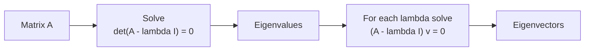

**🧪 Worked Example — Start to finish on a new matrix**

**Reminder:** determinant of a 2×2 [[a, b], [c, d]] is **ad − bc**.

A = [[4, 1], [2, 3]].
```
det(A − λI) = (4−λ)(3−λ) − (1)(2) = λ² − 7λ + 10 = 0
→ (λ − 5)(λ − 2) = 0  →  λ = 5 or λ = 2
Quick check: sum 5+2 = 7 = trace ✓,  product 5×2 = 10 = det ✓
```
**Eigenvector for λ = 5:** (A − 5I) v = 0
```
[−1  1] [x]   [0]   →  −x + y = 0  →  y = x   →  v = [1, 1]
[ 2 −2] [y] = [0]
```
**Eigenvector for λ = 2:** (A − 2I) = [[2, 1], [2, 1]] → 2x + y = 0 → v = [1, −2].
Verify: A·[1, −2] = [4−2, 2−6] = [2, −4] = 2·[1, −2] ✓.

**Triangular shortcut:** for a triangular (or diagonal) matrix the eigenvalues are simply the diagonal entries. [[2, 1], [0, 5]] → λ = **2, 5**.

**Quick formula for 2×2:** λ² − (trace)λ + det = 0.

<div class="page-break"></div>

**💻 In code: eigenvalues and eigenvectors**

```python
import numpy as np

A = np.array([[3, 1], [1, 3]], dtype=float)
vals, vecs = np.linalg.eig(A)
print(vals.round(3))
print(vecs.round(3))                              # columns are the eigenvectors
v = vecs[:, 0]
print(np.allclose(A @ v, vals[0] * v))            # A v = lambda v

# Output:
# [4. 2.]
# [[ 0.707 -0.707]
#  [ 0.707  0.707]]
# True
```

## Chapter 5: Matrix Decompositions

### Decomposition 1: LU Decomposition

**What it does:** Splits A into L (lower triangle) and U (upper triangle).

```
A = LU

L = [1  0  0]     U = [u11 u12 u13]
    [l21 1  0]         [0  u22 u23]
    [l31 l32 1]        [0   0  u33]

Used for: Solving Ax=b efficiently, especially when b changes multiple times.
```

**📐 Math notation**

$$
A = LU
\qquad
A\mathbf{x} = \mathbf{b} \ \Rightarrow\ L\mathbf{y} = \mathbf{b}\ \text{(forward)},\ \ U\mathbf{x} = \mathbf{y}\ \text{(backward)}
$$

**🧪 Worked Example — Factor once, solve many times**

A = [[2, 1], [6, 8]]. Eliminate: R2 ← R2 − **3**·R1 (the multiplier 3 = 6/2).
```
U = [2 1]     L = [1 0]     Check:  L·U = [2      1  ]  = [2 1] = A ✓
    [0 5]         [3 1]                   [6  3+5=8 ]    [6 8]
```
(L simply *stores the multipliers* used during elimination.)

**Solve Ax = b for b = [5, 14]** in two easy triangular steps:
```
Step 1 – Forward:  L y = b       y1 = 5;   3(5) + y2 = 14  →  y2 = −1
Step 2 – Backward: U x = y       5·x2 = −1 → x2 = −0.2;   2·x1 + (−0.2) = 5 → x1 = 2.6
Answer: x = [2.6, −0.2]        Check: 6(2.6) + 8(−0.2) = 15.6 − 1.6 = 14 ✓
```
If tomorrow b changes, you reuse L and U and do just the two cheap steps.

<div class="page-break"></div>

**💻 In code: LU with SciPy**

```python
import numpy as np
from scipy.linalg import lu

A = np.array([[2, 1, 1], [4, 3, 3], [8, 7, 9]], dtype=float)
P, L, U = lu(A)                    # P = row swaps (partial pivoting)
print(L.round(3))
print(U.round(3))
print(np.allclose(P @ L @ U, A))   # True: the pieces rebuild A

# Output:
# [[1.    0.    0.   ]
#  [0.25  1.    0.   ]
#  [0.5   0.667 1.   ]]
# [[ 8.     7.     9.   ]
#  [ 0.    -0.75  -1.25 ]
#  [ 0.     0.    -0.667]]
# True
```

### Decomposition 2: Singular Value Decomposition (SVD)

**What it does:** Splits A into three simpler matrices.

```
A = UΣV^T

Where:
- U = matrix of left singular vectors
- Σ (sigma) = diagonal matrix of singular values (always non-negative!)
- V^T = transpose of matrix of right singular vectors

All of these are special orthogonal matrices.
```

**What it means:** A is broken into "layers" of importance. The first singular value tells you the most important direction, the second tells you the second most important, etc.

**Real example:** Image compression
- An image is a matrix of pixel values
- SVD breaks it into components
- Keeping the top few components recreates ~95% of the image with 10% of the data

**Formula for variance explained:**
```
Variance explained by component i = σ_i² / Σ σ_j²

Where σ_i = i-th singular value (use the SQUARES of the singular values)
```

**📐 Math notation**

$$
\begin{gathered}
A = U\,\Sigma\,V^{T},
\qquad \sigma_1 \ge \sigma_2 \ge \cdots \ge 0
\\[6pt]
\text{variance explained by the top } k:\quad
\frac{\sum_{i=1}^{k}\sigma_i^{2}}{\sum_{i}\sigma_i^{2}}
\end{gathered}
$$

<div class="page-break"></div>

**🗺️ Diagram: what A does to a vector**

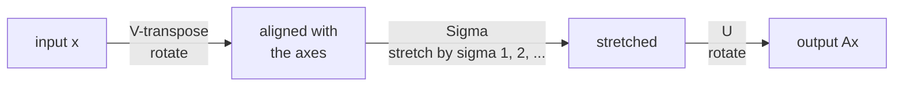

**🧪 Worked Example — Keeping the important layers**

**Non-negative rule:** A = [[3, 0], [0, −2]] has singular values **3 and 2** (the −2 becomes 2; singular values are never negative).

**Link to eigenvalues:** singular values = √(eigenvalues of AᵀA). Here AᵀA = diag(9, 4) → √ → 3, 2 ✓.

**Variance/"energy" kept** (use the *squares* σᵢ²): singular values [10, 3, 1]
```
Squares: 100, 9, 1   → total 110
Keep only the first component:  100/110 ≈ 90.9%
Keep the first two:             109/110 ≈ 99.1%
```
**Image compression:** a 100×100 image stores 10,000 numbers. Keeping the top k = 5 components stores about k(m + n + 1) = 5 × 201 = **1,005 numbers (≈10%)** and often looks nearly identical.

**💻 In code: SVD and variance explained**

```python
import numpy as np

A = np.array([[3, 0], [4, 5]], dtype=float)
U, s, Vt = np.linalg.svd(A)
print(s.round(4))                              # singular values, largest first
print((U @ np.diag(s) @ Vt).round(4))          # rebuilds A
print((s**2 / (s**2).sum()).round(4))          # variance explained per component

# Output:
# [6.7082 2.2361]
# [[3. 0.]
#  [4. 5.]]
# [0.9 0.1]
```

## Chapter 6: Projections and Least Squares

### Concept 1: Projection (Casting a shadow)

**What it means:** Drop a perpendicular from point P onto line L. Where it lands is the projection.

**Formula for projecting vector b onto vector a:**
```
proj_a(b) = (b·a / a·a) × a

In matrix form: proj = a(a^T a)^{-1}a^T b
```

<div class="page-break"></div>

**📐 Math notation**

$$
\operatorname{proj}_{\mathbf{a}}\mathbf{b} = \frac{\mathbf{a}\cdot\mathbf{b}}{\mathbf{a}\cdot\mathbf{a}}\ \mathbf{a}
$$

**🧪 Worked Example — The shadow of a vector**

Project **b = [2, 3]** onto **a = [1, 1]** (the 45° line).
```
b·a = 2×1 + 3×1 = 5        a·a = 1 + 1 = 2
proj = (5/2) × [1, 1] = [2.5, 2.5]
Error e = b − proj = [−0.5, 0.5]        e·a = −0.5 + 0.5 = 0  ✓ perpendicular
```
**Easiest case:** project [3, 4] onto the x-axis a = [1, 0] → (3/1)·[1, 0] = **[3, 0]** (just drop the y-part).

**Key idea:** the projection is the *closest* point on the line to b, and the leftover error is perpendicular to the line.

**💻 In code: projecting b onto a**

```python
import numpy as np

a = np.array([1.0, 1.0]); b = np.array([3.0, 1.0])
proj = (a @ b) / (a @ a) * a
print(proj, b - proj)             # the shadow, and the leftover part
print((b - proj) @ a)             # 0.0 -> the leftover is perpendicular to a

# Output:
# [2. 2.] [ 1. -1.]
# 0.0
```

### Concept 2: Projection onto subspace

**Formula for projecting b onto the column space of A:**
```
Projection = A(A^T A)^{-1}A^T b

The matrix P = A(A^T A)^{-1}A^T is called the projection matrix.
```

**📐 Math notation**

$$
P = A\,(A^{T}A)^{-1}A^{T},
\qquad \operatorname{proj}_{\operatorname{col}(A)}\mathbf{b} = P\mathbf{b},
\qquad P^{2} = P,\ \ P^{T} = P
$$

**🧪 Worked Example — Shadow on the floor**

Let the subspace be the x–y plane, with A having columns [1,0,0] and [0,1,0]. Project **b = [3, 4, 5]**.
```
AᵀA = I  →  P = A(AᵀA)⁻¹Aᵀ = AAᵀ = [1 0 0]
                                   [0 1 0]
                                   [0 0 0]
P × b = [3, 4, 0]           (the height 5 is dropped)
```

<div class="page-break"></div>

**Two properties of any projection matrix:** P² = P (projecting twice = projecting once) and P is symmetric (Pᵀ = P). Check: diag(1,1,0)² = diag(1,1,0) ✓.

### Concept 3: Least Squares (Best-fit line)

**The problem:** You have data points that don't lie on a line. Find the best-fit line.

**Solution:** Find x that minimizes ||Ax - b||²

**Formula:**
```
x_optimal = (A^T A)^{-1} A^T b

This gives the "least squares" solution: the line that minimizes total squared error.
```

**📐 Math notation**

$$
\hat{\mathbf{x}} = \arg\min_{\mathbf{x}} \|A\mathbf{x} - \mathbf{b}\|^{2}
\ \Longrightarrow\ A^{T}A\,\hat{\mathbf{x}} = A^{T}\mathbf{b}
\ \Longrightarrow\ \hat{\mathbf{x}} = (A^{T}A)^{-1}A^{T}\mathbf{b}
$$

**🧪 Worked Example — Best line through 3 points**

Points: (1, 1), (2, 2), (3, 2). No single line passes through all three. Fit y = c + m·x.
```
A = [1 1]      b = [1]       AᵀA = [3  6]      Aᵀb = [ 5]
    [1 2]          [2]             [6 14]            [11]
    [1 3]          [2]

Solve  3c + 6m = 5   and   6c + 14m = 11
→ subtract 2×(first) from second: 2m = 1 → m = 0.5,  c = (5 − 3)/3 = 0.667

Best line: y = 0.667 + 0.5x
```
**Residuals** (actual − predicted): 1 − 1.167 = −0.167, 2 − 1.667 = +0.333, 2 − 2.167 = −0.167. They add to 0, and this line has the smallest possible sum of squares (0.167).

**💻 In code: best-fit line via least squares**

```python
import numpy as np

x = np.array([1, 2, 3]); y = np.array([1, 2, 2])
A = np.column_stack([np.ones_like(x), x])          # columns: intercept, slope
w, *_ = np.linalg.lstsq(A, y, rcond=None)
print(w.round(4))                                   # [intercept, slope]

# Output:
# [0.6667 0.5   ]
```

<div class="page-break"></div>

# PART 4: CALCULUS
## Rates of Change (7.7 marks)

Calculus is about understanding how things change. It's everywhere in ML: optimization, gradients, learning rates.

---

## Chapter 1: Limits and Continuity

### Concept 1: Limits (Approaching a value)

**What it means:** What value does f(x) approach as x gets close to some point?

**Notation:**
```
lim(x→a) f(x) = L

Reads: "The limit of f(x) as x approaches a equals L"
```

**Example:**
```
f(x) = x² 
lim(x→2) x² = 4

As x gets close to 2, x² gets close to 4.
```

**Trap:** The limit is about approaching, not necessarily about the value at that point!

**📐 Math notation**

$$
\lim_{x \to a} f(x) = L,
\qquad
\lim_{x \to 0}\frac{\sin x}{x} = 1,
\qquad
\lim_{x \to \infty}\frac{1}{x} = 0
$$

**🧪 Worked Example — A limit at a "hole"**

f(x) = (x² − 1)/(x − 1) is **undefined** at x = 1 (0/0). But what does it *approach*?

| x | 0.9 | 0.99 | 0.999 | → 1 ← | 1.001 | 1.01 | 1.1 |
|---|---|---|---|---|---|---|---|
| f(x) | 1.9 | 1.99 | 1.999 | ? | 2.001 | 2.01 | 2.1 |

**Algebra shortcut:** (x−1)(x+1)/(x−1) = x + 1 → at x → 1 this is **2**. So lim = 2 even though f(1) doesn't exist.

**When a limit does NOT exist:** f(x) = |x|/x. From the left it's −1, from the right it's +1 → the two sides disagree → **no limit** at 0.

**Limits at infinity:** lim(x→∞) 1/x = 0 (bigger x, smaller value).

<div class="page-break"></div>

**💻 In code: limits with SymPy**

```python
import sympy as sp

x = sp.symbols("x")
print(sp.limit(sp.sin(x) / x, x, 0))              # 1
print(sp.limit((x**2 - 1) / (x - 1), x, 1))       # 2  (the hole at x = 1 is "filled in")
print(sp.limit(1 / x, x, sp.oo))                  # 0

# Output:
# 1
# 2
# 0
```

### Concept 2: Continuity (No breaks)

**What it means:** A function is continuous at a point if:
1. f(a) is defined
2. The limit as x→a exists
3. The limit equals f(a)

**In plain English:** The graph has no holes or jumps at that point.

**📐 Math notation**

$$
f \text{ is continuous at } a
\iff
\lim_{x \to a} f(x) = f(a)
$$

**🧪 Worked Example — Run the 3-point check**

f(x) = (x² − 1)/(x − 1) at x = 1:
1. Is f(1) defined? **No** → not continuous at 1 (a "hole").
2. Repair it: define f(1) = 2. Now f(1) exists, the limit is 2, they match → **continuous** (a *removable* discontinuity).

**Jump example:** the "round down" (floor) function jumps from 0 to 1 at x = 1 → left limit 0, right limit 1 → **not continuous**.

**ML link:** ReLU, f(x) = max(0, x), is continuous everywhere but has a sharp corner at 0, so it is **not differentiable at 0** (continuous does not imply differentiable). Polynomials, eˣ and sin x are continuous everywhere.

<div class="page-break"></div>

## Chapter 2: Derivatives (Slope and rates)

### Concept 1: Derivative (Instantaneous rate of change)

**The question:** How fast is something changing at this moment?

**Formal definition:**
```
f'(a) = lim(h→0) [f(a+h) - f(a)] / h

Reads: "f prime of a"

Meaning: Take a tiny step h, see how much f changes, divide by h, and take the limit as h→0.
```

**Geometric meaning:** The slope of the tangent line to the curve at point a.

**Real example:** Position over time
- f(t) = position at time t
- f'(t) = velocity (rate of change of position)
- f''(t) = acceleration (rate of change of velocity)

**📐 Math notation**

$$
f'(x) = \lim_{h \to 0}\frac{f(x+h) - f(x)}{h} = \frac{dy}{dx}
$$

**🧪 Worked Example — Slope of f(x) = x² at x = 3, from the definition**

```
f'(3) = lim(h→0) [ (3+h)² − 3² ] / h
      = lim [ 9 + 6h + h² − 9 ] / h
      = lim [ 6h + h² ] / h  =  lim (6 + h)  =  6
```
**Numerical check:** h = 0.001 → (3.001² − 9)/0.001 = 6.001 ≈ 6 ✓.

**Tangent line at x = 3:** slope 6, point (3, 9) → y = 9 + 6(x − 3).

**In real life:** a car's position is s(t) = t² metres. Velocity at t = 3 is s'(3) = **6 m/s**, and acceleration s''(t) = **2 m/s²**.

### Concept 2: Derivative Rules (Computing without the limit)

**Rule 1: Power Rule**
```
If f(x) = x^n
Then f'(x) = n × x^(n-1)

Example: f(x) = x³ → f'(x) = 3x²
```

**Rule 2: Constant Rule**
```
If f(x) = c (constant)
Then f'(x) = 0

Example: f(x) = 5 → f'(x) = 0
```

<div class="page-break"></div>

**Rule 3: Sum Rule**
```
If f(x) = g(x) + h(x)
Then f'(x) = g'(x) + h'(x)

Example: f(x) = x² + 3x → f'(x) = 2x + 3
```

**Rule 4: Product Rule**
```
If f(x) = g(x) × h(x)
Then f'(x) = g'(x)×h(x) + g(x)×h'(x)

Example: f(x) = x² × sin(x)
f'(x) = 2x×sin(x) + x²×cos(x)
```

**Rule 5: Chain Rule (Most important!)**
```
If f(x) = g(h(x))
Then f'(x) = g'(h(x)) × h'(x)

Example: f(x) = (x²+1)³
h(x) = x²+1, h'(x) = 2x
g(u) = u³, g'(u) = 3u²
f'(x) = 3(x²+1)² × 2x = 6x(x²+1)²
```

**📐 Math notation**

$$
\begin{aligned}
\frac{d}{dx}\,x^{n} &= n\,x^{n-1}, & \frac{d}{dx}\,e^{x} &= e^{x}, & \frac{d}{dx}\ln x &= \frac{1}{x} \\[4pt]
(uv)' &= u'v + uv', & \left(\frac{u}{v}\right)' &= \frac{u'v - uv'}{v^{2}}, & \frac{d}{dx}f(g(x)) &= f'(g(x))\,g'(x)
\end{aligned}
$$

**🧪 Worked Example — Which rule do I use? (plus 2 bonus rules)**

**Spotting the rule:** *two things multiplied* → Product. *One function inside another* → Chain. *One function divided by another* → Quotient.

<div class="page-break"></div>

| Function | Rule | Derivative |
|---|---|---|
| x⁵ | Power | 5x⁴ |
| √x = x^(1/2) | Power | ½·x^(−1/2) = 1/(2√x) |
| 1/x = x⁻¹ | Power | −x⁻² = −1/x² |
| 7x³ | Constant multiple + Power | 21x² |
| 3x² + 2x + 9 | Sum | 6x + 2 |
| x·eˣ | Product | 1·eˣ + x·eˣ = (1 + x)eˣ |
| (2x + 1)⁵ | Chain | 5(2x+1)⁴ · 2 = 10(2x+1)⁴ |
| e^(3x) | Chain | 3·e^(3x) |
| sin(x²) | Chain | cos(x²) · 2x |
| x/(x+1) | **Quotient** (bonus) | [(1)(x+1) − x(1)] / (x+1)² = 1/(x+1)² |

**Bonus quotient rule:** (g/h)' = (g'h − g h') / h².
**Standard derivatives to memorize:** (eˣ)' = eˣ · (ln x)' = 1/x · (sin x)' = cos x · (cos x)' = −sin x.

**💻 In code: derivatives with SymPy**

```python
import sympy as sp

x = sp.symbols("x")
print(sp.diff(x**3 + 2*x, x))            # power rule
print(sp.diff(x**2 * sp.sin(x), x))      # product rule
print(sp.diff(sp.exp(3 * x**2), x))      # chain rule

# Output:
# 3*x**2 + 2
# x**2*cos(x) + 2*x*sin(x)
# 6*x*exp(3*x**2)
```

<div class="page-break"></div>

## Chapter 3: Applications of Derivatives

### Concept 1: Finding Extrema (Max and min)

**Process:**
1. Find f'(x) = 0 (critical points)
2. Check second derivative f''(x):
   - If f''(x) > 0 → local minimum
   - If f''(x) < 0 → local maximum
   - If f''(x) = 0 → test further
3. Compare critical points and endpoints to find global max/min

**Example:** f(x) = x² - 4x + 3
- f'(x) = 2x - 4 = 0 → x = 2
- f''(x) = 2 > 0 → x=2 is a minimum
- f(2) = 4 - 8 + 3 = -1 (minimum value)

**📐 Math notation**

$$
f'(c) = 0\ \text{(critical point)},
\qquad
f''(c) > 0 \Rightarrow \text{local min},
\quad
f''(c) < 0 \Rightarrow \text{local max}
$$

**🗺️ Diagram: second-derivative test**

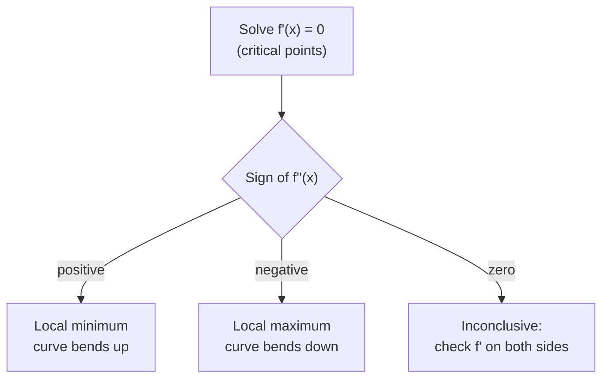

<div class="page-break"></div>

**🧪 Worked Example — A cubic with both a peak and a valley**

f(x) = x³ − 3x
```
f'(x) = 3x² − 3 = 0  →  x = 1 or x = −1
f''(x) = 6x
x = 1 :  f'' = 6 > 0  → local MIN, value f(1) = 1 − 3 = −2
x = −1:  f'' = −6 < 0 → local MAX, value f(−1) = −1 + 3 = 2
```
**When f'' = 0:** f(x) = x³ has f'(0) = 0 and f''(0) = 0, and it is **neither** a max nor a min at 0 (it just flattens: an inflection point). That's what "test further" means.

**Global vs local:** on [0, 5], f(x) = x² − 4x + 3 has its minimum −1 at x = 2 and its *global maximum* at an **endpoint**: f(0) = 3, f(5) = **8** → global max = 8.

### Concept 2: Optimization (ML uses this constantly)

**The goal:** Minimize loss function to train the model.

**Process:**
1. Write the function you want to minimize: L(w)
2. Take derivative: dL/dw
3. Set to zero: dL/dw = 0
4. Solve for w

**Example:** Minimize squared error for regression
```
L(w) = (y - w·x)²
dL/dw = -2x(y - w·x) = 0
w = y/x
```

**📐 Math notation**

$$
w_{t+1} = w_t - \eta\,\nabla L(w_t),
\qquad
\nabla L = \left(\frac{\partial L}{\partial w_1}, \dots, \frac{\partial L}{\partial w_d}\right)
$$

**🗺️ Diagram: the gradient-descent loop**

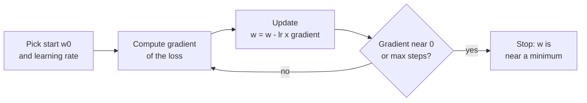

**🧪 Worked Example — Two flavours of optimization**

**1) The fence problem:** 40 m of fence around a rectangle. Maximize the area.
```
Sides x and (20 − x)  →  A(x) = x(20 − x) = 20x − x²
A'(x) = 20 − 2x = 0  →  x = 10;   A'' = −2 < 0 (max)   →  10 × 10 square, area 100 m²
```
**2) Gradient descent (how ML actually does it):** minimize L(w) = (w − 3)², so L'(w) = 2(w − 3). Update rule: **w ← w − η · L'(w)**, learning rate η = 0.1.

<div class="page-break"></div>

| Step | w | gradient 2(w−3) | new w |
|---|---|---|---|
| 0 | 0.000 | −6.000 | 0 + 0.6 = 0.600 |
| 1 | 0.600 | −4.800 | 1.080 |
| 2 | 1.080 | −3.840 | 1.464 |
| 3 | 1.464 | −3.072 | 1.771 … → 3 |

Each step closes 20% of the remaining gap to the answer w = 3.
**Learning rate too big?** η = 1.1: w jumps 0 → 6.6 (overshoot by 3.6), next → 6.6 − 1.1(7.2) = −1.32 (now 4.32 away)... it **diverges**. Too small → painfully slow.

**Link to the guide's example:** for y = 6, x = 2, the loss (y − wx)² is smallest at w = y/x = **3**.

**💻 In code: gradient descent from scratch**

```python
# minimise L(w) = (w - 3)^2, whose gradient is 2(w - 3)
w, lr = 0.0, 0.1
for step in range(1, 6):
    grad = 2 * (w - 3)
    w = w - lr * grad
    print(step, round(w, 4))

# Output:
# 1 0.6
# 2 1.08
# 3 1.464
# 4 1.7712
# 5 2.017
```

## Chapter 4: Taylor Series (Approximation)

**What it does:** Approximates a complicated function with a polynomial.

**Formula:**
```
f(x) ≈ f(a) + f'(a)(x-a) + f''(a)/2! (x-a)² + f'''(a)/3! (x-a)³ + ...

Where:
- f(a) = value at point a
- f'(a) = first derivative at a
- f''(a) = second derivative at a
- n! = factorial
```

**Simple example:**
```
f(x) = e^x at x=0:
e^x ≈ 1 + x + x²/2 + x³/6 + x⁴/24 + ...

Check: e^0 = 1 ✓, e^1 ≈ 1 + 1 + 0.5 + 0.17 + ... ≈ 2.71 ≈ e ✓
```

**Why it matters:** Neural networks, exponential functions, and many ML algorithms rely on Taylor approximations for efficiency.

<div class="page-break"></div>

**📐 Math notation**

$$
\begin{gathered}
f(x) \approx \sum_{n=0}^{N}\frac{f^{(n)}(a)}{n!}\,(x-a)^{n}
= f(a) + f'(a)(x-a) + \frac{f''(a)}{2!}(x-a)^{2} + \cdots
\\[6pt]
e^{x} = \sum_{n=0}^{\infty}\frac{x^{n}}{n!},
\qquad
\sin x = x - \frac{x^{3}}{3!} + \frac{x^{5}}{5!} - \cdots
\end{gathered}
$$

**🧪 Worked Example — Estimate √1.1 without a calculator**

f(x) = √x around a = 1: f(1) = 1, f'(x) = 1/(2√x) → f'(1) = 0.5, f''(x) = −1/(4·x^(3/2)) → f''(1) = −0.25.
```
f(1.1) ≈ f(1) + f'(1)(0.1) + f''(1)/2! · (0.1)²
       ≈ 1 + 0.05 + (−0.25/2)(0.01) = 1 + 0.05 − 0.00125 = 1.04875
True value √1.1 = 1.04881  →  the error is only 0.00006!
```
**More terms → better:** e^0.1 using 1 + x → 1.1 (true 1.10517); adding x²/2 → 1.105 (much closer).

**Why it works best near a:** the further x is from a, the more terms you need.
**ML link:** the first-order (linear) Taylor term is exactly the idea behind gradient descent; the second-order term gives Newton's method.

**💻 In code: Taylor polynomials of e^x at x = 1**

```python
import math

x = 1.0
for n in (1, 2, 3, 5):
    approx = sum(x**k / math.factorial(k) for k in range(n + 1))
    print(n, round(approx, 5), "error", round(math.e - approx, 5))

# Output:
# 1 2.0 error 0.71828
# 2 2.5 error 0.21828
# 3 2.66667 error 0.05162
# 5 2.71667 error 0.00162
```

<div class="page-break"></div>

# PART 5: DATA STRUCTURES & ALGORITHMS
## Problem Solving Fast (15.3 marks)

---

## Chapter 1: Data Structures (Organizing data)

### Structure 1: Arrays and Lists

**Array:** Fixed-size collection, direct access by index.
- Access element: O(1) → instant
- Insert/delete: O(n) → might shift all elements

**List:** Variable-size, linked elements.
- Access: O(n) → must traverse
- Insert/delete at front: O(1) → just update pointer

**🧪 Worked Example — Why access is instant but insertion is slow**

Array A = [10, 20, 30, 40] stored from memory address 1000, each number takes 4 bytes.
```
Address of A[i] = start + i × size   →  A[2] is at 1000 + 2×4 = 1008
One calculation, no searching  →  O(1)

Insert 25 at index 2:  [10, 20, _, 30, 40]  → 30 and 40 must shift right → 2 moves
[10, 20, 25, 30, 40]
Inserting at index 0 would shift everything → n moves → O(n)
```
**Linked list contrast:** inserting at the front only re-points one pointer (no shifting), but finding the 3rd element means hopping through 2 nodes.

### Structure 2: Stacks (Last In, First Out)

**What it is:** A stack of plates. You add/remove from the top only.

```
Push (add): [3]         Pop (remove): [3]  →  [1]
            [2]    →                   [2]      [2]
            [1]           [3,2]                 [1]
```

**Operations:**
- Push: Add element (O(1))
- Pop: Remove element (O(1))

**Real use:** Function call stack, undo operations

**🧪 Worked Example — Are the brackets balanced?**

Use a stack: **push** on "(", **pop** on ")". Balanced only if the stack is empty at the end and never popped when empty.

<div class="page-break"></div>

| String | Walk-through | Result |
|---|---|---|
| `(()())` | push, push, pop, push, pop, pop → empty | ✓ balanced |
| `(()` | push, push, pop → 1 left over | ✗ not balanced |
| `())` | push, pop, pop on **empty** stack | ✗ not balanced |

**LIFO in action:** push 1, 2, 3 → pop gives **3, 2, 1** (last in, first out). Reversing "GATE" by pushing each letter then popping gives "ETAG". Your browser's Back button and the editor's Undo are stacks.

### Structure 3: Queues (First In, First Out)

**What it is:** A line at a store. You add at back, remove from front.

```
Enqueue (add):  [1,2] → [1,2,3]
Dequeue (remove): [1,2,3] → [2,3]
```

**Operations:**
- Enqueue: Add to back (O(1))
- Dequeue: Remove from front (O(1))

**Real use:** BFS, printer queue, customer service

**🧪 Worked Example — Same input, opposite order**

Add A, B, C in that order.

| Structure | Removal order |
|---|---|
| **Queue** (FIFO) | A, B, C (first in, first out) |
| **Stack** (LIFO) | C, B, A |

Think of a ticket counter: whoever arrived first is served first. In BFS, the queue guarantees nodes closest to the start are processed first.

**💻 In code: stack vs queue**

```python
from collections import deque

stack = []
for x in (1, 2, 3):
    stack.append(x)
print(stack.pop(), stack.pop())            # 3 2  (last in, first out)

queue = deque()
for x in (1, 2, 3):
    queue.append(x)
print(queue.popleft(), queue.popleft())    # 1 2  (first in, first out)

# Output:
# 3 2
# 1 2
```

<div class="page-break"></div>

### Structure 4: Hash Tables (Dictionary)

**What it is:** A mapping from keys to values. Super fast lookup.

```
Hash Table:
Key → Value
"apple" → 5
"banana" → 3
"cherry" → 8

Lookup "banana": O(1) on average
```

**How it works:** 
- Hash function converts key to array index
- Value stored at that index
- Super fast (O(1)) lookup

**Collision:** Two keys hash to same index. Resolved by chaining or probing.

**📐 Math notation**

$$
\text{index} = h(k) = k \bmod m,
\qquad
\text{load factor } \alpha = \frac{n}{m},
\qquad
\text{expected chain length} = \alpha
$$

**🗺️ Diagram: key to bucket**

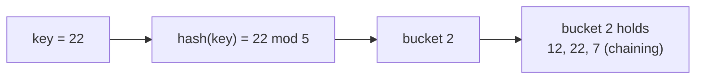

**🧪 Worked Example — h(key) = key mod 5, table has 5 slots (0–4)**

Insert keys **12, 8, 15, 22**:
```
12 mod 5 = 2  → slot 2
 8 mod 5 = 3  → slot 3
15 mod 5 = 0  → slot 0
22 mod 5 = 2  → slot 2 is TAKEN → collision!
```
| Fix | Where does 22 go? |
|---|---|
| **Chaining** | Slot 2 keeps a list: 12 → 22 |
| **Linear probing** | Try slot 3 (full, holds 8), then slot 4 → 22 stored in slot **4** |

**Load factor** α = keys/slots = 4/5 = 0.8. Higher α → more collisions → slower. That is why real hash tables resize when they get too full.

<div class="page-break"></div>

**💻 In code: a tiny hash table with chaining**

```python
m = 5
table = [[] for _ in range(m)]
for key in (12, 22, 7, 3):
    table[key % m].append(key)      # 12, 22 and 7 collide in bucket 2
print(table)

# Output:
# [[], [], [12, 22, 7], [3], []]
```

### Structure 5: Linked List

**What it is:** Nodes connected by pointers.

```
Head → [1|next] → [2|next] → [3|next] → NULL

Operations:
- Access element i: O(n) - must traverse
- Insert at front: O(1) - update pointers
- Insert at position: O(n) - traverse first
```

**🗺️ Diagram: nodes chained by pointers**

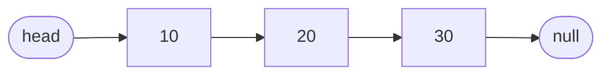

**🧪 Worked Example — Insert and delete without shifting**

List: `head → [1] → [2] → [3] → NULL`

- **Insert 0 at the front:** create node [0], set its *next* to the old head, move *head* to it → `head → [0] → [1] → [2] → [3]`. Two pointer changes → **O(1)**.
- **Delete node [2]:** make [1]'s *next* point to [3] → `[1] → [3]`. (You needed to reach [1] first.)
- **Find the 3rd node:** head → [1] → [2] → [3] = 2 hops → this is why access is **O(n)**.

### Structure 6: Trees

**Binary Search Tree (BST):**
- Every node has ≤ 2 children
- Left child < node < right child
- Search: O(log n) average, O(n) worst case

```
        5
       / \
      3   7
     / \
    1   4
```

<div class="page-break"></div>

**Operations:**
- Search: O(log n) if balanced
- Insert: O(log n)
- Delete: O(log n)

**📐 Math notation**

$$
\text{perfect binary tree of height } h:\quad
n = 2^{h+1} - 1,
\qquad
h_{\min} = \lfloor \log_2 n \rfloor
$$

**🗺️ Diagram: the BST from the example**

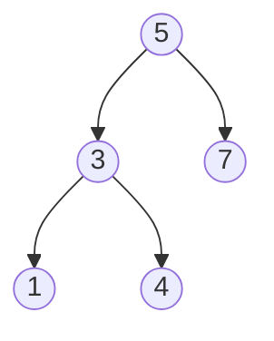

**🧪 Worked Example — Search, insert, traverse (using the tree above)**

```
        5
       / \
      3   7
     / \
    1   4
```
- **Search 4:** 4 < 5 → go left; 4 > 3 → go right; found → **3 comparisons**.
- **Insert 6:** 6 > 5 → right (7); 6 < 7 → left child of 7 → becomes a new leaf.
- **Traversals:** In-order (left, node, right) → **1, 3, 4, 5, 7** (sorted!) · Pre-order (node, left, right) → 5, 3, 1, 4, 7 · Post-order (left, right, node) → 1, 4, 3, 7, 5.

**When a BST goes bad:** insert 1, 2, 3, 4, 5 in that order → a straight line (height 5) → searching is O(n), not O(log n). A *balanced* tree with 1,000,000 nodes has height ≈ 20.

### Structure 7: Graphs

**What it is:** Nodes (vertices) connected by edges.

```
     A---B
     |   |
     C---D

Represented as:
- Adjacency matrix (fast access, uses space)
- Adjacency list (space-efficient)
```

<div class="page-break"></div>

**📐 Math notation**

$$
\sum_{v \in V} \deg(v) = 2\,|E|
\qquad\text{(handshake rule)}
$$

**🗺️ Diagram: the square graph**

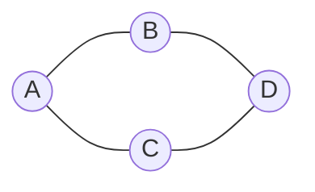

**🧪 Worked Example — Store the square A–B, A–C, B–D, C–D**

```
Adjacency list:  A: [B, C]    B: [A, D]    C: [A, D]    D: [B, C]

Adjacency matrix:   A B C D
                 A [0 1 1 0]
                 B [1 0 0 1]
                 C [1 0 0 1]
                 D [0 1 1 0]
```
- Every node has degree 2; sum of degrees = 8 = 2 × (number of edges = 4) ✓ (the handshake rule).
- **Space:** matrix uses V² = 16 cells; the list uses V + 2E = 12 entries. For a sparse graph with 10,000 nodes and 50,000 edges, the matrix needs 100 million cells but the list only ≈ 110,000 entries. Use lists for sparse graphs.

## Chapter 2: Sorting Algorithms (Putting in order)

### Algorithm 1: Bubble Sort

**How it works:** Compare adjacent pairs, swap if wrong order, repeat.

```
[5,3,1,4] 
[3,5,1,4]  (swap 5 and 3)
[3,1,5,4]  (swap 5 and 1)
[3,1,4,5]  (swap 5 and 4)
... (repeat passes until sorted)
```

**Complexity:** O(n²) - very slow, rarely used

**🧪 Worked Example — Full trace of [5, 3, 1, 4]**

```
Pass 1: (5,3)→swap [3,5,1,4] · (5,1)→swap [3,1,5,4] · (5,4)→swap [3,1,4,5]   ← biggest (5) bubbled to the end
Pass 2: (3,1)→swap [1,3,4,5] · (3,4) ok · (4,5) ok
Pass 3: no swaps at all → STOP (already sorted)
```
**Cost:** comparisons = (n−1) + (n−2) + … + 1 = n(n−1)/2. For n = 1000 that's ≈ 500,000, so **O(n²)**.
**Best case:** already sorted + "stop if no swaps" → one pass → **O(n)**.

<div class="page-break"></div>

### Algorithm 2: Merge Sort

**How it works:** Divide list in half, recursively sort, merge.

```
[5,3,1,4]
[5,3] [1,4]    (divide)
[3,5] [1,4]    (sort each half)
[1,3,4,5]      (merge)
```

**Complexity:** O(n log n) - fast and consistent

**📐 Math notation**

$$
T(n) = 2\,T\!\left(\frac{n}{2}\right) + O(n)
\ \Longrightarrow\ T(n) = O(n \log n)
$$

**🗺️ Diagram: split, then merge**

```mermaid
flowchart LR
    A["8 3 5 1"] --> B["8 3"]
    A --> C["5 1"]
    B --> D["8"]
    B --> E["3"]
    C --> F["5"]
    C --> G["1"]
    D --> H["3 8"]
    E --> H
    F --> I["1 5"]
    G --> I
    H --> J["1 3 5 8"]
    I --> J
```

**🧪 Worked Example — Sort [8, 3, 5, 1]**

```
Split:   [8, 3, 5, 1] → [8, 3] [5, 1] → [8] [3] [5] [1]
Merge:   [8]+[3] → [3, 8]         [5]+[1] → [1, 5]
Merge [3, 8] and [1, 5]  (look at the fronts, take the smaller):
   3 vs 1 → take 1      3 vs 5 → take 3      8 vs 5 → take 5      only 8 left → take 8
Result:  [1, 3, 5, 8]
```
**Why n log n?** With n = 8 there are log₂ 8 = **3 levels** of merging, and each level touches all n items → 8 × 3 = 24 steps. **Cost:** uses O(n) extra memory; it is **stable** (equal items keep their order).

<div class="page-break"></div>

**💻 In code: merge sort in 8 lines**

```python
def merge_sort(a):
    if len(a) <= 1:
        return a
    mid = len(a) // 2
    left, right = merge_sort(a[:mid]), merge_sort(a[mid:])
    out = []
    while left and right:
        out.append(left.pop(0) if left[0] <= right[0] else right.pop(0))
    return out + left + right

print(merge_sort([8, 3, 5, 1]))

# Output:
# [1, 3, 5, 8]
```

### Algorithm 3: Quick Sort

**How it works:** Pick pivot, partition into smaller/larger, recurse.

```
[5,3,1,4], pivot=5
[3,1,4], 5, []
[1,3,4], 5, []
[1,3,4,5]      (sorted)
```

**Complexity:** O(n log n) average, O(n²) worst case

**🧪 Worked Example — A good pivot vs a bad pivot**

**Good:** [5, 3, 8, 1, 9, 2], pivot = 5
```
smaller: [3, 1, 2]   pivot: 5   larger: [8, 9]
sort each side → [1, 2, 3] 5 [8, 9] → [1, 2, 3, 5, 8, 9]
```
The two sides are roughly balanced → about log n levels → **O(n log n)**.

**Bad:** an already-sorted list [1, 2, 3, 4, 5] with the *first element* as pivot: each partition peels off just one element:
```
comparisons = 4 + 3 + 2 + 1 = 10  →  n(n−1)/2  →  O(n²)
```
(The guide's example above with pivot = 5 in [5,3,1,4] is this worst case in miniature.) **Fix:** choose a random pivot or the median of three.

### Algorithm 4: Heap Sort

**How it works:** Build max-heap, repeatedly extract maximum.

**Complexity:** O(n log n) - consistent

**🧪 Worked Example — Sort [4, 10, 3, 5, 1]**

A max-heap keeps the biggest at the top; for index i, children are at 2i+1 and 2i+2.

<div class="page-break"></div>

```
Build max-heap:  [4,10,3,5,1] → swap 4 with 10 → [10,4,3,5,1] → swap 4 with 5 → [10,5,3,4,1]
Extract max: swap root with last → 10 goes to its final place; re-fix heap (→ [5,4,3,1])
Extract 5, then 4, then 3, then 1 the same way.
Numbers leave the heap in order 10, 5, 4, 3, 1 and are placed from the back → [1, 3, 4, 5, 10]
```
**Cost:** building the heap is O(n); each of the n extractions costs O(log n) → **O(n log n)** always, and it sorts **in place** (no extra array).

### When to use each:
| Algorithm | Best for | Complexity |
|---|---|---|
| Merge sort | General purpose, guaranteed speed | O(n log n) |
| Quick sort | Most cases, average speed | O(n log n) avg |
| Heap sort | Guaranteed O(n log n) | O(n log n) |
| Bubble sort | Teaching only | O(n²) |

<div class="page-break"></div>

**🗺️ Diagram: choosing a sort**

```mermaid
flowchart TD
    S{"How big is the list?"} -->|"tiny, or teaching"| BS["Bubble sort is fine"]
    S -->|"large"| A{"Need a worst-case<br/>O(n log n) guarantee?"}
    A -->|"no"| Q["Quick sort<br/>fastest on average"]
    A -->|"yes"| B{"Extra memory OK?"}
    B -->|"yes (want stable)"| M["Merge sort"]
    B -->|"no"| H["Heap sort<br/>in place"]
```

<div class="page-break"></div>

**🧪 Worked Example — Pick the algorithm for the situation**

| Situation | Best pick | Reason |
|---|---|---|
| Random data, fastest in practice | Quick sort | Small constants, in place |
| Must guarantee O(n log n), memory is fine | Merge sort | Never degrades; stable |
| Must guarantee O(n log n), memory is tight | Heap sort | In place, guaranteed |
| Data is nearly sorted, tiny list | Bubble/insertion (with early exit) | Close to O(n) |
| Sorting records and equal keys must keep their order | Merge sort | It is stable |

## Chapter 3: Searching Algorithms

### Algorithm 1: Linear Search

**How it works:** Check each element one by one.

```
Search for 4 in [1,5,3,4,2]:
Check 1: no
Check 5: no
Check 3: no
Check 4: YES, found at position 3
```

**Complexity:** O(n) - check every element

**When to use:** Small arrays, unsorted data

**🧪 Worked Example — How many checks?**

Searching a list of n = 1000 items:
- **Best case:** target is first → **1** check.
- **Worst case:** target is last (or missing) → **1000** checks.
- **Average (target present):** about (n + 1)/2 = **500** checks.

Complexity is O(n): doubling the list doubles the work.

### Algorithm 2: Binary Search

**How it works:** Divide search space in half each time.

```
Sorted array: [1,3,4,5,7,9,11]
Search for 5:
Check middle (5): Found! Position 3
(If not found, go left or right half)
```

**Complexity:** O(log n) - very fast!

<div class="page-break"></div>

**Requirement:** Data must be sorted

**Why it works:** Each comparison eliminates half the remaining data.

**📐 Math notation**

$$
T(n) = T\!\left(\frac{n}{2}\right) + O(1)
\ \Longrightarrow\ T(n) = O(\log n),
\qquad \text{steps} \le \lfloor \log_2 n \rfloor + 1
$$

**🧪 Worked Example — Find 9, then fail to find 6, in [1, 3, 4, 5, 7, 9, 11]**

Indices 0–6. Keep `low`, `high`, `mid = (low + high) // 2`.
```
Search 9:  low=0 high=6 mid=3 (5)  5 < 9 → low=4
           low=4 high=6 mid=5 (9)  found!  (2 checks)

Search 6:  low=0 high=6 mid=3 (5)  5 < 6 → low=4
           low=4 high=6 mid=5 (9)  9 > 6 → high=4
           low=4 high=4 mid=4 (7)  7 > 6 → high=3
           low=4 > high=3 → STOP, 6 is not in the list
```
**Speed:** every step halves the list. 1,000,000 items → at most ⌈log₂ 1,000,000⌉ = **20** checks (linear search could need 1,000,000).

**💻 In code: binary search that counts its steps**

```python
def binary_search(a, target):
    lo, hi, steps = 0, len(a) - 1, 0
    while lo <= hi:
        mid = (lo + hi) // 2
        steps += 1
        if a[mid] == target:
            return mid, steps
        if a[mid] < target:
            lo = mid + 1
        else:
            hi = mid - 1
    return -1, steps

print(binary_search(list(range(1, 1025)), 700))    # (index, steps): at most 11 steps for 1024 items

# Output:
# (699, 8)
```

<div class="page-break"></div>

## Chapter 4: Graph Algorithms

### Algorithm 1: Breadth-First Search (BFS)

**What it does:** Explore level by level from starting node.

**How it works:**
1. Start at node S
2. Visit all neighbors (distance 1)
3. Then visit their neighbors (distance 2)
4. Continue expanding outward

**Complexity:** O(V + E), where V=vertices, E=edges

**Returns:** Shortest path in unweighted graphs

**Data structure:** Queue

**🗺️ Diagram: BFS visit order, coloured by level**

```mermaid
flowchart LR
    S["S<br/>visit 1"] --- A["A<br/>visit 2"]
    S --- B["B<br/>visit 3"]
    A --- C["C<br/>visit 4"]
    B --- D["D<br/>visit 5"]
    C --- G["G<br/>visit 6 (goal)"]
    D --- G
    classDef l0 fill:#cfe8ff,stroke:#333,color:#000
    classDef l1 fill:#d5f5d5,stroke:#333,color:#000
    classDef l2 fill:#fff2cc,stroke:#333,color:#000
    classDef l3 fill:#f8d7da,stroke:#333,color:#000
    class S l0
    class A,B l1
    class C,D l2
    class G l3
```

**🧪 Worked Example — BFS on a small map (start S, goal G)**

```
Edges:  S–A, S–B, A–C, B–D, C–G, D–G
```
The queue holds nodes waiting to be visited:
```
Queue: [S]                      visit S  → add A, B
Queue: [A, B]                   visit A  → add C
Queue: [B, C]                   visit B  → add D
Queue: [C, D]                   visit C  → add G
Queue: [D, G]                   visit D  (G already added)
Queue: [G]                      visit G  = goal!
Visit order: S, A, B, C, D, G
```
**Levels (distance from S):** S = 0 · A, B = 1 · C, D = 2 · G = 3. Shortest path: **S → A → C → G** (3 edges). BFS is perfect for "fewest steps" in unweighted graphs.

<div class="page-break"></div>

**💻 In code: BFS with a queue**

```python
from collections import deque

graph = {"S": ["A", "B"], "A": ["S", "C"], "B": ["S", "D"],
         "C": ["A", "G"], "D": ["B", "G"], "G": ["C", "D"]}

def bfs(start, goal):
    queue, seen, parent, order = deque([start]), {start}, {start: None}, []
    while queue:
        node = queue.popleft()
        order.append(node)
        if node == goal:
            break
        for nb in graph[node]:
            if nb not in seen:
                seen.add(nb); parent[nb] = node; queue.append(nb)
    path, n = [], goal
    while n:
        path.append(n); n = parent[n]
    return order, path[::-1]

print(bfs("S", "G"))       # (visit order, shortest path)

# Output:
# (['S', 'A', 'B', 'C', 'D', 'G'], ['S', 'A', 'C', 'G'])
```

### Algorithm 2: Depth-First Search (DFS)

**What it does:** Go deep into one path before backtracking.

**How it works:**
1. Start at node S
2. Follow one path as far as possible
3. Backtrack when stuck
4. Try another path

**Complexity:** O(V + E)

**Returns:** Visits all nodes, useful for checking connectivity

**Data structure:** Stack

<div class="page-break"></div>

**🗺️ Diagram: DFS visit order (dive first, backtrack later)**

```mermaid
flowchart LR
    S["S<br/>visit 1"] --- A["A<br/>visit 2"]
    S --- B["B<br/>visit 6"]
    A --- C["C<br/>visit 3"]
    B --- D["D<br/>visit 5"]
    C --- G["G<br/>visit 4"]
    D --- G
    linkStyle 0,2,3,4,5 stroke:#d9534f,stroke-width:3px
```

**🧪 Worked Example — DFS on the same map (neighbours in alphabetical order)**

```
Visit S → A (first neighbour) → C → G → D → B
Order: S, A, C, G, D, B
Backtrack only when stuck: from G we go to D (G's other neighbour), then D to B.
```
DFS reaches G quickly, but the *path it found to D* is S → A → C → G → D (4 edges), while the true shortest path to D is **S → B → D** (2 edges). That's why DFS is not optimal for shortest paths.

**Memory:** DFS stores just the current path, so it uses far less memory than BFS on big graphs.

**💻 In code: recursive DFS**

```python
graph = {"S": ["A", "B"], "A": ["S", "C"], "B": ["S", "D"],
         "C": ["A", "G"], "D": ["B", "G"], "G": ["C", "D"]}

def dfs(node, seen=None):
    seen = [] if seen is None else seen
    seen.append(node)
    for nb in graph[node]:
        if nb not in seen:
            dfs(nb, seen)
    return seen

print(dfs("S"))            # dives deep first, backtracks when stuck

# Output:
# ['S', 'A', 'C', 'G', 'D', 'B']
```

### Algorithm 3: Dijkstra's Algorithm (Shortest path with weights)

**What it does:** Find shortest path from start to all other nodes when edges have weights.

**How it works:**
1. Mark start distance as 0, others as infinity
2. Pick unvisited node with smallest distance
3. Update neighbors' distances through this node
4. Repeat until all visited

<div class="page-break"></div>

**Complexity:** O((V+E) log V) with heap, O(V²) with array

**Requirement:** No negative edge weights

**Example:**
```
Find shortest path from A to D (edge weights in brackets):

        B
     1 / \ 3
      A   D
     2 \ / 1
        C

A→B→D = 1 + 3 = 4
A→C→D = 2 + 1 = 3   ← shortest
```

**🗺️ Diagram: shortest path A to D in red**

```mermaid
flowchart LR
    A((A)) ---|"1"| B((B))
    A ---|"2"| C((C))
    B ---|"3"| D((D))
    C ---|"1"| D
    linkStyle 1,3 stroke:#d9534f,stroke-width:4px
```

**🧪 Worked Example — Find the shortest path from A to D**

Edges: **A–B (1), A–C (2), B–D (3), C–D (1)** (same graph as the drawing above).
```
Step | Pick (smallest unvisited) | dist A | dist B | dist C | dist D
 0   | start                     |   0    |   ∞    |   ∞    |   ∞
 1   | A (0)                     |   0    |   1    |   2    |   ∞
 2   | B (1)  → D via B = 1+3    |   0    |   1    |   2    |   4
 3   | C (2)  → D via C = 2+1    |   0    |   1    |   2    |   3   ← improved!
 4   | D (3)  done               |   0    |   1    |   2    |   3
```
Shortest **A → D = 3**, via **A → C → D** (the path A → B → D costs 4).

**Why no negative weights?** Dijkstra assumes once a node is picked, its distance is final. A negative edge discovered later could make it even shorter, which breaks that assumption.

<div class="page-break"></div>

**💻 In code: Dijkstra with a priority queue**

```python
import heapq

graph = {"A": {"B": 1, "C": 2}, "B": {"A": 1, "D": 3},
         "C": {"A": 2, "D": 1}, "D": {"B": 3, "C": 1}}

def dijkstra(src):
    dist = {n: float("inf") for n in graph}
    dist[src] = 0
    pq = [(0, src)]
    while pq:
        d, u = heapq.heappop(pq)
        if d > dist[u]:
            continue
        for v, w in graph[u].items():
            if d + w < dist[v]:
                dist[v] = d + w
                heapq.heappush(pq, (dist[v], v))
    return dist

print(dijkstra("A"))       # D costs 3 (via C), not 4 (via B)

# Output:
# {'A': 0, 'B': 1, 'C': 2, 'D': 3}
```

### Algorithm 4: A* Search

**What it does:** Like Dijkstra but with a heuristic (guess) to guide search.

**How it works:**
```
f(n) = g(n) + h(n)

g(n) = actual distance from start to node n
h(n) = estimated distance from n to goal
f(n) = total estimated cost through n

Always expand node with smallest f(n).
```

**Complexity:** Depends on heuristic quality

**Requirement:** h(n) must be admissible (never overestimates)

**Real use:** GPS navigation, game AI

**🧪 Worked Example — Start S, goal G**

Edges: **S–A (1), S–B (4), A–G (6), B–G (2)**. Estimates h (distance to goal): h(A) = 4, h(B) = 2, h(G) = 0. Real remaining costs are 6 (from A) and 2 (from B), so h never overestimates → **admissible**.
```
Expand S:  A: g=1, f=1+4=5      B: g=4, f=4+2=6
Expand A (lowest f=5):  G via A: g=7, f=7
Expand B (f=6, lower than G's 7):  G via B: g=6, f=6  → improves G
Expand G (f=6) → goal reached. Path S → B → G, cost 6 (the other path costs 7).
```

<div class="page-break"></div>

**Important:** stop only when the goal is *taken off* the frontier, not when it is first discovered, otherwise you would return the cost-7 path.
**Admissible example:** straight-line distance ≤ driving distance; Manhattan distance on a grid that allows only up/down/left/right moves.

## Chapter 5: Complexity Analysis

### Big-O Notation (What matters as data grows)

**What it means:** How does algorithm time/space grow as input size increases?

| Notation | Grows like | Examples | Speed |
|---|---|---|---|
| O(1) | Constant | Array access by index | ⚡⚡⚡ Instant |
| O(log n) | Logarithmic | Binary search | ⚡⚡ Very fast |
| O(n) | Linear | Linear search, scan array | ⚡ Fast |
| O(n log n) | Linearithmic | Merge sort, Quick sort | ⚡ Good |
| O(n²) | Quadratic | Bubble sort, nested loops | 🐢 Slow |
| O(n³) | Cubic | Triple nested loops | 🐌 Very slow |
| O(2ⁿ) | Exponential | Brute force subsets | 🐌🐌 Extremely slow |
| O(n!) | Factorial | Generate all permutations | 🐌🐌🐌 Impossible |

**The rule:** For large n, ignore constants and lower-order terms.
- O(2n + 5) → O(n)
- O(n² + 100n) → O(n²)

**📐 Math notation**

$$
\begin{gathered}
f(n) = O(g(n)) \iff \exists\, c > 0,\ n_0 :\ f(n) \le c\,g(n)\ \ \forall\, n \ge n_0
\\[6pt]
O(1) < O(\log n) < O(n) < O(n \log n) < O(n^{2}) < O(2^{n}) < O(n!)
\end{gathered}
$$

**🗺️ Diagram: growth ladder**

```mermaid
flowchart LR
    A["O(1)<br/>constant"] --> B["O(log n)<br/>binary search"] --> C["O(n)<br/>linear scan"] --> D["O(n log n)<br/>merge sort"] --> E["O(n squared)<br/>bubble sort"] --> F["O(2 to the n)<br/>all subsets"]
    classDef fast fill:#d5f5d5,stroke:#333,color:#000
    classDef ok fill:#fff2cc,stroke:#333,color:#000
    classDef slow fill:#f8d7da,stroke:#333,color:#000
    class A,B fast
    class C,D ok
    class E,F slow
```

<div class="page-break"></div>

**🧪 Worked Example — Read the loops, count the steps**

```
for i in 1..n:            # runs n times
    for j in 1..n:        # runs n times for each i
        do_work()         # 1 step        →  n × n = n² steps   → O(n²)

loop A (n steps), then a nested loop (n² steps)  → n + n² → O(n²)   (drop the smaller term)

i = n
while i > 1:  i = i / 2   # 1024 → 512 → … → 1 = 10 steps  → O(log n)
```
**How big is "big"? (n = 1000)**

| Class | Steps | Feels like |
|---|---|---|
| O(1) | 1 | instant |
| O(log n) | ≈ 10 | instant |
| O(n) | 1,000 | instant |
| O(n log n) | ≈ 10,000 | instant |
| O(n²) | 1,000,000 | a blink |
| O(n³) | 1,000,000,000 | seconds to minutes |
| O(2ⁿ) | ≈ 10³⁰¹ | longer than the age of the universe |

**Drop constants:** 3n² + 5n + 2 at n = 1000 is 3,005,002, essentially 3,000,000. The n² term dominates → O(n²).

### Worst-case vs Average-case

| Algorithm | Worst case | Average case | When to worry |
|---|---|---|---|
| Quick sort | O(n²) | O(n log n) | Bad pivot choice |
| Hash lookup | O(n) | O(1) | Many collisions |
| Binary search | O(log n) | O(log n) | Always consistent |

**🧪 Worked Example — Same algorithm, two very different days**

- **Quick sort on sorted input** with first-element pivot, n = 1000: about 500,000 comparisons instead of ≈ 10,000 for the typical case (50× slower).
- **Hash table where every key hashes to the same slot:** all 1000 keys sit in one chain → one lookup scans up to 1000 items (O(n)), not O(1).
- **Binary search** doesn't care: best, average and worst all stay O(log n).

**Exam habit:** when a question says "worst case", assume the adversary picks the nastiest input.

<div class="page-break"></div>

# PART 6: DATABASES
## Organizing and Retrieving Data (12.7 marks)

---

## Chapter 1: Data Models

### Concept 1: Relational Model (Tables)

**What it is:** Data organized in tables (relations) with rows (tuples) and columns (attributes).

```
Table: Students

| StudentID | Name   | Age | GPA  |
|-----------|--------|-----|------|
| 1         | Alice  | 20  | 3.8  |
| 2         | Bob    | 21  | 3.5  |
| 3         | Charlie| 19  | 3.9  |

StudentID = primary key (unique identifier)
```

**🧪 Worked Example — Vocabulary on the Students table**

| StudentID | Name | Age | GPA | Note |
|---|---|---|---|---|
| 1 | Alice | 20 | 3.8 | ← a **tuple** (one student) |
| 2 | Bob | 21 | 3.5 | another tuple |
| 3 | Charlie | 19 | 3.9 | another tuple |

- **Attributes (columns):** 4 → this is the table's **degree**. **Tuples (rows):** 3 → its **cardinality**.
- **Candidate keys:** any column set that identifies a row uniquely. If every student also has a unique email, then StudentID *and* Email are both candidate keys. We *choose* StudentID as the **primary key**.
- **Foreign key:** a column that points to another table's primary key (see the next concept).

### Concept 2: Relationships between tables

**One-to-Many:** One student has many courses.
```
Students:                   Enrollments:
| StudentID | Name |       | StudentID | CourseID |
| 1 | Alice |       | 1 | C1 |
| 2 | Bob |         | 1 | C2 |
                     | 2 | C1 |
```

**Many-to-Many:** Students and courses have many-to-many relationship.

<div class="page-break"></div>

```
Solution: Intermediate "junction" table:
Enrollments (StudentID, CourseID)
```

**🗺️ Diagram: ER diagram: many-to-many via a junction table**

```mermaid
erDiagram
    STUDENTS ||--o{ ENROLLMENTS : "enrolls in"
    COURSES ||--o{ ENROLLMENTS : "has"
    STUDENTS {
        int StudentID PK
        string Name
    }
    ENROLLMENTS {
        int StudentID FK
        string CourseID FK
    }
    COURSES {
        string CourseID PK
        string Title
    }
```

**🧪 Worked Example — Students, Courses and the junction table**

```
Students                Enrollments (junction)        Courses
StudentID | Name        StudentID | CourseID          CourseID | Title
    1     | Alice           1     |   C1                 C1    | DBMS
    2     | Bob             1     |   C2                 C2    | ML
    3     | Charlie         2     |   C1                 C3    | AI
```
- **Alice ↔ two courses; DBMS ↔ two students** → many-to-many → needs the junction table. Its primary key is the pair **(StudentID, CourseID)**; each half is a **foreign key**.
- **One-to-many:** one Department has many Employees → put DepartmentID as a foreign key in the *Employee* table (the "many" side).

<div class="page-break"></div>

## Chapter 2: SQL (Language to query databases)

### Concept 1: SELECT (Get data)

**Basic syntax:**
```sql
SELECT column1, column2
FROM table_name
WHERE condition;
```

**Example:**
```sql
SELECT Name, GPA
FROM Students
WHERE GPA > 3.7;

Output:
| Name   | GPA |
|--------|-----|
| Alice  | 3.8 |
| Charlie| 3.9 |
```

**Wildcards:**
```sql
SELECT * FROM Students;  -- Get all columns
```

**📐 Math notation**

$$
\texttt{SELECT Name, Age FROM Students} \ \equiv\ \pi_{\text{Name, Age}}(\text{Students})
$$

**🧪 Worked Example — Picking columns (Students: Alice 3.8, Bob 3.5, Charlie 3.9)**

```sql
SELECT Name FROM Students;
-- Alice, Bob, Charlie

SELECT Name AS StudentName, GPA * 10 AS Score FROM Students;
-- StudentName | Score        (AS gives a column a new name; you can calculate)
-- Alice       | 38
-- Bob         | 35
-- Charlie     | 39

SELECT DISTINCT Age FROM Students;   -- removes duplicate values (ages 20, 21, 19 all distinct here)
```
**Logical order SQL actually runs (a GATE favourite):** FROM → WHERE → GROUP BY → HAVING → SELECT → ORDER BY → LIMIT.

<div class="page-break"></div>

### Concept 2: Filtering (WHERE clause)

**Operators:**
```sql
= (equals)
> (greater than)
< (less than)
>= (greater than or equal)
<= (less than or equal)
!= (not equal)
AND (both conditions true)
OR (at least one true)
LIKE (pattern matching)
IN (within a list)
```

**Example:**
```sql
SELECT *
FROM Students
WHERE Age > 20 AND GPA >= 3.5;
```

**📐 Math notation**

$$
\texttt{SELECT * FROM Students WHERE Age > 20} \ \equiv\ \sigma_{\text{Age} > 20}(\text{Students})
$$

**🧪 Worked Example — Same table, different filters**

| Query (WHERE …) | Rows returned |
|---|---|
| `Age > 20 AND GPA >= 3.5` | Bob (21, 3.5) |
| `Age = 19 OR GPA > 3.7` | Alice, Charlie |
| `Name LIKE 'A%'` (starts with A) | Alice |
| `Age IN (19, 21)` | Bob, Charlie |
| `GPA BETWEEN 3.6 AND 3.9` | Alice, Charlie |

**NULL trap:** `WHERE GPA = NULL` returns **nothing**, because NULL means "unknown" and nothing equals unknown. Write **`WHERE GPA IS NULL`**.

### Concept 3: Joins (Combining tables)

**INNER JOIN:** Only matching rows from both tables.
```sql
SELECT Students.Name, Enrollments.CourseID
FROM Students
INNER JOIN Enrollments
ON Students.StudentID = Enrollments.StudentID;
```

**LEFT JOIN:** All rows from left table, matching rows from right.

<div class="page-break"></div>

```sql
SELECT Students.Name, Enrollments.CourseID
FROM Students
LEFT JOIN Enrollments
ON Students.StudentID = Enrollments.StudentID;

-- Every student appears, even if not enrolled
```

**RIGHT JOIN:** All from right, matching from left (opposite of LEFT).

**FULL JOIN:** All from both tables.

**📐 Math notation**

$$
R \bowtie_{R.a = S.b} S \ =\ \sigma_{R.a = S.b}\,(R \times S)
\qquad
|R \times S| = |R|\cdot|S|
$$

**🧪 Worked Example — Same tables, four joins**

Students: (1 Alice), (2 Bob), (3 Charlie). Enrollments: (1, C1), (1, C2), (2, C1). Courses: C1, C2, C3.

**INNER JOIN Students ↔ Enrollments** (only matches) → **3 rows**
```
Alice   C1
Alice   C2
Bob     C1          (Charlie disappears: he has no enrolment)
```
**LEFT JOIN** (all students, matched or not) → **4 rows**
```
Alice C1 · Alice C2 · Bob C1 · Charlie NULL
```
**RIGHT JOIN Enrollments → Courses** (all courses) → C3 appears with a NULL student.
**FULL JOIN** = everything from both sides, NULLs wherever there is no match.

**Row-count trick for MCQs:** INNER ≤ LEFT, INNER ≤ RIGHT, FULL ≥ each of them. A CROSS JOIN of a 3-row and a 4-row table always gives 3 × 4 = **12** rows.

**💻 In code: INNER vs LEFT JOIN with sqlite3**

```python
import sqlite3

db = sqlite3.connect(":memory:")
db.executescript("""
CREATE TABLE Students (StudentID INT, Name TEXT);
CREATE TABLE Enrollments (StudentID INT, CourseID TEXT);
INSERT INTO Students VALUES (1,'Alice'),(2,'Bob'),(3,'Charlie');
INSERT INTO Enrollments VALUES (1,'C1'),(1,'C2'),(2,'C1');
""")
q = "SELECT s.Name, e.CourseID FROM Students s {} Enrollments e ON s.StudentID = e.StudentID"
print(db.execute(q.format("INNER JOIN")).fetchall())   # matches only
print(db.execute(q.format("LEFT JOIN")).fetchall())    # keeps Charlie, with None

# Output:
# [('Alice', 'C1'), ('Alice', 'C2'), ('Bob', 'C1')]
# [('Alice', 'C1'), ('Alice', 'C2'), ('Bob', 'C1'), ('Charlie', None)]
```

<div class="page-break"></div>

### Concept 4: Aggregation (Summarizing)

```sql
SELECT CourseID, COUNT(*) as StudentCount
FROM Enrollments
GROUP BY CourseID
HAVING COUNT(*) > 10;

-- Count students per course
-- Only show courses with >10 students
```

**Functions:**
- COUNT() - count rows
- SUM() - add up values
- AVG() - average
- MAX() / MIN() - largest/smallest

**🗺️ Diagram: the order SQL actually runs a query**

```mermaid
flowchart LR
    F["FROM / JOIN<br/>pick tables"] --> W["WHERE<br/>filter rows"] --> G["GROUP BY<br/>make groups"] --> H["HAVING<br/>filter groups"] --> S["SELECT<br/>choose columns"] --> O["ORDER BY<br/>sort"] --> L["LIMIT<br/>keep first n"]
```

**🧪 Worked Example — Counting enrolments per course**

Enrollments: (1,C1), (1,C2), (2,C1).
```sql
SELECT CourseID, COUNT(*) AS StudentCount
FROM Enrollments GROUP BY CourseID;
-- C1 | 2
-- C2 | 1

... HAVING COUNT(*) > 1;      -- only C1 | 2 survives
```
**WHERE vs HAVING:** WHERE filters **rows before** grouping (e.g. `WHERE StudentID = 1`); HAVING filters **groups after** aggregating.

**Aggregates on GPA (3.8, 3.5, 3.9):** COUNT = 3 · SUM = 11.2 · AVG = 3.73 · MAX = 3.9 · MIN = 3.5.
**NULL note:** `COUNT(*)` counts all rows; `COUNT(GPA)` and `AVG(GPA)` **skip NULLs**.

**💻 In code: GROUP BY and HAVING with sqlite3**

```python
import sqlite3

db = sqlite3.connect(":memory:")
db.executescript("""
CREATE TABLE Enrollments (StudentID INT, CourseID TEXT);
INSERT INTO Enrollments VALUES (1,'C1'),(2,'C1'),(3,'C1'),(1,'C2'),(2,'C2'),(3,'C3');
""")
rows = db.execute("""SELECT CourseID, COUNT(*) AS n FROM Enrollments
                     GROUP BY CourseID HAVING COUNT(*) > 1 ORDER BY n DESC""").fetchall()
print(rows)                # courses with more than one student

# Output:
# [('C1', 3), ('C2', 2)]
```

<div class="page-break"></div>

### Concept 5: Sorting and Limiting

```sql
SELECT *
FROM Students
ORDER BY GPA DESC, Name ASC
LIMIT 5;

-- Sort by GPA descending, then name ascending
-- Return top 5 rows
```

**🧪 Worked Example — Leaderboard**

```sql
SELECT Name, GPA FROM Students ORDER BY GPA DESC;
-- Charlie 3.9 · Alice 3.8 · Bob 3.5

SELECT Name, GPA FROM Students ORDER BY GPA DESC LIMIT 2;
-- Charlie 3.9 · Alice 3.8        (top 2 only)
```
**Tie-breaking:** `ORDER BY GPA DESC, Name ASC` sorts by GPA first; students with the *same* GPA are then alphabetical.

---

## Chapter 3: Database Design (Normal Forms)

### Concept 1: Normalization (Reducing redundancy)

**Problem:** Redundant data wastes space and causes update anomalies.

```
Bad design:
| StudentID | Name  | Address | CourseID | CourseName |
| 1         | Alice | NYC     | C1       | Algebra    |
| 1         | Alice | NYC     | C2       | Geometry   |

Problems:
- Alice's address repeated
- If address changes, must update multiple rows
```

**📐 Math notation**

$$
X \to Y \iff \text{any two rows that agree on } X \text{ also agree on } Y
\qquad\text{(functional dependency)}
$$

**🗺️ Diagram: the normal-form ladder**

```mermaid
flowchart LR
    U["Messy table<br/>repeats, lists in cells"] -->|"one value per cell"| N1["1NF"]
    N1 -->|"no partial dependency<br/>on part of the key"| N2["2NF"]
    N2 -->|"no transitive dependency<br/>non-key to non-key"| N3["3NF"]
```

<div class="page-break"></div>

**🧪 Worked Example — The three "anomalies" (why bad design hurts)**

Bad table `Enrolled(StudentID, Name, Address, CourseID, CourseName)`:

| StudentID | Name | Address | CourseID | CourseName |
|---|---|---|---|---|
| 1 | Alice | NYC | C1 | Algebra |
| 1 | Alice | NYC | C2 | Geometry |

- **Update anomaly:** Alice moves to Boston → you must edit **both** rows. Miss one and the data contradicts itself.
- **Insertion anomaly:** you can't record a new course "C3 Calculus" until a student enrols in it.
- **Deletion anomaly:** if Alice drops her only course, deleting that row also erases **Alice's address**.

Normalization splits this into `Students`, `Courses`, `Enrollments`, so each fact is stored **once**.

### Concept 2: First Normal Form (1NF)

**Rule:** Each cell must contain an atomic (indivisible) value.

```
Bad:
| Name  | Courses      |
| Alice | C1, C2, C3   |  -- Cell contains a list!

Good:
| Name  | CourseID |
| Alice | C1       |
| Alice | C2       |
| Alice | C3       |
```

**🧪 Worked Example — Two ways to break 1NF**

| ✗ Bad (list in one cell) | ✗ Bad (repeating columns) |
|---|---|
| Alice → "C1, C2, C3" | Alice → Course1=C1, Course2=C2, Course3=C3 |

Both fail because you can't easily search "who takes C2?" or handle a 4th course. **Fix:** one row per (student, course) pair.

**Quick test:** can each cell be described with a *single* value? A phone-number cell holding "9876, 5432" fails 1NF.

### Concept 3: Second Normal Form (2NF)

**Rule:** Every non-key attribute must depend on the ENTIRE primary key (not just part of it).

```
Bad (Composite key StudentID, CourseID):
| StudentID | CourseID | InstructorName |

InstructorName depends only on CourseID, not StudentID!

Good: Split into two tables
```

<div class="page-break"></div>

**🧪 Worked Example — Split the partial dependency**

Table `Enrollment(StudentID, CourseID, InstructorName)` with composite key **(StudentID, CourseID)**.

| StudentID | CourseID | InstructorName |
|---|---|---|
| 1 | C1 | Dr. Rao |
| 2 | C1 | Dr. Rao |
| 3 | C1 | Dr. Rao |

Dr. Rao is repeated for every student because InstructorName depends only on **CourseID** (part of the key) → violates 2NF. **Fix:**
- `Enrollment(StudentID, CourseID)`
- `Course(CourseID, InstructorName)` → C1 | Dr. Rao (stored **once**)

**Shortcut:** 2NF can only be violated when the key has **more than one column**. A table with a single-column key is automatically in 2NF (if already in 1NF).

### Concept 4: Third Normal Form (3NF)

**Rule:** Non-key attributes must depend ONLY on the primary key, not on other non-key attributes.

```
Bad:
| StudentID | Name | DepartmentID | DepartmentName |

DepartmentName depends on DepartmentID, not StudentID!

Good:
Students: | StudentID | Name | DepartmentID |
Departments: | DepartmentID | DepartmentName |
```

**📐 Math notation**

$$
A \to B,\ \ B \to C,\ \ B \not\to A
\ \Longrightarrow\
A \to C \text{ is a transitive dependency (violates 3NF)}
$$

**🧪 Worked Example — Spot the chain, then find keys with closure**

Table `Student(StudentID, Name, DepartmentID, DepartmentName)`:
StudentID → DepartmentID → DepartmentName. The department name is reached *through* another non-key column (a **transitive dependency**). Change "CS" to "Computer Science" and you'd edit every CS student's row. **Fix:** put departments in their own table.

**Bonus – attribute closure (finds candidate keys fast):**
R(A, B, C, D) with functional dependencies **A → B, B → C**.
```
A⁺ = {A}  → A→B adds B → {A,B} → B→C adds C → {A,B,C}   (D is missing!)
(A, D)⁺ = {A, B, C, D}  = everything  → (A, D) is the candidate key
```
**Memory hook for 3NF:** "Every non-key attribute depends on **the key, the whole key, and nothing but the key**."

<div class="page-break"></div>

## Chapter 4: Indexes (Speed up queries)

### What is an index?

**Purpose:** Speed up lookups, like an index in a book.

```
Without index: Scan entire table (O(n))
With index: Direct lookup (O(log n) or O(1))

Trade-off: Indexes use extra space and slow down writes.
```

**🗺️ Diagram: scan versus index lookup**

```mermaid
flowchart LR
    Q["Query:<br/>WHERE id = 42"] --> D{"Index on id?"}
    D -->|"no"| FS["Full scan:<br/>read all N rows"]
    D -->|"yes"| IX["Walk the index tree<br/>(about 3 steps)"] --> R["Jump straight<br/>to the row"]
```

**🧪 Worked Example — Phone-book effect**

A table has **1,000,000 rows**. Query: `SELECT * FROM Users WHERE UserID = 725341`.
- **No index:** scan row by row → up to **1,000,000** comparisons.
- **With an index:** a B-tree finds it in ≈ log₂(1,000,000) ≈ **20** comparisons (and only ~3 disk reads, see below).

**The price:** every INSERT/UPDATE/DELETE must also update the index → writes get slower and the index takes disk space. **Index the columns you search and join on often, not everything.**

**💻 In code: watch the query plan change**

```python
import sqlite3

db = sqlite3.connect(":memory:")
db.execute("CREATE TABLE t (id INT, name TEXT)")
db.executemany("INSERT INTO t VALUES (?, ?)", [(i, f"user{i}") for i in range(1000)])
q = "EXPLAIN QUERY PLAN SELECT * FROM t WHERE id = 42"
print(db.execute(q).fetchall()[0][-1])        # no index: reads every row
db.execute("CREATE INDEX idx_id ON t(id)")
print(db.execute(q).fetchall()[0][-1])        # with index: jumps straight to the row

# Output:
# SCAN t
# SEARCH t USING INDEX idx_id (id=?)
```

### B-Tree Index (Most common)

**How it works:** Balanced tree structure for sorted data.

<div class="page-break"></div>

```
        [50]
       /    \
    [30]   [70]
    / \     / \
  [10][40][60][80]

Search for 65:
50 < 65, go right
70 > 65, go left
Found between 60 and 80
```

**Characteristics:**
- O(log n) search
- Efficient for range queries
- Maintains sorted order

**📐 Math notation**

$$
\text{disk reads} \approx \log_{m}(n)
\qquad\text{e.g. } m = 100,\ n = 10^{6}:\ \log_{100}10^{6} = 3
$$

**🧪 Worked Example — Why 3 levels can hold a million keys**

If each node holds ~100 keys (100 branches), then:
```
Level 1: 1 node        → 100 branches
Level 2: 100 nodes     → 10,000 branches
Level 3: 10,000 nodes  → 1,000,000 keys reachable
```
So finding any of 1,000,000 keys takes just **3 disk reads**. Fan-out (many keys per node) makes the tree *short and wide*, which suits disks.

**Walk-through (the tree above), search 40:** 40 < 50 → go left; 40 > 30 → go right → found 40. Two steps.

### B+ Tree (Database standard)

**Difference from B-Tree:** 
- Leaves contain actual data
- Internal nodes are just for navigation

<div class="page-break"></div>

**🗺️ Diagram: internal nodes navigate, leaves hold data and are chained**

```mermaid
flowchart TD
    R["Root: 30"] --> I1["Internal: 10, 20"]
    R --> I2["Internal: 40, 50"]
    I1 --> L1["Leaf: 1, 5, 9"]
    I1 --> L2["Leaf: 10, 15, 18"]
    I1 --> L3["Leaf: 20, 25, 29"]
    I2 --> L4["Leaf: 30, 35, 39"]
    I2 --> L5["Leaf: 40, 45, 49"]
    I2 --> L6["Leaf: 50, 55, 60"]
    L1 -.-> L2 -.-> L3 -.-> L4 -.-> L5 -.-> L6
```

**🧪 Worked Example — Range query: 30 ≤ key ≤ 60**

In a **B+ tree** all keys live in the **leaves**, and the leaves are linked in sorted order.

<div class="page-break"></div>

```
1. Descend from the root to the leaf containing 30           (a few steps)
2. Follow leaf → leaf links:  30 → 40 → 50 → 60   and stop after 60
```
No need to climb up and down the tree for each key. In a plain B-tree the same range query must keep jumping between levels. That's why databases prefer **B+ trees**.

## Chapter 5: Transactions (Data integrity)

### ACID Properties

| Property | Means | Example |
|---|---|---|
| **Atomicity** | All or nothing - either full commit or full rollback | Transfer money: debit AND credit, or neither |
| **Consistency** | Database remains valid before and after | Total money in system unchanged |
| **Isolation** | Concurrent transactions don't interfere | Two transfers don't see partial results |
| **Durability** | Committed data survives failures | Power outage won't lose saved data |

<div class="page-break"></div>

**🗺️ Diagram: life of a transaction**

```mermaid
stateDiagram-v2
    [*] --> Active
    Active --> PartiallyCommitted: last statement done
    PartiallyCommitted --> Committed: changes made durable
    Active --> Failed: error
    PartiallyCommitted --> Failed: error
    Failed --> Aborted: rollback (atomicity)
    Committed --> [*]
    Aborted --> [*]
```

**🧪 Worked Example — Transferring ₹200 from Account A (₹1000) to Account B (₹500)**

```
1. Read A            (1000)
2. A = A − 200       (800)
3. Read B            (500)
4. B = B + 200       (700)
5. COMMIT
```

<div class="page-break"></div>

| Property | What it means in this story |
|---|---|
| **Atomicity** | Power fails after step 2? The database **rolls back** → A is back to 1000. Never "money vanished". |
| **Consistency** | A + B = 1500 before and after. The rule "total money unchanged" holds. |
| **Isolation** | Someone reading balances during step 3 must not see A = 800 and B = 500 (total 1300). |
| **Durability** | After COMMIT, a crash one second later still shows A = 800, B = 700. |

<div class="page-break"></div>

# PART 7: MACHINE LEARNING
## Teaching Computers to Predict (13.7 marks)

---

## Chapter 1: Fundamentals

### Concept 1: Types of ML

**Supervised Learning:** Learn from labeled examples.
- Goal: Predict output for new input
- Example: Given house features, predict price

**Unsupervised Learning:** Learn patterns from unlabeled data.
- Goal: Discover hidden structure
- Example: Group customers by behavior

**Reinforcement Learning:** Learn from rewards.
- Goal: Maximize cumulative reward
- Example: Robot learns to walk by trial and error

**🗺️ Diagram: the family tree**

```mermaid
flowchart TD
    ML["Machine Learning"] --> SUP["Supervised<br/>labelled examples"]
    ML --> UNS["Unsupervised<br/>no labels"]
    ML --> RL["Reinforcement<br/>rewards"]
    SUP --> REG["Regression<br/>predict a number"]
    SUP --> CLS["Classification<br/>predict a category"]
    UNS --> CLU["Clustering<br/>k-means, hierarchical"]
    UNS --> DIM["Dimensionality reduction<br/>PCA"]
    RL --> AG["Agent learns by<br/>trial and error"]
```

<div class="page-break"></div>

**🧪 Worked Example — Which type is it?**

| Situation | Data has labels? | Type |
|---|---|---|
| Predict a house's price from its size and location | Yes (past prices) | **Supervised – regression** |
| Decide if an email is spam | Yes (spam / not spam) | **Supervised – classification** |
| Group shop customers by buying behaviour, no groups given | No | **Unsupervised – clustering** |
| Shrink 100 features to 5 | No | **Unsupervised – dimensionality reduction (PCA)** |
| A game agent learns chess by winning/losing | Rewards only | **Reinforcement learning** |

**Quick test:** *is there a "right answer" column in the data you train on?* Yes → supervised. No → unsupervised. Learning from rewards over time → reinforcement.

### Concept 2: Training and Testing

**Training set:** Learn from this data (60-70%)
**Validation set:** Tune model on this data (10-15%)
**Test set:** Evaluate final model on this (15-30%)

**Why separate?** 
- Training on test data gives overly optimistic results
- Need unbiased evaluation of real-world performance

**🗺️ Diagram: who sees which data**

```mermaid
flowchart LR
    D["All data"] --> TR["Training set<br/>60-70%"] --> F["Fit the model"]
    D --> VA["Validation set<br/>10-15%"] --> T["Tune the settings"]
    D --> TE["Test set<br/>15-30%"] --> R["Final honest score<br/>(look only once)"]
    F --> T --> R
```

**🧪 Worked Example — Split 1000 examples, and the exam analogy**

```
Train 70% = 700   (practice questions you study from)
Validation 15% = 150   (mock tests you use to pick the best study plan / hyper-parameters)
Test 15% = 150   (the real exam, opened only ONCE at the very end)
```

<div class="page-break"></div>

**Why it matters:** if you memorise the answers to the exam paper beforehand, your score says nothing about real ability. Same with models.

**Data leakage trap:** normalising (e.g., subtracting the mean) using **all** the data *before* splitting lets test-set information leak into training. Correct order: split first → compute the mean only on the training part → apply it to test data.

### Concept 3: Loss Functions (Measuring error)

**Regression (predicting numbers):**
```
Mean Squared Error (MSE) = (1/n) × Σ(actual - predicted)²

Example: Predict house prices
Predicted: 300k, Actual: 320k, Error² = (300-320)² = 400
MSE measures average squared error across all examples
```

**Classification (predicting categories):**
```
Cross-Entropy Loss = -Σ(actual × log(predicted))

Penalizes confident wrong predictions more heavily
```

**📐 Math notation**

$$
\begin{aligned}
\mathrm{MSE} &= \frac{1}{n}\sum_{i}(y_i - \hat{y}_i)^2 \\
\mathrm{MAE} &= \frac{1}{n}\sum_{i}\lvert y_i - \hat{y}_i\rvert \\
\text{Cross-entropy} &= -\frac{1}{n}\sum_{i}\big[\,y_i\log\hat{y}_i + (1-y_i)\log(1-\hat{y}_i)\,\big]
\end{aligned}
$$

**🧪 Worked Example — Score a model on 3 houses (prices in ₹ thousands)**

| House | Actual | Predicted | Error | Error² |
|---|---|---|---|---|
| 1 | 320 | 300 | 20 | 400 |
| 2 | 260 | 250 | 10 | 100 |
| 3 | 380 | 400 | −20 | 400 |

**MSE** = (400 + 100 + 400)/3 = **300**. **RMSE** = √300 ≈ 17.3 (back in original units). **MAE** = (20 + 10 + 20)/3 ≈ 16.7.

**Cross-entropy (true class = 1, so loss = −ln(predicted probability of class 1)):**
```
Predict 0.90 → −ln(0.90) = 0.105   (confident and right → tiny loss)
Predict 0.50 → −ln(0.50) = 0.693
Predict 0.10 → −ln(0.10) = 2.303   (confident and WRONG → big loss)
Predict 0.01 → −ln(0.01) = 4.605
```
That is what "penalizes confident wrong predictions" means.

<div class="page-break"></div>

## Chapter 2: Regression (Predicting numbers)

### Algorithm 1: Linear Regression

**Problem:** Find the best-fit line through data points.

**Formula:**
```
ŷ = β₀ + β₁x₁ + β₂x₂ + ... + βₙxₙ

ŷ = predicted value
β₀ = intercept (starting point)
β₁, β₂, ... = slopes (how much each feature matters)
x₁, x₂, ... = features (input variables)
```

**In matrix form:**
```
β_OLS = (X^T X)^(-1) X^T y

OLS = Ordinary Least Squares (minimizes squared error)
```

**Why it works:**
- Simple and interpretable
- Fast to train
- Works well for linear relationships

**Assumptions:**
- Relationship is linear
- Errors are normally distributed
- Error variance is constant (homoscedastic)

**📐 Math notation**

$$
\begin{gathered}
\hat{y} = w_0 + w_1 x_1 + \cdots + w_d x_d,
\qquad \mathbf{w} = (X^{T}X)^{-1}X^{T}\mathbf{y}
\\[6pt]
\text{one feature: } w_1 = \frac{\operatorname{Cov}(x, y)}{\operatorname{Var}(x)},
\qquad w_0 = \bar{y} - w_1\bar{x}
\end{gathered}
$$

**🧪 Worked Example — Study hours → marks**

| Hours x | 1 | 2 | 3 | 4 | 5 |
|---|---|---|---|---|---|
| Marks y | 2 | 4 | 5 | 4 | 5 |

```
mean x = 3, mean y = 4
Sxy = Σ(x−3)(y−4) = (−2)(−2)+(−1)(0)+(0)(1)+(1)(0)+(2)(1) = 6
Sxx = Σ(x−3)²     = 4+1+0+1+4 = 10
slope β₁ = Sxy/Sxx = 0.6           intercept β₀ = 4 − 0.6×3 = 2.2
Model: ŷ = 2.2 + 0.6x
```
**Read it:** each extra hour of study adds about **0.6 marks**; with 0 hours you'd expect 2.2. Predict 6 hours → 2.2 + 3.6 = **5.8**.

<div class="page-break"></div>

**Many features:** ŷ = 20 + 5·(bedrooms) + 0.1·(area in m²) in ₹ lakh. A 3-bedroom, 100 m² home → 20 + 15 + 10 = **₹45 lakh**.

(The matrix formula β = (XᵀX)⁻¹Xᵀy finds exactly these numbers; it's the same least-squares idea from Linear Algebra.)

**💻 In code: fit a line with scikit-learn**

```python
import numpy as np
from sklearn.linear_model import LinearRegression

X = np.array([[1], [2], [3], [4]]); y = np.array([3, 5, 7, 9])
model = LinearRegression().fit(X, y)
print(round(float(model.intercept_), 3), model.coef_.round(3), model.predict([[10]]).round(3))

# Output:
# 1.0 [2.] [21.]
```

### Algorithm 2: Ridge Regression (L2 Regularization)

**Problem:** Linear regression can overfit (fit noise in data).

**Solution:** Add penalty for large coefficients.

```
Loss = Σ(y - ŷ)² + λ × Σ(β²)
         ↑ usual error       ↑ penalty term

λ (lambda) controls penalty strength:
- Large λ: Force coefficients small (might underfit)
- Small λ: Closer to normal linear regression
```

**Formula:**
```
β_ridge = (X^T X + λI)^(-1) X^T y

The λI term shrinks coefficients toward zero.
```

**📐 Math notation**

$$
J(\mathbf{w}) = \|\mathbf{y} - X\mathbf{w}\|^{2} + \lambda\|\mathbf{w}\|^{2},
\qquad
\hat{\mathbf{w}} = (X^{T}X + \lambda I)^{-1}X^{T}\mathbf{y}
$$

**🧪 Worked Example — Watch λ shrink the slope**

One feature, no intercept: x = [1, 2, 3], y = [2, 4, 6]. Here XᵀX = 1+4+9 = **14** and Xᵀy = 2+8+18 = **28**.
```
β_ridge = Xᵀy / (XᵀX + λ)
λ = 0   → 28/14 = 2.00     (plain regression)
λ = 1   → 28/15 ≈ 1.87
λ = 14  → 28/28 = 1.00     (slope cut in half)
λ = 100 → 28/114 ≈ 0.25    (almost flat = underfitting)
```
**Story:** λ is a "brake" on the coefficients. A little brake stops the model chasing noise; too much brake and it can't learn anything.

<div class="page-break"></div>

**💻 In code: ridge tames unstable weights**

```python
import numpy as np
from sklearn.linear_model import LinearRegression, Ridge

X = np.array([[1, 1.01], [2, 1.99], [3, 3.02], [4, 3.98]])   # two almost-identical features
y = np.array([2.0, 4.1, 5.9, 8.1])                            # y is roughly 2 * x
print(LinearRegression().fit(X, y).coef_.round(2))            # wild, opposite-sign weights
print(Ridge(alpha=1.0).fit(X, y).coef_.round(2))              # calm weights that share the credit

# Output:
# [ 7.71 -5.73]
# [0.92 0.91]
```

### Algorithm 3: Logistic Regression (Binary classification)

**Problem:** Predict probability of two classes (0 or 1).

**Formula:**
```
P(y=1|x) = σ(z) = 1 / (1 + e^(-z))

Where z = β₀ + β₁x₁ + β₂x₂ + ...

σ = sigmoid function (S-shaped curve)
Output: Always between 0 and 1 (probability!)
```

**Decision rule:**
```
If σ(z) > 0.5: Predict class 1
If σ(z) < 0.5: Predict class 0
```

**Intuition:** Linear regression on the log-odds of the probability.

**📐 Math notation**

$$
\sigma(z) = \frac{1}{1 + e^{-z}},
\qquad
P(y = 1 \mid \mathbf{x}) = \sigma(\mathbf{w}^{T}\mathbf{x} + b),
\qquad
\ln\frac{p}{1-p} = \mathbf{w}^{T}\mathbf{x} + b
$$

**🧪 Worked Example — Will the student pass? z = −4 + 0.5 × (study hours)**

| Hours | z | σ(z) = 1/(1+e^−z) | Prediction |
|---|---|---|---|
| 4 | −2 | 0.119 | Fail (0) |
| 8 | 0 | 0.500 | on the boundary |
| 10 | 1 | 0.731 | Pass (1) |

**Decision boundary:** σ(z) = 0.5 exactly when z = 0 → −4 + 0.5h = 0 → **h = 8 hours**.
**Log-odds view:** at z = 1 the odds of passing are e¹ ≈ 2.72 to 1 → probability 2.72/3.72 = 0.731 ✓. Each extra study hour multiplies the odds by e^0.5 ≈ 1.65.

<div class="page-break"></div>

**💻 In code: probability of passing**

```python
import numpy as np
from sklearn.linear_model import LogisticRegression

hours = np.array([[1], [2], [3], [4], [5], [6]])
passed = np.array([0, 0, 0, 1, 1, 1])
clf = LogisticRegression().fit(hours, passed)
print(clf.predict_proba([[2], [3.5], [5]])[:, 1].round(3))   # P(pass) for 2, 3.5 and 5 hours
print(clf.predict([[2], [5]]))

# Output:
# [0.157 0.5   0.843]
# [0 1]
```

## Chapter 3: Classification (Predicting categories)

### Algorithm 1: Naive Bayes

**Idea:** Use Bayes theorem with independence assumption.

```
P(Class | Features) = P(Features | Class) × P(Class) / P(Features)

Assumes all features are independent (naive assumption!)
```

**Why it works:**
- Simple
- Works well with high-dimensional data
- Fast to train

**Assumption:** Features are independent (usually not true, but works surprisingly well!)

**📐 Math notation**

$$
P(C \mid x_1, \dots, x_n) \ \propto\ P(C)\prod_{i=1}^{n} P(x_i \mid C),
\qquad
\hat{C} = \arg\max_{C}\ P(C)\prod_{i} P(x_i \mid C)
$$

**🧪 Worked Example — Is this email spam? It contains "free" and "win"**

Training statistics: P(spam) = 0.4, P(ham) = 0.6.

| Word | P(word \| spam) | P(word \| ham) |
|---|---|---|
| free | 0.5 | 0.05 |
| win | 0.4 | 0.10 |

```
Spam score = 0.4 × 0.5 × 0.4   = 0.08
Ham score  = 0.6 × 0.05 × 0.10 = 0.003
P(spam | free, win) = 0.08 / (0.08 + 0.003) ≈ 0.964
```
**"Naive" = we simply multiplied the word probabilities as if the words were independent.**
**Zero-frequency trap:** if a word never appeared in spam, its probability is 0 and wipes out the whole product. Fix: *Laplace smoothing* (add 1 to every count).

<div class="page-break"></div>

### Algorithm 2: k-Nearest Neighbors (kNN)

**Idea:** Classify based on k nearest neighbors.

```
To classify point P:
1. Find k closest points in training data
2. Take majority class among those k points
3. That's the prediction
```

**Example:**
```
Classify new point (blue):
    X X    (2 red)
  X   X    (2 red)
    P X    (1 blue)

With k=5: Majority is red, predict red
With k=1: Closest is blue, predict blue
```

**Complexity:**
- Training: O(1) - just store data
- Prediction: O(n) - must check all points (slow!)

**Best for:** Small datasets, non-linear decision boundaries

**📐 Math notation**

$$
d(\mathbf{x}, \mathbf{y}) = \sqrt{\sum_{i}(x_i - y_i)^2},
\qquad
\hat{y} = \text{majority class among the } k \text{ nearest points}
$$

**🧪 Worked Example — Classify the point (4, 4)**

| Point | Class | Distance to (4,4) |
|---|---|---|
| (4, 5) | Blue | 1.00 |
| (2, 4) | Red | 2.00 |
| (3, 2) | Red | 2.24 |
| (4, 1) | Red | 3.00 |
| (8, 8) | Blue | 5.66 |

- **k = 1:** nearest is (4,5) → **Blue**.
- **k = 3:** nearest three = Blue, Red, Red → **Red**.
- **k = 5:** 3 Red vs 2 Blue → **Red**.
Tiny k follows every noisy point (overfits); huge k blurs everything (underfits). Use odd k for 2 classes to avoid ties.

**Scale trap:** person A (age 30, income ₹50,000), B (age 60, income ₹50,500), C (age 31, income ₹60,000). Distance A–B ≈ 501, A–C ≈ 10,000. Income dominates completely, so age hardly matters. **Standardize features before using kNN.**

<div class="page-break"></div>

**💻 In code: kNN in three lines**

```python
from sklearn.neighbors import KNeighborsClassifier

X = [[1, 1], [2, 1], [1, 2], [6, 6], [7, 6], [6, 7]]
y = ["A", "A", "A", "B", "B", "B"]
knn = KNeighborsClassifier(n_neighbors=3).fit(X, y)
print(knn.predict([[2, 2], [6, 5]]))

# Output:
# ['A' 'B']
```

### Algorithm 3: Decision Trees

**Idea:** Ask yes/no questions recursively.

```
Is age > 30?
├─ Yes: Is income > 50k?
│       ├─ Yes: Approve loan ✓
│       └─ No: Reject loan ✗
└─ No: Always reject loan ✗
```

**How to build:**
1. Find feature with best information gain
2. Split data on that feature
3. Recursively build tree on each subset
4. Stop when pure (all same class) or other criteria

**Metrics for splitting:**
```
Gini impurity = 1 - Σ(p_i²)

Where p_i = proportion of class i

Lower Gini = purer (better split)
```

```
Entropy = -Σ(p_i × log₂(p_i))

Higher entropy = more mixed (worse split)
```

**Advantages:**
- Interpretable
- Handles non-linear relationships
- No preprocessing needed

**Disadvantages:**
- Prone to overfitting
- Biased toward high-cardinality features

**📐 Math notation**

$$
\mathrm{Gini} = 1 - \sum_i p_i^{2},
\qquad
H = -\sum_i p_i \log_2 p_i,
\qquad
\mathrm{IG} = H(\text{parent}) - \sum_j \frac{n_j}{n}\,H(\text{child}_j)
$$

<div class="page-break"></div>

**🗺️ Diagram: the loan tree**

```mermaid
flowchart TD
    A{"Age over 30?"} -->|"Yes"| B{"Income over 50k?"}
    A -->|"No"| R2["Reject"]
    B -->|"Yes"| AP["Approve"]
    B -->|"No"| R1["Reject"]
```

**🧪 Worked Example — Compute impurity and information gain**

**Impurity of a node with 6 "yes" and 4 "no":**
```
p = 0.6, 0.4
Gini    = 1 − (0.6² + 0.4²) = 1 − 0.52 = 0.48
Entropy = −0.6·log₂0.6 − 0.4·log₂0.4 = 0.971
```
| Node | Gini | Entropy |
|---|---|---|
| Pure (all one class) | **0** | **0** |
| 50/50 mix | 0.5 | 1 |

**Which split is better?** Parent has 5 yes / 5 no (entropy 1). Split on feature F:
- Left: 4 yes, 1 no → entropy 0.722 (Gini 0.32)
- Right: 1 yes, 4 no → entropy 0.722 (Gini 0.32)

<div class="page-break"></div>

```
Weighted entropy after split = 0.5 × 0.722 + 0.5 × 0.722 = 0.722
Information gain = 1 − 0.722 = 0.278      (pick the split with the biggest gain)
```
(Note: "higher entropy = more mixed node". A good split *reduces* the average entropy.)

**💻 In code: grow a tree and print its rules (it picks its own best splits)**

```python
from sklearn.tree import DecisionTreeClassifier, export_text

X = [[25, 30], [28, 90], [35, 80], [40, 60], [45, 20], [50, 30], [33, 70], [22, 25]]   # age, income (k)
y = [0, 0, 1, 1, 0, 0, 1, 0]                                                            # 1 = approve
tree = DecisionTreeClassifier(max_depth=2, random_state=0).fit(X, y)
print(export_text(tree, feature_names=["age", "income"]))

# Output:
# |--- income <= 45.00
# |   |--- class: 0
# |--- income >  45.00
# |   |--- age <= 30.50
# |   |   |--- class: 0
# |   |--- age >  30.50
# |   |   |--- class: 1
```

### Algorithm 4: Support Vector Machines (SVM)

**Idea:** Find the line/plane that maximizes the margin between classes.

```
    ○○  ← margin
    ─ ← decision boundary
    ××  ← margin

SVM maximizes the gap between red and blue points.
```

**Why it works:**
- Handles high dimensions well
- Works with non-linear kernels
- Maximizes generalization (margin)

**Kernels (handling non-linearity):**
- Linear: Direct line
- Polynomial: Curves
- RBF (Radial Basis Function): Complex boundaries
- Sigmoid: Neural-network-like

**📐 Math notation**

$$
\text{margin} = \frac{2}{\|\mathbf{w}\|},
\qquad
\min_{\mathbf{w}, b}\ \tfrac{1}{2}\|\mathbf{w}\|^{2}
\ \ \text{s.t.}\ \ y_i(\mathbf{w}^{T}\mathbf{x}_i + b) \ge 1
$$

<div class="page-break"></div>

**🧪 Worked Example — 1-D points and the "widest street"**

Class − at x = 1, 2. Class + at x = 5, 6.
- Best boundary = halfway between the *closest* opposite points (2 and 5): **x = 3.5**.
- **Support vectors** = the points touching the margin: x = 2 and x = 5. Points 1 and 6 could be deleted and the boundary wouldn't change.
- Margin width = 5 − 2 = **3** (and for f(x) = wx + b with margin conditions ±1, width = 2/|w| → w = 2/3, b = −7/3).

**Kernel idea:** class + at x = −3, 3 and class − at x = −1, 0, 1 can't be separated by one cut on a line. Map each x to **(x, x²)**:
```
+ points → (−3, 9), (3, 9)     − points → (−1, 1), (0, 0), (1, 1)
The line x² = 5 (a horizontal line) now separates them perfectly.
```
Kernels do this lifting without computing the new coordinates explicitly.

## Chapter 4: Unsupervised Learning

### Algorithm 1: k-Means Clustering

**Goal:** Group similar points together.

**How it works:**
1. Randomly initialize k centroids (cluster centers)
2. Assign each point to nearest centroid
3. Recalculate centroids as average of assigned points
4. Repeat 2-3 until convergence (no changes)

**Example:**
```
Initial:        After iteration 1:    After iteration 2:
  C1    C2        C1    C2    C1        C2
 X X   X X       X X   X X   O O      X X X X
 X X   X X       X X   X X   O O      

Assignment      Assignment          Converged!
changes         changes
```

**Distance metric:**
```
Euclidean distance = √(Σ(x_i - y_i)²)

Measures straight-line distance between points
```

**Choosing k:** 
- "Elbow method": Plot inertia vs k, look for elbow
- Domain knowledge: How many clusters make sense?
- Silhouette score: Measure of cluster quality

<div class="page-break"></div>

**📐 Math notation**

$$
J = \sum_{j=1}^{k}\ \sum_{\mathbf{x} \in C_j}\|\mathbf{x} - \boldsymbol{\mu}_j\|^{2},
\qquad
\boldsymbol{\mu}_j = \frac{1}{|C_j|}\sum_{\mathbf{x} \in C_j}\mathbf{x}
$$

**🗺️ Diagram: the k-means loop**

```mermaid
flowchart LR
    A["Pick k random<br/>centroids"] --> B["Assign each point to<br/>the nearest centroid"] --> C["Move each centroid to<br/>the mean of its points"] --> D{"Assignments<br/>changed?"}
    D -->|"yes"| B
    D -->|"no"| E["Converged"]
```

**🧪 Worked Example — 1-D points 1, 2, 3, 10, 11, 12 with k = 2**

**Start with centroids c₁ = 1 and c₂ = 10:**
```
Assign: {1, 2, 3} → c₁ (closer to 1)     {10, 11, 12} → c₂
Update: c₁ = (1+2+3)/3 = 2               c₂ = (10+11+12)/3 = 11
Assign again → same groups → CONVERGED
```
**Unlucky start c₁ = 1, c₂ = 2:**
```
Assign: {1} → c₁, {2, 3, 10, 11, 12} → c₂     Update: c₁ = 1, c₂ = 7.6
Assign: {1, 2, 3} → c₁, {10, 11, 12} → c₂     Update: c₁ = 2, c₂ = 11   → same answer, one more round
```
**Euclidean distance:** between (1, 2) and (4, 6) → √(3² + 4²) = **5**.
**Inertia** of the final clusters: (1−2)² + 0 + (3−2)² = 2 for each cluster → total **4**.

**Choosing k (elbow):** inertia for k = 1…5 might be 100, 40, 20, 18, 17. It drops fast until k = 3, then barely changes → the "elbow" is at **k = 3**.

**💻 In code: k-means on the worked example**

```python
import numpy as np
from sklearn.cluster import KMeans

X = np.array([[1], [2], [3], [10], [11], [12]])
km = KMeans(n_clusters=2, n_init=10, random_state=0).fit(X)
print(sorted(km.cluster_centers_.ravel().tolist()), round(float(km.inertia_), 3))

# Output:
# [2.0, 11.0] 4.0
```

### Algorithm 2: Hierarchical Clustering

**Goal:** Build a tree of clusters (dendrogram).

**Single Linkage:** Distance between closest pair
```
d(A,B) = min(distance between any point in A and any in B)
Good for: Identifying elongated clusters
Bad for: Outliers create long chains
```

<div class="page-break"></div>

**Complete Linkage:** Distance between farthest pair
```
d(A,B) = max(distance between any point in A and any in B)
Good for: Compact, spherical clusters
Bad for: May break large clusters
```

**Average Linkage:** Average distance between all pairs
```
d(A,B) = average(distances between all pairs)
Good for: Balanced, well-separated clusters
```

**📐 Math notation**

$$
d_{\text{single}} = \min_{a \in A,\, b \in B} d(a, b),
\quad
d_{\text{complete}} = \max_{a \in A,\, b \in B} d(a, b),
\quad
d_{\text{avg}} = \frac{1}{|A||B|}\sum_{a, b} d(a, b)
$$

**🗺️ Diagram: merge tree for points 1, 2, 6, 9**

```mermaid
flowchart BT
    A["A = 1"] --> AB["A,B merge at 1"]
    B["B = 2"] --> AB
    C["C = 6"] --> CD["C,D merge at 3"]
    D["D = 9"] --> CD
    AB --> ALL["Final merge at<br/>4 (single), 8 (complete), 6 (average)"]
    CD --> ALL
```

**🧪 Worked Example — Points A = 1, B = 2, C = 6, D = 9 on a line**

Merge order: closest pair first → **A–B** (distance 1), then **C–D** (distance 3). Now compare the clusters {A,B} and {C,D}:

| Linkage | Calculation | Distance |
|---|---|---|
| Single (min) | closest pair: B–C = 4 | **4** |
| Complete (max) | farthest pair: A–D = 8 | **8** |
| Average | (A–C 5 + A–D 8 + B–C 4 + B–D 7)/4 | **6** |

<div class="page-break"></div>

The last merge joins everything into one cluster at height 4, 8 or 6 depending on the linkage. On the dendrogram the merge heights are exactly these distances. Cut the tree at a chosen height to get the clusters you want.

### Algorithm 3: Principal Component Analysis (PCA)

**Goal:** Reduce dimensions while keeping important information.

**How it works:**
1. Center data (subtract mean)
2. Compute covariance matrix
3. Find eigenvectors (principal components)
4. Project data onto top k components

**Output:**
```
Original: 100 features
PCA: 5 principal components
Each component captures some variance

Variance explained = (eigenvalue) / (sum of all eigenvalues)

Example:
Eigenvalues: [50, 30, 15, 3, 2, ...]
PC1 explains: 50/(50+30+15+3+2+...) = 50% of variance
PC2 explains: 30/... = 30% of variance
First 2 PCs explain 80% of variance!
```

**Intuition:** Find the directions where data varies most.

**📐 Math notation**

$$
\Sigma = \frac{1}{n-1}X_c^{T}X_c,
\qquad
\Sigma\,\mathbf{v}_i = \lambda_i\mathbf{v}_i,
\qquad
\text{explained ratio}_i = \frac{\lambda_i}{\sum_j \lambda_j},
\qquad
Z = X_c V_k
$$

**🗺️ Diagram: PCA recipe**

```mermaid
flowchart LR
    A["Centre (and scale)<br/>the data"] --> B["Covariance<br/>matrix"] --> C["Eigenvalues and<br/>eigenvectors"] --> D["Sort by eigenvalue,<br/>keep the top k"] --> E["Project the data<br/>onto those k directions"]
```

**🧪 Worked Example — Two features become one**

Suppose the covariance matrix of your centered data is **[[2, 1], [1, 2]]**.
```
Eigenvalues: det → (2−λ)² − 1 = 0 → λ = 3 and λ = 1
PC1 direction for λ = 3: [1, 1]/√2 (the diagonal)     PC2: [1, −1]/√2
Variance explained: PC1 = 3/(3+1) = 75%,  PC2 = 25%
```
**Keep only PC1:** a point (2, 2) becomes the single number (2 + 2)/√2 ≈ **2.83**. You dropped a feature and kept 75% of the variance.

<div class="page-break"></div>

**Centering step:** feature values 2, 4, 6 have mean 4 → centered values −2, 0, 2. (Always subtract the mean first.)
**Typical use:** keep enough components to reach ~90–95% of variance.

**💻 In code: PCA explained variance**

```python
import numpy as np
from sklearn.decomposition import PCA

X = np.array([[2.5, 2.4], [0.5, 0.7], [2.2, 2.9], [1.9, 2.2], [3.1, 3.0],
              [2.3, 2.7], [2.0, 1.6], [1.0, 1.1], [1.5, 1.6], [1.1, 0.9]])
pca = PCA(n_components=2).fit(X)
print(pca.explained_variance_ratio_.round(4))    # the first direction carries almost everything

# Output:
# [0.9632 0.0368]
```

## Chapter 5: Evaluation Metrics

### For Regression:

```
Mean Absolute Error (MAE) = (1/n) × Σ|actual - predicted|
(Average of absolute errors)

R² = 1 - (SS_residual / SS_total)
(Percentage of variance explained, 1.0 = perfect)
```

**📐 Math notation**

$$
\mathrm{RMSE} = \sqrt{\mathrm{MSE}},
\qquad
R^{2} = 1 - \frac{\sum_i (y_i - \hat{y}_i)^2}{\sum_i (y_i - \bar{y})^2}
$$

**🧪 Worked Example — Same 3 houses as before**

Actual = [320, 260, 380], predicted = [300, 250, 400], errors = 20, 10, −20.
```
MAE = (20 + 10 + 20)/3 = 16.67
Mean of actuals = 320
SS_total    = (320−320)² + (260−320)² + (380−320)² = 0 + 3600 + 3600 = 7200
SS_residual = 20² + 10² + (−20)² = 900
R² = 1 − 900/7200 = 0.875
```
**Read R² = 0.875:** the model explains **87.5%** of the variation in house prices. R² = 0 means "no better than always guessing the mean"; it can even go negative for a terrible model.

<div class="page-break"></div>

### For Classification:

```
Accuracy = (Correct predictions) / (Total predictions)
(% of correct classifications)

Precision = TP / (TP + FP)
(Of predicted positive, how many are actually positive?)

Recall = TP / (TP + FN)
(Of actual positive, how many did we find?)

F1-Score = 2 × (Precision × Recall) / (Precision + Recall)
(Harmonic mean of precision and recall)

Confusion Matrix:
           Predicted:
           Positive  Negative
Actual: +  TP        FN    (missed positives)
        -  FP        TN
           (false positives)
```

**📐 Math notation**

$$
\text{Accuracy} = \frac{TP + TN}{TP + TN + FP + FN},
\quad
\text{Precision} = \frac{TP}{TP + FP},
\quad
\text{Recall} = \frac{TP}{TP + FN},
\quad
F_1 = \frac{2PR}{P + R}
$$

**🗺️ Diagram: which metric to trust?**

```mermaid
flowchart TD
    Q{"Which mistake<br/>hurts more?"} -->|"missing a real positive<br/>(e.g. a disease)"| R["Maximise recall"]
    Q -->|"a false alarm<br/>(e.g. spam filter)"| P["Maximise precision"]
    Q -->|"both matter, or classes<br/>are imbalanced"| F["Use F1 score"]
    Q -->|"balanced classes,<br/>equal error costs"| AC["Accuracy is fine"]
```

**🧪 Worked Example — 100 emails, a spam filter**

| | Predicted spam | Predicted not spam |
|---|---|---|
| **Actually spam** | TP = 40 | FN = 5 |
| **Actually not spam** | FP = 10 | TN = 45 |

<div class="page-break"></div>

```
Accuracy  = (40 + 45)/100          = 0.85
Precision = 40/(40 + 10) = 40/50   = 0.80   "of the emails I flagged, 80% were really spam"
Recall    = 40/(40 + 5)  = 40/45   = 0.889  "of all real spam, I caught 88.9%"
F1 = 2 × 0.80 × 0.889 / (0.80 + 0.889) = 0.842
```
**The accuracy trap:** a rare disease affects 1% of people. A "model" that says *nobody is sick* is **99% accurate** but has **recall = 0** (finds no patient). That's why we look at precision, recall and F1.

**Which to favour?** Cancer screening → high **recall** (don't miss cases). Spam filter for important mail → high **precision** (don't bin real mail).

**💻 In code: confusion matrix and metrics**

```python
from sklearn.metrics import confusion_matrix, precision_score, recall_score, f1_score, accuracy_score

y_true = [1, 1, 1, 1, 0, 0, 0, 0, 0, 0]
y_pred = [1, 1, 1, 0, 1, 0, 0, 0, 0, 0]
print(confusion_matrix(y_true, y_pred))          # [[TN FP] [FN TP]]
print(accuracy_score(y_true, y_pred), precision_score(y_true, y_pred),
      recall_score(y_true, y_pred), round(f1_score(y_true, y_pred), 3))

# Output:
# [[5 1]
#  [1 3]]
# 0.8 0.75 0.75 0.75
```

### Cross-Validation (Avoid overfitting):

```
k-Fold Cross-Validation:
1. Split data into k equal folds
2. For each fold i:
   - Train on k-1 folds
   - Test on fold i
3. Average the k test scores

Example (k=5):
Fold 1: Train on [2,3,4,5], Test on [1]
Fold 2: Train on [1,3,4,5], Test on [2]
... etc

Advantage: Uses all data for both training and testing
```

**📐 Math notation**

$$
\mathrm{CV\ score} = \frac{1}{k}\sum_{i=1}^{k}\text{score}_i
$$

**🧪 Worked Example — 5-fold on 100 samples**

Each fold = 100/5 = **20** samples. Every round trains on **80** and tests on **20**.

<div class="page-break"></div>

| Fold tested | 1 | 2 | 3 | 4 | 5 |
|---|---|---|---|---|---|
| Accuracy | 0.80 | 0.84 | 0.78 | 0.82 | 0.86 |

**CV score = mean = 0.82**, spread ≈ 0.03. Report both: "82% ± 3%".

**Why better than a single split?** One lucky/unlucky split can mislead (accuracy might be 0.86 or 0.78 depending on which 20 you hold out). Averaging gives a steadier estimate.
**Leakage reminder:** do preprocessing (scaling, feature selection) **inside** each training fold, not on the whole dataset first.

**💻 In code: 5-fold cross-validation**

```python
from sklearn.datasets import load_iris
from sklearn.model_selection import cross_val_score
from sklearn.neighbors import KNeighborsClassifier

X, y = load_iris(return_X_y=True)
scores = cross_val_score(KNeighborsClassifier(3), X, y, cv=5)
print(scores.round(3), round(float(scores.mean()), 3))

# Output:
# [0.967 0.967 0.933 0.967 1.   ] 0.967
```

### Bias-Variance Tradeoff:

```
Total Error = Bias² + Variance + Irreducible noise

Bias: Error from wrong assumptions (underfitting)
Variance: Error from sensitivity to training data (overfitting)

Simple model: High bias, low variance
Complex model: Low bias, high variance

Sweet spot: Moderate complexity
```

**📐 Math notation**

$$
E\big[(y - \hat{f}(x))^{2}\big] = \underbrace{\mathrm{Bias}^{2}}_{\text{too simple}} + \underbrace{\mathrm{Variance}}_{\text{too sensitive}} + \underbrace{\sigma_{\varepsilon}^{2}}_{\text{irreducible noise}}
$$

**🧪 Worked Example — Fitting house prices with different polynomial degrees** *(illustrative numbers)*

<div class="page-break"></div>

| Model | Train error | Test error | Diagnosis |
|---|---|---|---|
| Degree 1 (a straight line) | 50 | 52 | **High bias** – underfits (both errors high, similar) |
| Degree 3 | 10 | 12 | **Just right** |
| Degree 15 | 1 | 60 | **High variance** – overfits (tiny train error, huge test error) |

**Reading the pattern:** big gap between train and test error → overfitting (variance problem). Both errors high → underfitting (bias problem).

**Decomposition with numbers:** if Bias² = 4 and Variance = 6, expected error = 4 + 6 = **10** (plus irreducible noise you can never remove).
**Fixes:** overfitting → more data, simpler model, regularization (Ridge), fewer features. Underfitting → richer model, more features.

**💻 In code: underfit, good fit, overfit (degree = model complexity)**

```python
import numpy as np
from sklearn.linear_model import LinearRegression
from sklearn.pipeline import make_pipeline
from sklearn.preprocessing import PolynomialFeatures

rng = np.random.default_rng(0)
def make(n):
    x = np.sort(rng.uniform(0, 1, n)).reshape(-1, 1)
    return x, np.sin(2 * np.pi * x).ravel() + rng.normal(0, 0.2, n)
x, y = make(12); xt, yt = make(200)      # only 12 training points

for d in (1, 3, 9):
    m = make_pipeline(PolynomialFeatures(d), LinearRegression()).fit(x, y)
    tr = np.mean((m.predict(x) - y) ** 2); te = np.mean((m.predict(xt) - yt) ** 2)
    print(f"degree {d:>2}: train MSE {tr:.3f}   test MSE {te:.3f}")

# Output:
# degree  1: train MSE 0.141   test MSE 0.407
# degree  3: train MSE 0.017   test MSE 0.059
# degree  9: train MSE 0.004   test MSE 0.855
```

<div class="page-break"></div>

## Chapter 6: Neural Networks

### Concept 1: Single Neuron (Perceptron)

**How it works:**
```
Inputs:     x₁─\
            x₂─ ┐ ╱ ← Linear combination: z = w₁x₁ + w₂x₂ + b
            x₃─ ┤ ╱ ─ sigmoid ─ Output: σ(z)
            b ──╱
```

**Formula:**
```
z = w₁x₁ + w₂x₂ + ... + wₙxₙ + b
ŷ = σ(z)

w = weights (learnable parameters)
b = bias (learnable parameter)
σ = activation function (e.g., sigmoid)
```

**📐 Math notation**

$$
\hat{y} = \phi\!\left(\sum_{i} w_i x_i + b\right) = \phi(\mathbf{w}^{T}\mathbf{x} + b)
$$

**🗺️ Diagram: one neuron**

```mermaid
flowchart LR
    X1["x1"] -->|"w1"| S(("sum + b"))
    X2["x2"] -->|"w2"| S
    X3["x3"] -->|"w3"| S
    S --> A["activation"] --> Y["output y-hat"]
```

**🧪 Worked Example — Compute one neuron by hand**

Inputs x = (2, 1), weights w = (0.5, −1), bias b = 0.5.
```
z = 0.5×2 + (−1)×1 + 0.5 = 1 − 1 + 0.5 = 0.5
Sigmoid output:  σ(0.5) = 1/(1 + e^−0.5) ≈ 0.622
ReLU output:     max(0, 0.5) = 0.5
```

<div class="page-break"></div>

**A neuron that acts like a logic AND gate** (step activation: output 1 if z > 0): w = (1, 1), b = −1.5.
```
(0,0): z = −1.5 → 0     (0,1): −0.5 → 0     (1,0): −0.5 → 0     (1,1): +0.5 → 1  ✓
```
The bias moves the threshold: without b the neuron couldn't separate (1,1) from (0,1).

### Concept 2: Multi-Layer Networks

**Architecture:**
```
Input layer    Hidden layer       Output layer
    x₁ ───┐
    x₂ ───├─ h₁ ──┐
    x₃ ───┘       ├─ ŷ
           h₂ ───┘

h₁, h₂ = hidden units (learned features)
```

**How it learns:**
1. Forward pass: Compute output
2. Calculate loss: How wrong is prediction?
3. Backward pass (backpropagation): Calculate gradients
4. Update weights: Move in direction of gradient
5. Repeat

**📐 Math notation**

$$
\mathbf{h} = \phi(W_1\mathbf{x} + \mathbf{b}_1),
\qquad
\hat{y} = W_2\mathbf{h} + b_2,
\qquad
\#\text{params} = \sum_{\ell}\big(n_{\ell-1}\,n_{\ell} + n_{\ell}\big)
$$

**🗺️ Diagram: the 2-2-1 network from the worked example**

```mermaid
flowchart LR
    X1(("x1 = 1")) -->|"1"| H1(("h1"))
    X2(("x2 = 2")) -->|"-1"| H1
    X1 -->|"0.5"| H2(("h2"))
    X2 -->|"1"| H2
    H1 -->|"2"| Y(("y-hat"))
    H2 -->|"1"| Y
```

**🧪 Worked Example — One forward pass and one learning step (ReLU hidden layer)**

Input x = (1, 2). Hidden: h₁ = ReLU(1·x₁ − 1·x₂), h₂ = ReLU(0.5·x₁ + 1·x₂). Output ŷ = 2·h₁ + 1·h₂. True y = 3.

<div class="page-break"></div>

```
Forward:  h₁ = ReLU(1 − 2) = ReLU(−1) = 0      h₂ = ReLU(0.5 + 2) = 2.5      ŷ = 2×0 + 1×2.5 = 2.5
Loss:     (ŷ − y)² = (2.5 − 3)² = 0.25
Backward: dL/dw₂ = 2(ŷ − y)·h₂ = 2(−0.5)(2.5) = −2.5
Update (learning rate 0.1):  w₂ = 1 − 0.1×(−2.5) = 1.25   → next prediction is closer to 3
```
Notice h₁ = 0, so its weight got gradient 0 and did not change this round (a "dead" ReLU for this input).

**Counting parameters (favourite MCQ):** a network 2 → 3 → 1 has weights 2×3 + 3×1 = 9 and biases 3 + 1 = 4 → **13 parameters**.

**💻 In code: the worked forward and backward pass**

```python
import numpy as np

x = np.array([1.0, 2.0])
W1 = np.array([[1.0, -1.0], [0.5, 1.0]])      # one row per hidden unit
h = np.maximum(0, W1 @ x)                     # ReLU
w2 = np.array([2.0, 1.0])
y_hat = w2 @ h
print(h, y_hat)                               # hidden outputs, prediction
print("loss:", (y_hat - 3) ** 2)
grad_w2 = 2 * (y_hat - 3) * h                 # dL/dw2 (true y = 3)
print(grad_w2, w2 - 0.1 * grad_w2)            # gradient, updated weights

# Output:
# [0.  2.5] 2.5
# loss: 0.25
# [-0.  -2.5] [2.   1.25]
```

### Concept 3: Activation Functions

```
Linear: f(z) = z
(No transformation, rarely used in hidden layers)

Sigmoid: f(z) = 1 / (1 + e^(-z))
(Output between 0 and 1, for probabilities)

ReLU: f(z) = max(0, z)
(0 if negative, z if positive, fast and effective)

Tanh: f(z) = (e^z - e^(-z)) / (e^z + e^(-z))
(Output between -1 and 1, similar to sigmoid)
```

**📐 Math notation**

$$
\sigma(z) = \frac{1}{1+e^{-z}},
\quad
\tanh z = \frac{e^{z} - e^{-z}}{e^{z} + e^{-z}},
\quad
\mathrm{ReLU}(z) = \max(0, z),
\quad
\mathrm{softmax}(z_i) = \frac{e^{z_i}}{\sum_j e^{z_j}}
$$

<div class="page-break"></div>

**🧪 Worked Example — Same inputs through each activation**

| z | Linear | Sigmoid | ReLU | Tanh |
|---|---|---|---|---|
| −2 | −2 | 0.119 | 0 | −0.964 |
| 0 | 0 | 0.500 | 0 | 0 |
| 2 | 2 | 0.881 | 2 | 0.964 |

**Vanishing gradients:** sigmoid's slope is σ(1 − σ), at most **0.25**. Multiplying that through 10 layers gives 0.25¹⁰ ≈ 0.000001, so the early layers barely learn. ReLU's slope is exactly 1 for z > 0, which is why it trains deep networks better.
**Rule of thumb:** ReLU in hidden layers · sigmoid for a yes/no output · tanh when you want outputs centred around 0.

**💻 In code: activation functions on three inputs**

```python
import numpy as np

z = np.array([-2.0, 0.0, 2.0])
print((1 / (1 + np.exp(-z))).round(4))         # sigmoid
print(np.tanh(z).round(4))                     # tanh
print(np.maximum(0, z))                        # ReLU
e = np.exp(z - z.max())
print((e / e.sum()).round(4))                  # softmax: sums to 1

# Output:
# [0.1192 0.5    0.8808]
# [-0.964  0.     0.964]
# [0. 0. 2.]
# [0.0159 0.1173 0.8668]
```

<div class="page-break"></div>

# PART 8: ARTIFICIAL INTELLIGENCE
## Search and Logic (8 marks)

---

## Chapter 1: Search Algorithms (Finding solutions)

**🗺️ Diagram: which search algorithm?**

```mermaid
flowchart TD
    Q{"Do edges have<br/>different costs?"} -->|"no"| N{"Memory tight?"}
    N -->|"no"| B["BFS<br/>shortest path"]
    N -->|"yes"| D["DFS<br/>tiny memory"]
    Q -->|"yes"| H{"Good heuristic<br/>available?"}
    H -->|"no"| U["Uniform-cost search"]
    H -->|"yes (admissible)"| A["A*<br/>optimal and fast"]
```

### Concept 1: Search Frontier (Nodes to explore)

**Idea:** Start from initial state, expand neighbors, track frontier of unexplored nodes.

<div class="page-break"></div>

**📐 Math notation**

$$
\begin{aligned}
\text{BFS} &: \text{oldest node first (queue)} \\
\text{DFS} &: \text{newest node first (stack)} \\
\text{UCS} &: \arg\min_{n}\, g(n) \\
\text{Greedy} &: \arg\min_{n}\, h(n) \\
\text{A}^{*} &: \arg\min_{n}\, \big(g(n) + h(n)\big)
\end{aligned}
$$

**🗺️ Diagram: the generic search loop**

```mermaid
flowchart LR
    F["Frontier<br/>(to-do list)"] -->|"pick one node using<br/>the strategy's rule"| X["Expand it"]
    X -->|"add its unseen neighbours"| F
    X --> G{"Is it the goal?"}
    G -->|"yes"| Done["Return the path"]
```

**🧪 Worked Example — Frontier vs explored, on the map S–A, S–B, A–C, B–D, C–G, D–G**

```
Start:      frontier = [S]                       explored = {}
Take S:     frontier = [A, B]                    explored = {S}
Take A:     frontier = [B, C]                    explored = {S, A}
Take B:     frontier = [C, D]                    explored = {S, A, B}
...
```
- **Frontier** = discovered but not yet expanded ("to-do list").
- **Explored** = already expanded ("done list"); remembering it stops you looping forever on graphs with cycles.
- The **search strategy is just the rule for which frontier node to pick next.** BFS picks the oldest (queue), DFS the newest (stack), UCS the cheapest so far, greedy the closest-looking, A* the best total estimate.

### Algorithm 1: Breadth-First Search (BFS)

**Strategy:** Explore shallowest nodes first (distance-based).

**How it works:**
```
Start: S
Goal: G

Level 0: S
Level 1: A, B (neighbors of S)
Level 2: C, D, E (neighbors of A, B)
Level 3: ...

Explore each level completely before next level.
```

<div class="page-break"></div>

**Properties:**
- Complete: Always finds solution if one exists
- Optimal: Finds shortest path (unweighted graphs)
- Space: O(b^d) where b=branching factor, d=depth

**🧪 Worked Example — How big does BFS get?**

On the small map above, BFS visits S, A, B, C, D, G level by level and returns the path S → A → C → G (3 steps).

**Memory cost b^d in numbers:** branching factor b = 10 (each node has 10 children), goal at depth d = 5.
```
Nodes at each level: 1, 10, 100, 1,000, 10,000, 100,000
BFS must keep the whole last level in memory → about 10⁵ = 100,000 nodes
```
Great for *shortest* answers, but memory hungry.

### Algorithm 2: Depth-First Search (DFS)

**Strategy:** Go deep, backtrack when stuck.

**Properties:**
- Complete: Finite graphs only
- Not optimal: Finds solution, may be long
- Space: O(bd) - better space than BFS

**🧪 Worked Example — Same numbers, tiny memory**

With b = 10, d = 5, DFS only stores the current path plus the unexplored siblings along it: about b × d = **50** nodes (versus BFS's 100,000).

**Catch:** on the map above DFS returns S → A → C → G (happens to be 3 steps), but if the neighbour order were different it could wander down a long path first. DFS also **never finishes** on an infinite (or cyclic, unmarked) graph if it dives down a bad branch forever.

### Algorithm 3: Uniform-Cost Search

**Strategy:** Expand cheapest nodes first (edge weights matter).

**How it works:**
```
g(n) = actual cost from start to node n

Always expand node with smallest g(n).
```

**Properties:**
- Complete: Yes
- Optimal: Yes (finds minimum-cost path)
- Used when: Edges have different weights

**🗺️ Diagram: the weighted map used for UCS, Greedy and A***

<div class="page-break"></div>

```mermaid
flowchart LR
    S((S)) ---|"1"| A((A))
    S ---|"5"| B((B))
    A ---|"10"| G((G))
    B ---|"2"| G
    linkStyle 1,3 stroke:#d9534f,stroke-width:4px
```

**🧪 Worked Example — One weighted graph for UCS, Greedy and A\* (start S, goal G)**

Edges: **S–A (1), S–B (5), A–G (10), B–G (2)**. Paths: S→A→G costs 11; S→B→G costs **7** (best).

**UCS (expand smallest g):**
```
Pop S (0):  A g=1, B g=5
Pop A (1):  G via A g=11
Pop B (5):  G via B g=7  → better, update
Pop G (7):  goal!  Path S → B → G, cost 7  ✓ optimal
```
We reuse this same graph for Greedy and A* just below, so you can compare all three.

### Algorithm 4: Greedy Best-First Search

**Strategy:** Expand node closest to goal (guess-based).

**How it works:**
```
h(n) = estimated cost from node n to goal

Always expand node with smallest h(n).
```

**Properties:**
- Fast to expand (greedy)
- Often finds solution quickly
- Not guaranteed optimal
- Quality depends on heuristic quality

**🧪 Worked Example — On the same graph, with estimates h(A) = 1, h(B) = 2, h(G) = 0**

```
Pop S:  frontier A (h=1), B (h=2)
Pop A (smallest h = 1):  adds G (h=0)
Pop G (h = 0):  goal!  Path S → A → G, cost 11   ✗ (the best is 7)
```
Greedy only looks at "how close does it look?" and ignores the cost already paid. A looked closest (h = 1) but the road A → G is really long (10).

### Algorithm 5: A* Search (Best of both worlds)

**Strategy:** Balance actual cost and estimated cost.

<div class="page-break"></div>

**How it works:**
```
f(n) = g(n) + h(n)

g(n) = actual cost from start to n
h(n) = estimated cost from n to goal
f(n) = total estimated cost through n

Always expand node with smallest f(n).
```

**Properties:**
- Complete: Yes
- Optimal: Yes (with admissible heuristic)
- Space: O(b^d)
- Used for: GPS, games, pathfinding

**Admissible heuristic:** Never overestimates true cost.
```
h(n) ≤ actual_cost_to_goal

Example: Straight-line distance ≤ actual driving distance
```

**📐 Math notation**

$$
f(n) = g(n) + h(n),
\qquad
\text{admissible: } 0 \le h(n) \le h^{*}(n)\ \ \forall n
\qquad
\text{consistent: } h(n) \le c(n, n') + h(n')
$$

**🗺️ Diagram: the values A* computes**

```mermaid
flowchart LR
    S["S<br/>g = 0"] -->|"1"| A["A<br/>g = 1, h = 1, f = 2"]
    S -->|"5"| B["B<br/>g = 5, h = 2, f = 7"]
    A -->|"10"| G1["G via A<br/>g = 11, f = 11"]
    B -->|"2"| G2["G via B<br/>g = 7, f = 7 (best)"]
```

**🧪 Worked Example — Same graph, f = g + h**

```
Pop S:  A g=1 f=1+1=2     B g=5 f=5+2=7
Pop A (f=2):  G via A: g=11 f=11
Pop B (f=7, smaller than 11):  G via B: g=7, f=7 → update G
Pop G (f=7):  goal!  Path S → B → G, cost 7  ✓ optimal
```
**Admissibility check:** true remaining costs are A→G = 10, B→G = 2. h(A) = 1 ≤ 10 ✓, h(B) = 2 ≤ 2 ✓ → admissible.

<div class="page-break"></div>

**What if h overestimates?** Set h(B) = 20 (true cost is only 2). Then f(B) = 5 + 20 = 25. After expanding A, the frontier is B (25) and G (11) → G gets popped first → A* returns the **cost-11** path. Wrong! That's why the heuristic must **never overestimate**.

**💻 In code: A* with a priority queue**

```python
import heapq

graph = {"S": {"A": 1, "B": 5}, "A": {"G": 10}, "B": {"G": 2}, "G": {}}
h = {"S": 3, "A": 1, "B": 2, "G": 0}          # admissible estimates (h(S) is just a placeholder)

def a_star(start, goal):
    frontier = [(h[start], 0, start, [start])]     # (f, g, node, path)
    best = {}
    while frontier:
        f, g, node, path = heapq.heappop(frontier)
        if node == goal:                           # stop when the goal is POPPED, not discovered
            return g, path
        if node in best and best[node] <= g:
            continue
        best[node] = g
        for nb, cost in graph[node].items():
            heapq.heappush(frontier, (g + cost + h[nb], g + cost, nb, path + [nb]))

print(a_star("S", "G"))

# Output:
# (7, ['S', 'B', 'G'])
```

## Chapter 2: Logic and Knowledge Representation

### Concept 1: Propositional Logic (T/F statements)

**Basic elements:**
- Proposition: Statement that's true or false
- Connectives: and (∧), or (∨), not (¬), implies (→), iff (↔)

**Truth table example:**
```
P | Q | P∧Q | P∨Q | P→Q |
T | T |  T  |  T  |  T  |
T | F |  F  |  T  |  F  |
F | T |  F  |  T  |  T  |
F | F |  F  |  F  |  T  |

P→Q is false only when P is true and Q is false.
```

<div class="page-break"></div>

**📐 Math notation**

$$
\begin{aligned}
p \to q &\equiv \neg p \lor q \\
p \to q &\equiv \neg q \to \neg p \quad\text{(contrapositive)} \\
\neg(p \land q) &\equiv \neg p \lor \neg q, \qquad \neg(p \lor q) \equiv \neg p \land \neg q \quad\text{(De Morgan)}
\end{aligned}
$$

**🧪 Worked Example — English to logic, and equivalences**

**Translate:** "If it rains **and** I have **no** umbrella, I get wet."
R = rains, U = have umbrella, W = get wet → **(R ∧ ¬U) → W**.
- R = T, U = F, W = T → (T ∧ T) → T = **True** (rule respected).
- R = T, U = F, W = F → T → F = **False** (rule broken: it rained, no umbrella, but I stayed dry).
- R = F (no rain) → the "if" part is false → whole statement is **True** whatever W is.

**Equivalences to memorize**

| Statement | Equivalent to | Example ("If you study, you pass") |
|---|---|---|
| P → Q | ¬P ∨ Q | "You don't study, or you pass" |
| P → Q | **¬Q → ¬P** (contrapositive) | "If you didn't pass, you didn't study" ✓ same meaning |
| P → Q | ≠ **Q → P** (converse) | "If you passed, you studied" ✗ different! |

**Counting rows:** n variables → 2ⁿ rows in a truth table (3 variables → 8).
**Tautology** = always true (P ∨ ¬P). **Contradiction** = always false (P ∧ ¬P).

<div class="page-break"></div>

**💻 In code: truth table and validity check**

```python
from itertools import product

implies = lambda p, q: (not p) or q
print("p      q      p -> q")
for p, q in product([True, False], repeat=2):
    print(f"{p!s:6} {q!s:6} {implies(p, q)}")

# Valid argument: the conclusion holds in EVERY row where all premises hold.
# Modus ponens: premises (p -> q) and p, conclusion q
print("Modus ponens valid:", all(q for p, q in product([True, False], repeat=2) if implies(p, q) and p))

# Output:
# p      q      p -> q
# True   True   True
# True   False  False
# False  True   True
# False  False  True
# Modus ponens valid: True
```

### Concept 2: Inference Rules

**Modus Ponens (Most important):**
```
If (P→Q) and P are both true, then Q is true.

Example:
- "If it rains, the ground is wet" (P→Q)
- "It rains" (P)
- Therefore: "Ground is wet" (Q)
```

**Modus Tollens:**
```
If (P→Q) and not Q are both true, then not P is true.

Example:
- "If it rains, the ground is wet" (P→Q)
- "Ground is not wet" (¬Q)
- Therefore: "It didn't rain" (¬P)
```

**📐 Math notation**

$$
\frac{p \to q \qquad p}{q}\ \text{(Modus Ponens)}
\qquad
\frac{p \to q \qquad \neg q}{\neg p}\ \text{(Modus Tollens)}
\qquad
\frac{p \to q \qquad q \to r}{p \to r}\ \text{(Hypothetical Syllogism)}
$$

**🧪 Worked Example — Chain the rules, and spot the fake ones**

**Knowledge base:** (1) P → Q, (2) Q → R, (3) P. Prove R.
```
From (1) and (3), Modus Ponens → Q
From (2) and Q,   Modus Ponens → R    ✓
```

<div class="page-break"></div>

| Valid | Invalid (fallacy) |
|---|---|
| **Modus ponens:** P→Q, P ⊢ Q | **Affirming the consequent:** P→Q, Q ⊢ P ✗ ("wet ground ⇒ it rained"?) |
| **Modus tollens:** P→Q, ¬Q ⊢ ¬P | **Denying the antecedent:** P→Q, ¬P ⊢ ¬Q ✗ ("no rain ⇒ ground dry"? sprinklers!) |

### Concept 3: Validity vs Soundness

**Valid argument:** Conclusion follows logically from premises (form is correct).
**Sound argument:** Valid AND premises are true.

**To test validity:** Find a situation where all premises are true but conclusion is false. If found, invalid.

**📐 Math notation**

$$
\text{sound} = \text{valid} \ \land\ \text{all premises true}
$$

<div class="page-break"></div>

**🗺️ Diagram: valid, sound, or neither**

```mermaid
flowchart TD
    A{"Does the conclusion follow<br/>from the premises?"} -->|"no"| I["INVALID"]
    A -->|"yes"| V["VALID"]
    V --> B{"Are all premises<br/>actually true?"}
    B -->|"yes"| S["SOUND"]
    B -->|"no"| U["Valid but UNSOUND"]
```

<div class="page-break"></div>

**🧪 Worked Example — Four arguments**

| Argument | Valid? | Sound? |
|---|---|---|
| All humans are mortal. Socrates is human. So Socrates is mortal. | ✓ | ✓ (premises true) |
| All birds can fly. Penguins are birds. So penguins can fly. | ✓ (the form is correct) | ✗ (first premise is false) |
| If it rains the ground is wet. The ground is wet. So it rained. | ✗ (counterexample: sprinkler) | ✗ |
| Some cats are black. Some black things are cars. So some cats are cars. | ✗ | ✗ |

**Reminder:** validity is about the *shape* of the reasoning (if premises were true, the conclusion must be). Soundness = valid **and** true premises.

## Chapter 3: Uncertainty and Probability

### Concept 1: Bayesian Networks (Graphical models)

**What it shows:** Dependencies between variables.

```
Example: Rain → Sprinkler → Wet

Reads as:
- Rain affects whether sprinkler runs
- Sprinkler affects whether ground is wet

P(Wet) depends on both Rain and Sprinkler
```

**Factorization:**
```
P(A, B, C, D) = P(A) × P(B|A) × P(C|A) × P(D|B,C)

Joint probability factors according to graph structure!
This makes computation tractable.
```

**📐 Math notation**

$$
\begin{gathered}
P(X_1, \dots, X_n) = \prod_{i=1}^{n} P\big(X_i \mid \mathrm{Parents}(X_i)\big)
\\[6pt]
\text{Rain and Sprinkler example: } P(R, S, W) = P(R)\,P(S)\,P(W \mid R, S)
\end{gathered}
$$

<div class="page-break"></div>

**🗺️ Diagram: the Rain and Sprinkler network**

```mermaid
flowchart TD
    R["Rain<br/>P(R) = 0.2"] --> W["Wet lawn<br/>P(W given R, S)"]
    S["Sprinkler<br/>P(S) = 0.1"] --> W
```

**🧪 Worked Example — Rain and Sprinkler both cause a Wet lawn (R → W ← S)**

CPTs: P(R) = 0.2, P(S) = 0.1 (independent). P(W=T | R,S): (T,T) = 0.99, (T,F) = 0.8, (F,T) = 0.9, (F,F) = 0.
```
P(W) = Σ P(R)P(S)P(W|R,S)
     = 0.2×0.1×0.99 + 0.2×0.9×0.8 + 0.8×0.1×0.9 + 0.8×0.9×0
     = 0.0198 + 0.144 + 0.072 + 0 = 0.2358
```
**Why factorization saves work:** for the 4-variable formula P(A)P(B|A)P(C|A)P(D|B,C) with binary variables, we need only 1 + 2 + 2 + 4 = **9 numbers**, but the full joint table needs 2⁴ − 1 = **15**. With 30 variables the gap becomes enormous.

**💻 In code: P(Wet) by enumeration**

```python
from itertools import product

P_R, P_S = 0.2, 0.1
P_W = {(True, True): 0.99, (True, False): 0.8, (False, True): 0.9, (False, False): 0.0}  # P(W=T | R, S)

total = 0.0
for r, s in product([True, False], repeat=2):
    total += (P_R if r else 1 - P_R) * (P_S if s else 1 - P_S) * P_W[(r, s)]
print(round(total, 4))

# Output:
# 0.2358
```

### Concept 2: Variable Elimination (Computing probabilities)

**Goal:** Compute P(Query | Evidence) efficiently.

**Process:**
1. Write joint distribution factored according to network
2. Condition on evidence (set those variables)
3. Eliminate hidden variables by summing them out

<div class="page-break"></div>

**Example:**
```
Find P(C) given:
P(A) = 0.4
P(B|A) = [0.3, 0.7]  (if A, P(B)=0.3; if ¬A, P(B)=0.7)
P(C|B) = [0.8, 0.2]

P(C) = Σ_A Σ_B P(A) P(B|A) P(C|B)

Eliminate A first:
g(B) = Σ_A P(A) P(B|A) = P(A)P(B|A) + P(¬A)P(B|¬A)

Then eliminate B:
P(C) = Σ_B g(B) P(C|B)
```

**📐 Math notation**

$$
P(Q \mid e) = \frac{\sum_{h} P(Q, e, h)}{\sum_{q}\sum_{h} P(q, e, h)}
= \alpha \sum_{h} P(Q, e, h),
\qquad \alpha = \frac{1}{P(e)}
$$

**🧪 Worked Example — Finish the numbers for the chain A → B → C**

P(A) = 0.4. P(B|A) = 0.3, P(B|¬A) = 0.7. P(C|B) = 0.8, P(C|¬B) = 0.2.
```
Eliminate A:  g(B) = P(B)  = 0.4×0.3 + 0.6×0.7 = 0.12 + 0.42 = 0.54   (so P(¬B) = 0.46)
Eliminate B:  P(C) = 0.54×0.8 + 0.46×0.2 = 0.432 + 0.092 = 0.524
```
**With evidence:** find P(A | C).
```
P(A ∧ C) = 0.4 × (0.3×0.8 + 0.7×0.2) = 0.4 × 0.38 = 0.152
P(A | C) = 0.152 / 0.524 ≈ 0.29
```
Sum out variables one at a time so you never build the huge full table.

### Concept 3: Sampling (Approximate inference)

**Why:** Exact inference can be exponential. Use sampling for approximate answer.

**Method:**
1. Generate random sample from distribution
2. Estimate probability from samples

**Example:** Estimate P(Rain) by sampling 1000 times:
```
Result: 340 times it rained
Estimate: P(Rain) ≈ 340/1000 = 0.34
```

**Error:**
```
Standard error ≈ √(p(1-p)/N)

For p=0.5, N=1000: SE ≈ 0.016 (1.6% error)
Rare events (p=0.01) have larger relative error!
```

<div class="page-break"></div>

**📐 Math notation**

$$
\hat{p} = \frac{N_{\text{match}}}{N},
\qquad
\mathrm{SE} = \sqrt{\frac{\hat{p}(1-\hat{p})}{N}},
\qquad
P(Q \mid e) \approx \frac{N(Q, e)}{N(e)}
$$

**🗺️ Diagram: rejection sampling**

```mermaid
flowchart LR
    A["Sample all variables<br/>from the network"] --> B{"Matches the<br/>evidence?"}
    B -->|"yes"| C["Keep the sample"]
    B -->|"no"| D["Throw it away"]
    C --> E["Estimate =<br/>count(query true) / count(kept)"]
    D -.-> A
```

**🧪 Worked Example — Rejection sampling for P(Rain | Wet)**

Generate 1000 samples from the network. Keep only the ones where **Wet = True** (evidence), throw away the rest.
```
Say 280 samples have Wet = True; in 200 of those Rain = True.
Estimate: P(Rain | Wet) ≈ 200/280 ≈ 0.71
```
**How many samples for a given accuracy?** SE = √(p(1−p)/N). For p = 0.5 and SE = 0.01 → N = 0.25/0.01² = **2,500** samples. For N = 10,000, SE = 0.005.
**Weakness:** if the evidence is rare (say 1 in 100 samples match), you throw away 99% of the work; that's why smarter methods (likelihood weighting) exist.

<div class="page-break"></div>

# APPENDIX: FORMULAS & QUICK REFERENCE

> Every formula below now comes with a **10-second example**. Cover the last column, try the example yourself, then check.

<div class="page-break"></div>

## Probability and Statistics

| Formula | Meaning | 10-second example |
|---|---|---|
| P(A') = 1 − P(A) | Complement | P(rain) = 0.3 → P(no rain) = **0.7** |
| P(A ∪ B) = P(A) + P(B) − P(A ∩ B) | Probability of A or B | 0.6 + 0.5 − 0.3 = **0.8** |
| P(A ∩ B) = P(A)·P(B) (independent) | Both happen | Coin heads × die 3 = 0.5 × 1/6 = **1/12** |
| P(A ∩ B) = P(A)·P(B \| A) | Both happen (dependent) | Two aces: 4/52 × 3/51 = **1/221** |
| P(A \| B) = P(A ∩ B) / P(B) | Conditional probability | 20/30 = **0.667** |
| P(A \| B) = P(B \| A)·P(A) / P(B) | Bayes' theorem | 0.0099 / 0.1089 = **9.09%** |
| E[X] = Σ x·P(x) | Expected value | Fair die → **3.5** |
| Var(X) = E[X²] − (E[X])² | Variance | Die: 15.17 − 12.25 = **2.92** |
| σ = √Var(X) | Standard deviation | √2.92 = **1.71** |
| Var(aX + b) = a²·Var(X) | Scaling variance | Var(2X + 3) with Var(X) = 2.67 → **10.67** |
| Cov(X,Y) = E[XY] − E[X]E[Y] | Do X and Y move together? | X = {1,2,3}, Y = {2,4,6} → 9.33 − 8 = **1.33** |
| ρ = Cov(X,Y) / (σ_X σ_Y) | Correlation (−1 to +1) | 1.67 / (0.82 × 2.16) = **0.945** |
| Z = (X − μ) / σ | Z-score | (190 − 170)/10 = **2** |
| SE = σ / √n | Standard error of the mean | 10/√100 = **1** |
| x̄ ± Z*·σ/√n | Confidence interval | 75 ± 1.96 × 0.5 = **[74.02, 75.98]** |
| Z = (x̄ − μ₀) / (σ/√n) | Z-test | (490 − 500)/5 = **−2** |
| t = (x̄ − μ₀) / (s/√n), df = n − 1 | T-test | (52 − 50)/1.414 = **1.41** |
| χ² = Σ (O − E)² / E | Chi-squared | (8²/50) + (8²/50) = **2.56** |

<div class="page-break"></div>

## Distributions

| Distribution | Formula | Mean / Variance | 10-second example |
|---|---|---|---|
| Bernoulli(p) | p^k (1−p)^(1−k) | p / p(1−p) | p = 0.7 → P(1) = **0.7**, variance **0.21** |
| Binomial(n, p) | C(n,k) p^k (1−p)^(n−k) | np / np(1−p) | n = 4, k = 2, p = 0.5 → **0.375** |
| Poisson(λ) | e^(−λ) λ^k / k! | λ / λ | λ = 3, k = 2 → **0.224** |
| Normal(μ, σ²) | 68 – 95 – 99.7 rule | μ / σ² | μ = 70, σ = 10 → 68% between **60 and 80** |
| Uniform(a, b) | density 1/(b − a) | (a+b)/2 / (b−a)²/12 | (0, 30) → mean **15**, P(X < 10) = **1/3** |
| Exponential(λ) | P(X > t) = e^(−λt) | 1/λ / 1/λ² | λ = 3/hr, t = 1/3 hr → e^−1 = **0.368** |

## Linear Algebra

| Concept | Formula | 10-second example |
|---|---|---|
| Dot product | a·b = Σ aᵢbᵢ | [1,2,3]·[4,5,6] = **32** |
| Matrix product size | (m×n)(n×p) = m×p | (2×3)(3×2) = **2×2** |
| Determinant (2×2) | ad − bc | [[4,1],[2,3]] → 12 − 2 = **10** |
| Rank + Nullity | rank(A) + nullity(A) = n | 4 columns, rank 2 → nullity **2** |
| Eigenvalues | det(A − λI) = 0 | [[4,1],[2,3]] → λ² − 7λ + 10 = 0 → **5, 2** |
| Trace / determinant link | Σλ = trace, Πλ = det | 5 + 2 = 7 ✓, 5 × 2 = 10 ✓ |
| Projection onto a | (b·a / a·a)·a | b = [2,3], a = [1,1] → **[2.5, 2.5]** |
| Projection matrix | P = A(AᵀA)⁻¹Aᵀ | Onto the x–y plane → diag(1, 1, 0) |
| Least squares | β = (XᵀX)⁻¹Xᵀy | Points (1,1), (2,2), (3,2) → y = **0.667 + 0.5x** |
| SVD energy | σᵢ² / Σσⱼ² | σ = [10,3,1] → 100/110 = **90.9%** |

<div class="page-break"></div>

## Calculus

| Concept | Formula | 10-second example |
|---|---|---|
| Derivative | f'(a) = lim[h→0] (f(a+h) − f(a))/h | f = x² at 3 → **6** |
| Power rule | (xⁿ)' = n·xⁿ⁻¹ | (x⁵)' = **5x⁴** |
| Product rule | (gh)' = g'h + gh' | (x·eˣ)' = **(1+x)eˣ** |
| Chain rule | f'(g(x))·g'(x) | (2x+1)⁵ → **10(2x+1)⁴** |
| Quotient rule | (g/h)' = (g'h − gh')/h² | (x/(x+1))' = **1/(x+1)²** |
| Extrema | f' = 0, then f'' > 0 → min | x³ − 3x: min at x = 1, max at x = −1 |
| Gradient descent | w ← w − η·L'(w) | L = (w−3)², w = 0, η = 0.1 → w = 0 + 0.6 = **0.6** |
| Taylor series | f(x) ≈ f(a) + f'(a)(x−a) + … | √1.1 ≈ 1 + 0.05 − 0.00125 = **1.04875** |

## Data Structures and Algorithms

| Concept | Rule | 10-second example |
|---|---|---|
| Array access | O(1) | A[2] at address 1000 + 2×4 = **1008** |
| Stack / Queue | LIFO / FIFO | Push 1,2,3 → pop **3,2,1**; queue → **1,2,3** |
| Hash table | index = key mod m | 22 mod 5 = **2** (collides with 12) |
| Balanced BST height | ≈ log₂ n | n = 1,000,000 → about **20** |
| Sorting (comparison-based) | Merge/Heap O(n log n); Quick avg n log n, worst n²; Bubble n² | n = 1000: n log n ≈ **10,000**, n² = **1,000,000** |
| Binary search | ⌈log₂ n⌉ steps | 1,000,000 items → **20** checks |
| BFS / DFS | O(V + E) | 4 nodes, 4 edges → 8 steps |
| Dijkstra | O((V + E) log V), no negative edges | A→C→D = 2 + 1 = **3** beats A→B→D = **4** |
| A* | f = g + h, h admissible | S→B→G: g = 4 + 2 = **6** |

<div class="page-break"></div>

## Databases

| Concept | Rule | 10-second example |
|---|---|---|
| SQL execution order | FROM → WHERE → GROUP BY → HAVING → SELECT → ORDER BY | HAVING sees groups; WHERE sees rows |
| INNER / LEFT join | LEFT keeps every left row | Enrolments: Alice ×2, Bob ×1, Charlie none → INNER **3 rows**, LEFT **4** |
| Cross join rows | m × n | 3 × 4 = **12** |
| 2NF | No partial dependency on part of a composite key | CourseID → InstructorName inside (StudentID, CourseID): **split it** |
| 3NF | Non-key depends only on the key | StudentID → DeptID → DeptName: **split it** |
| Attribute closure | Apply FDs until nothing new | A→B, B→C: A⁺ = **{A, B, C}** |
| B-tree lookup | Levels = log_fanout(n) | 100 keys per node, 10⁶ keys → **3 levels** |
| ACID | Atomic, Consistent, Isolated, Durable | Bank transfer: all or nothing |

<div class="page-break"></div>

## Machine Learning

| Concept | Formula | 10-second example |
|---|---|---|
| MSE | (1/n) Σ (y − ŷ)² | Errors 20, 10, −20 → 900/3 = **300** |
| MAE | (1/n) Σ \|y − ŷ\| | (20 + 10 + 20)/3 = **16.67** |
| R² | 1 − SS_res/SS_tot | 1 − 900/7200 = **0.875** |
| Linear regression slope | Sxy / Sxx | 6 / 10 = **0.6** |
| Ridge | β = Xᵀy / (XᵀX + λ) (1 feature) | 28/(14 + 14) = **1.0** |
| Sigmoid | 1 / (1 + e^−z) | z = 1 → **0.731** |
| Gini / Entropy | 1 − Σp² / −Σ p log₂ p | 6 yes, 4 no → **0.48 / 0.971** |
| Information gain | H(parent) − weighted H(children) | 1 − 0.722 = **0.278** |
| Accuracy / Precision / Recall / F1 | (TP+TN)/all · TP/(TP+FP) · TP/(TP+FN) · harmonic mean | TP 40, FP 10, FN 5, TN 45 → **0.85 / 0.80 / 0.889 / 0.842** |
| k-fold CV | Average of k test scores | 0.80, 0.84, 0.78, 0.82, 0.86 → **0.82** |
| Neural-network parameters | Σ (inputs × outputs + outputs) per layer | 2 → 3 → 1 → **13** |
| PCA variance explained | λᵢ / Σλⱼ | λ = 3, 1 → **75%** |

<div class="page-break"></div>

## Artificial Intelligence

| Concept | Rule | 10-second example |
|---|---|---|
| BFS memory | O(b^d) | b = 10, d = 5 → **100,000** nodes |
| DFS memory | O(b·d) | b = 10, d = 5 → **50** nodes |
| UCS | expand smallest g | S→B→G = 5 + 2 = **7** |
| Greedy | expand smallest h | Can return the cost-**11** path |
| A* | expand smallest f = g + h | Returns cost **7**, needs h ≤ true cost |
| Modus ponens / tollens | P→Q, P ⊢ Q · P→Q, ¬Q ⊢ ¬P | Rain → wet; not wet → **no rain** |
| Bayes-net joint | Π P(Xᵢ \| parents) | 4 binary variables → **9** numbers instead of 15 |
| Sampling error | SE = √(p(1−p)/N) | p = 0.5, N = 1000 → **0.016** |

<div class="page-break"></div>

# YOUR SUCCESS CHECKLIST

## Can you do ALL of these without notes?

### General Aptitude
- [ ] Correct subject-verb agreement and tenses
- [ ] Read and comprehend passages
- [ ] Solve percentage, ratio, and counting problems
- [ ] Mentally rotate and visualize 3D shapes

### Probability and Statistics
- [ ] Apply Bayes theorem with base rates
- [ ] Identify which distribution fits (binomial, Poisson, normal, etc.)
- [ ] Compute expectation, variance, correlation
- [ ] Design and interpret hypothesis tests (z-test, t-test, chi-squared)
- [ ] Understand Central Limit Theorem and confidence intervals

### Linear Algebra
- [ ] Solve systems using elimination
- [ ] Compute rank, nullity, eigenvalues
- [ ] Interpret matrix decompositions (LU, SVD)
- [ ] Use least squares for regression

### Calculus
- [ ] Compute derivatives using rules
- [ ] Find local maxima/minima
- [ ] Understand Taylor approximations

### Algorithms
- [ ] Trace BFS, DFS, Dijkstra, A*
- [ ] Analyze complexity (O-notation)
- [ ] Choose sorting algorithm for scenario
- [ ] Implement basic data structures

### Databases
- [ ] Write SQL queries (SELECT, JOIN, GROUP BY)
- [ ] Design schemas in 3NF
- [ ] Explain B-tree indexes

<div class="page-break"></div>

### Machine Learning
- [ ] Explain all algorithms (linear regression, logistic regression, decision trees, SVM, kNN, k-means, PCA)
- [ ] Recognize bias-variance tradeoff
- [ ] Prevent data leakage in cross-validation
- [ ] Interpret evaluation metrics

### AI
- [ ] Compare search algorithms (BFS, DFS, A*)
- [ ] Test logical validity
- [ ] Use Bayes theorem for uncertainty

<div class="page-break"></div>

# FINAL STUDY TIPS FOR 2-MONTH SUCCESS

## Week 1-2: Foundations
- Study this guide section by section
- Write formulas on flashcards
- Solve 30 problems per day
- Don't rush — understanding matters more than speed

## Week 3-4: Core Topics
- Deep dive into P&S, linear algebra
- Solve 50+ problems daily
- Track errors in a log (what went wrong?)
- Review previous week's weak areas

## Week 5-6: Advanced Topics
- ML, AI, databases
- Combine topics (e.g., ML uses linear algebra)
- Solve 60+ problems daily
- Time yourself — aim for speed

## Week 7-8: Full Practice
- Take 3-4 full-length mock tests
- Review every mistake within 24 hours
- Focus on weak topics
- Get 8+ hours sleep before exam day

## During Exam (3 hours, 65 questions)

**Time allocation per subject:**
- GA: 15 minutes (quick, high confidence)
- P&S + Calculus: 40 minutes
- Algorithms: 30 minutes
- Linear Algebra: 25 minutes
- Databases: 25 minutes
- ML: 30 minutes
- AI: 15 minutes
- Review: 5 minutes

<div class="page-break"></div>

**Question-attempt strategy:**
1. **Pass 1 (20 min):** Easy questions you're certain of
2. **Pass 2 (60 min):** Medium questions needing calculation
3. **Pass 3 (35 min):** Hard or uncertain questions
4. **Review (5 min):** Double-check answers

**Golden rules:**
- Read all options before answering
- For MCQ, eliminate wrong options first
- For NAT, write equation before calculating
- For MSQ, check every option (multiple can be right)
- Don't guess randomly at end—better to leave blank

---

## You've got this! 🎯

This guide contains everything needed to score 100/100. The difference between 50 and 100 is not intelligence—it's:
1. **Understanding** what each topic means (this guide does that)
2. **Practice** on real problems (do 500+ questions)
3. **Review** of mistakes (find patterns in your errors)
4. **Confidence** from repetition (solve same concept 10 times)

Start today, study consistently, and trust the process. You will succeed.

---

**Last updated:** 2024-2026 examination years
**Official reference:** GATE Information Brochure
**Next step:** Open practice problems and start solving!
